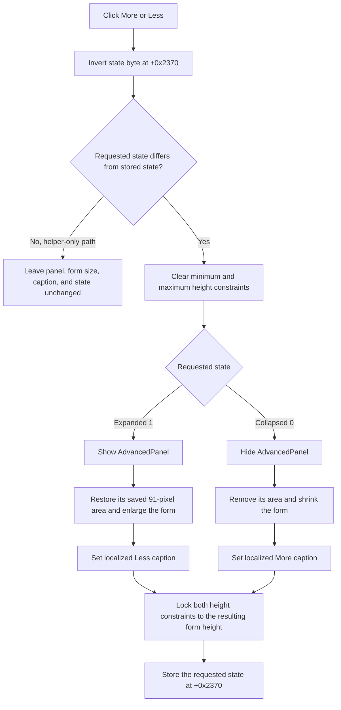

# Show or hide the advanced library controls

> Analysis status: Source, graph, and form evidence reviewed.

## Control

| Property | Recovered value |
| --- | --- |
| Form | CompilePackage |
| Form caption | Manage Libraries |
| Component path | CompilePackage.SimplePanel.bMore |
| Control class | TBitBtn |
| DFM caption | More... |
| Hint | Not present in the recovered resource. |
| Handler name | bMoreClick |
| Handler address | 014ec7a0 |
| Graph node | `resource:dfm:CompilePackage/CompilePackage.SimplePanel.bMore` |
| Handler node | `function:014ec7a0` |
| Graph layer | UI |

## What happens when clicked

`FUN_014ec7a0` reads the form's simple-or-advanced state byte at `+0x2370`, inverts it, and passes the result to `FUN_014ed4b0`. There is no sender check. Every normal click requests the state opposite to the one currently stored.

When the requested state is expanded, `FUN_014ed4b0`:

- shows `AdvancedPanel` at form field `+0x6e8`;
- sets the form height from `AdvancedPanel.Top`, the panel height saved at `+0x237c`, `pnBottom.Height`, and a two-pixel allowance;
- resolves `d.DesignToolObject_Dfm_Less` through the localization manager and assigns the result to `bMore` at form field `+0x750`; and
- stores `1` in the state byte.

When the requested state is collapsed, it:

- hides `AdvancedPanel`;
- sets the form height from `SimplePanel.Top + SimplePanel.Height`, `pnBottom.Height`, and the same two-pixel allowance;
- resolves `d.DesignToolObject_Dfm_More` and assigns it to `bMore`; and
- stores `0` in the state byte.

The recovered DFM dimensions explain the layout calculation. `SimplePanel` starts at 0 and has height 153. `AdvancedPanel` starts at 153 and has height 91. `pnBottom` has height 337. At these recovered dimensions, the calculated content heights are 492 when collapsed and 583 when expanded. The expanded form shows the panel and makes its 91-pixel area available between the top and bottom panels. The collapsed form hides the panel and removes that area from the usable client layout.

Before it changes the form height, the helper clears the form's minimum-height and maximum-height constraints. It restores both constraints to the resulting form height after the resize. This locks the dialog to the selected vertical size. The width and width constraints do not change.

## Caption and repeated-click behavior

The DFM gives the button its initial caption **More...**. At run time, the helper gets the captions through the localization keys `d.DesignToolObject_Dfm_More` and `d.DesignToolObject_Dfm_Less`. Each key has a recovered fallback string, but the fallback text itself is referenced through a global pointer and is not present as a literal in this function. The VCL text setter suppresses its text-change path if the resolved caption already matches the button.

The state alternates on repeated clicks:

- collapsed state `0` -> click -> expanded state `1`, advanced panel shown, caption changed to localized **Less**;
- expanded state `1` -> click -> collapsed state `0`, advanced panel hidden, caption changed to localized **More**.

`FUN_014ed4b0` has a same-state guard. If another caller asks it to apply the state that is already stored, it skips panel, height, constraint, caption, and state writes. `bMoreClick` does not take this no-op path in normal execution because it always requests the inverse state.

## Initial state and persistence boundary

`FUN_014ec080`, the form-create handler, saves the DFM `AdvancedPanel.Height` in form field `+0x237c` and initializes the state byte to `1`. On the first form show, `FUN_014ec0d0` calls the same helper with the inverse state, which is `0`. This performs the collapse transition, hides the advanced panel, applies the smaller height, and changes the button to the localized More caption. The first visible state of a newly created Manage Libraries dialog is therefore collapsed.

The state byte and saved height are fields of this form instance. The click handler does not write an INI file, registry key, package setting, or owner object. The recovered caller creates a new `TCompilePackage` form for each Manage Libraries command, so the expanded state is not preserved for the next new dialog instance.

## Unrelated data and errors

This click does not read or change the target-library combo, library search list, Xilinx home directory, **Generate small libraries** check box, package list, progress bar, or compilation result. It does not compile, add, or delete a library. Its only proven responsibilities are the display-state byte, advanced-panel visibility, form height constraints and height, and More/Less button caption.

There is no validation or user-cancel branch because the operation has no dialog or fallible user input. The handler and helper have no explicit local exception branch. An unexpected localization or VCL exception follows normal Delphi exception handling. Localization lookup uses the supplied fallback string when the resource is unavailable.

## Click flow

## Evidence

- [Click handler `FUN_014ec7a0`](../../../DecompiledSources/Tina16/functions/00000000014EC7A0__FUN_014ec7a0.c) reads byte `+0x2370`, compares it with zero, and sends the Boolean inverse to `FUN_014ed4b0`.
- [Panel-state helper `FUN_014ed4b0`](../../../DecompiledSources/Tina16/functions/00000000014ED4B0__FUN_014ed4b0.c) guards equal states, changes field `+0x6e8` through the VCL visibility setter, calculates two form heights, resolves the More or Less resource key, updates field `+0x750`, restores the height constraints, and writes the requested state.
- [Form-create handler `FUN_014ec080`](../../../DecompiledSources/Tina16/functions/00000000014EC080__FUN_014ec080.c) copies the height of field `+0x6e8` to `+0x237c` and initializes the state byte to `1`.
- [Form-show handler `FUN_014ec0d0`](../../../DecompiledSources/Tina16/functions/00000000014EC0D0__FUN_014ec0d0.c) calls `FUN_014ed4b0` with the inverse of the initialized state after it loads the library list and Xilinx home text.
- [VCL visibility setter `FUN_0064dbe0`](../../../DecompiledSources/Tina16/functions/000000000064DBE0__FUN_0064dbe0.c) changes a control's visible byte only when it differs and sends `CM_VISIBLECHANGED` (`0xb00b`).
- [VCL text setter `FUN_0064de00`](../../../DecompiledSources/Tina16/functions/000000000064DE00__FUN_0064de00.c) compares the resolved caption with current control text and sends the text-change path only when they differ.
- [Form-height helper `FUN_007fdf10`](../../../DecompiledSources/Tina16/functions/00000000007FDF10__FUN_007fdf10.c) applies the calculated height to the form.
- [Size-constraint setter `FUN_0064b380`](../../../DecompiledSources/Tina16/functions/000000000064B380__FUN_0064b380.c) changes the selected constraint and maintains the paired minimum or maximum value.
- [Localization wrapper `FUN_00b8e650`](../../../DecompiledSources/Tina16/functions/0000000000B8E650__FUN_00b8e650.c) prefixes the supplied key with `tina.exe.Strings.` and delegates lookup with a fallback value.
- The recovered [DFM evidence](../../../DecompiledSources/Tina16/resources/dfm/ui-evidence.json) identifies `bMore`, `SimplePanel`, `AdvancedPanel`, and `pnBottom`, including their captions, alignment, positions, and heights.

## Direct calls

- `function:014ed4b0` applies the requested expanded or collapsed layout state.

## Analysis limits

- The decompiler does not recover Delphi field names. The height calculations, DFM positions, the visibility call, and the caption setter establish `+0x6e0` as `SimplePanel`, `+0x6e8` as `AdvancedPanel`, `+0x6b0` as `pnBottom`, and `+0x750` as `bMore`.
- The exact translated captions depend on the active language resources. The resource keys prove More versus Less intent, while the DFM proves the initial **More...** caption.
- The helper explicitly changes `AdvancedPanel.Visible` and also changes the form height to add or remove the panel's area.
