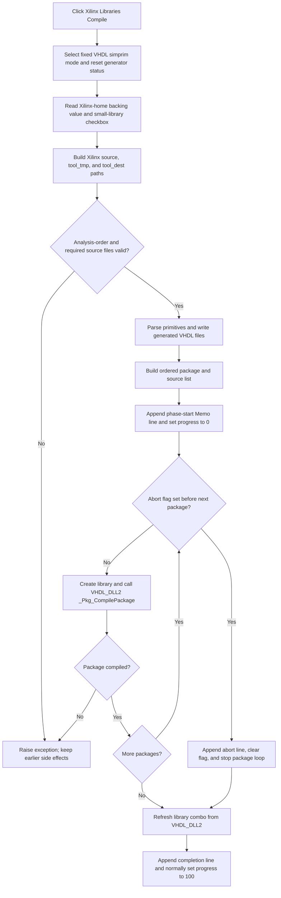

# Generate and compile Xilinx simulation-primitive libraries

> Analysis status: Source reviewed and behavior traced.

## Control

| Property | Recovered value |
| --- | --- |
| Form | CompilePackage |
| Component path | CompilePackage.AdvancedPanel.gbXilinx.bPrimGen |
| Control class | TButton |
| Caption | Compile |
| Handler name | bPrimGenClick |
| Handler address | 014ecbc0 |
| Graph node | `resource:dfm:CompilePackage/CompilePackage.AdvancedPanel.gbXilinx.bPrimGen` |
| Handler node | `function:014ecbc0` |
| Graph layer | UI |

## What happens when clicked

`FUN_014ecbc0` runs two immediate phases:

1. Generate VHDL simulation-primitive source files from the configured Xilinx
   installation.
2. Create and compile the generated package libraries through
   `VHDL_DLL2.DLL`.

This button is not a file-selection command and it does not stage work for a
later OK action. Generation and package compilation happen during the click.

The handler first clears a generator-status byte at form offset `+0x2390` and
sets the two generator mode integers at `+0x2378` and `+0x2374` to zero. The
mode pair `(0, 0)` selects the recovered VHDL `simprim` source tree. The
`Generate small libraries` check box at `+0x740` selects the source-list mode:

- When it is checked, the handler passes the prefix `tina`. The generator uses
  TINA's bundled `vhdl_analyze_order_simprim_tina` list to select a smaller
  primitive set.
- When it is not checked, the handler passes a second built-in prefix whose
  original string is unresolved. The generator accepts this token and uses the
  vendor `vhdl_analyze_order` file for the full source list.

The other main input is the backing Xilinx-home string at `+0x2388`. Form
creation loads this value from the `XilinxHome` user setting, with
`D:\Xilinx\14.7\ISE_DS\ISE` as the recovered fallback. Form show copies it to
the `eDirectory` edit, and the adjacent folder-selection button updates both
the backing value and the edit. The primitive handler reads the backing value;
it does not read `eDirectory` directly.

## Source generation

`FUN_014e94d0` is the internal primitive-source generator. It constructs these
paths:

- bundled generator support: `vhdl\tools\src-prmtvsgen\` below the application
  path;
- temporary work directory: `tool_tmp` below the application tool-data base;
- generated source directory: `tool_dest` below the same base; and
- Xilinx input: `vhdl\src\simprims\primitive\other\` and
  `vhdl\src\simprims\` below the configured Xilinx home.

It ensures the two work directories exist, loads the selected analysis-order
file, and validates each named primitive source before it parses it. It reads
the Xilinx component declarations, filters recovered unsupported components,
and writes generated VHDL units such as `simprim_VITAL*.vhd` and
`simprim_Vcomponents*.vhd`. It also writes `ignoredcomponents.txt` to the
temporary directory and builds an ordered list of package-library and source
file pairs for the next phase.

No recovered call in this path starts an external Xilinx process. The Xilinx
home is used as a source-tree root. The only external library calls in the
traced click path are the later package APIs from `VHDL_DLL2.DLL`.

## Package compilation

After generation, `FUN_014ecbc0` appends a localized phase-start line to the
form Memo, resets the progress bar to zero, and passes the generated package
list to `FUN_014ecfb0`.

For each package entry, `FUN_014ecfb0`:

1. Selects either a generated file under `tool_dest` or a required vendor file
   under the Xilinx `simprims` directory.
2. Calls `_Pkg_NewLibrary` for the entry's library name.
3. Appends a localized compile line to the Memo.
4. Calls `_Pkg_CompilePackage` with the selected source path and an error-buffer
   field on the form.
5. Adds a localized success suffix to the last Memo line and advances progress
   when compilation succeeds.

After the loop, it calls `_Pkg_GetLibraryList` and replaces the target-library
combo contents with the current library list. The click handler then appends a
localized completion line and normally sets progress to 100.

This is the boundary to compilation. The separate `SimplePanel.bCompile`
button is not called. Primitive generation produces an ordered package list,
and `FUN_014ecfb0` consumes that list through the package DLL in the same click.

## Compile flow

## Progress, output, and UI processing

- `FUN_014ebd70` appends each status string to `Memo.Lines`.
- `FUN_014ebde0` appends a success suffix to the most recent Memo line.
- `FUN_014ebef0` assigns a progress value and processes application messages.
  The source generator and package compiler use this helper while they run.
- Message processing keeps the UI responsive enough for the shared Abort
  button to set its flag. It also means the handler does not block all other UI
  events while the operation is active.
- Generated files are written before package compilation. New package
  libraries and successful earlier packages are visible before the complete
  loop finishes.

The recovered localized resource pointers establish the start, per-package,
success, abort, and completion log positions, but their exact displayed text
is not present in the recovered source.

## Abort and error behavior

The shared Abort button (`FUN_014ec7c0`) sets form byte `+0x2371`. The primitive
source generator does not read this byte. `FUN_014ecfb0` checks it only at the
start of each package iteration. When set, it appends a localized abort line,
clears the flag, and exits the package loop before it creates that package.

Abort is therefore delayed and cooperative:

- it does not interrupt the source-generation phase;
- it does not interrupt a package already inside `_Pkg_CompilePackage`;
- it does not remove generated files, libraries, or packages completed before
  the check; and
- the normal post-loop library refresh, completion log, and final progress path
  still run.

The primitive click resets `+0x2390`, but it does not clear the shared abort
byte `+0x2371` at its start. A flag set after an earlier operation can therefore
be consumed by the next package loop.

Validation and failures include these recovered cases:

- an invalid generator prefix raises `Invalid prefix`;
- a missing analysis-order file, required Xilinx source, component file, or
  named component raises an exception that identifies the missing input;
- directory creation results are not checked at the call site, so a later file
  operation reports an unusable output path;
- a false `_Pkg_CompilePackage` result raises an exception built from the DLL
  error buffer; and
- other file access, parsing, allocation, and DLL errors have no local retry or
  recovery branch.

The click handler has no transaction or rollback. An exception skips the later
completion log and final progress update, but generated files and successful
library changes that occurred before the failure remain.

## Staging and persistence

- The Xilinx-home backing value is not changed by this click. `FormClose`
  writes it to the user setting `XilinxHome` regardless of how the modal form
  closes.
- Memo lines and progress are form-local display state.
- Files in `tool_tmp` and `tool_dest` are written immediately. The recovered
  generator destructor releases objects but does not delete these directories
  or files.
- `_Pkg_NewLibrary` and `_Pkg_CompilePackage` change the package system during
  the click. Closing the Manage Libraries form does not commit or cancel those
  changes.
- Repeated clicks run generation and package compilation again. The handler has
  no already-running guard and does not disable the Compile button.

## Evidence

- [Click handler `FUN_014ecbc0`](../../../DecompiledSources/Tina16/functions/00000000014ECBC0__FUN_014ecbc0.c)
  selects the fixed mode and prefix, creates and runs the generator, updates
  Memo and progress state, and invokes package compilation.
- [Primitive generator `FUN_014e94d0`](../../../DecompiledSources/Tina16/functions/00000000014E94D0__FUN_014e94d0.c)
  builds paths, validates and parses Xilinx sources, writes generated files,
  reports progress, and creates the package list.
- [Generated-file writer `FUN_014e85a0`](../../../DecompiledSources/Tina16/functions/00000000014E85A0__FUN_014e85a0.c)
  names and saves generated VITAL source chunks under `tool_dest`.
- [Component-file builder `FUN_014e8c40`](../../../DecompiledSources/Tina16/functions/00000000014E8C40__FUN_014e8c40.c)
  combines the component fragments and writes the generated component file.
- [Package-list builder `FUN_014ea970`](../../../DecompiledSources/Tina16/functions/00000000014EA970__FUN_014ea970.c)
  records the `simprim` package sources consumed by the compiler phase.
- [Package compiler `FUN_014ecfb0`](../../../DecompiledSources/Tina16/functions/00000000014ECFB0__FUN_014ecfb0.c)
  checks Abort between entries, creates libraries, calls the DLL compiler,
  updates log and progress state, and refreshes the library list.
- [Memo append helper `FUN_014ebd70`](../../../DecompiledSources/Tina16/functions/00000000014EBD70__FUN_014ebd70.c)
  adds a new status line to the form Memo.
- [Progress and message helper `FUN_014ebef0`](../../../DecompiledSources/Tina16/functions/00000000014EBEF0__FUN_014ebef0.c)
  sets the progress-bar position and processes pending application messages.
- [Abort handler `FUN_014ec7c0`](../../../DecompiledSources/Tina16/functions/00000000014EC7C0__FUN_014ec7c0.c)
  sets the shared abort byte at `+0x2371`.
- [Form initialization `FUN_014ec080`](../../../DecompiledSources/Tina16/functions/00000000014EC080__FUN_014ec080.c)
  loads Xilinx home and initializes the abort and view-state fields.
- [Xilinx-home loader `FUN_014ed840`](../../../DecompiledSources/Tina16/functions/00000000014ED840__FUN_014ed840.c)
  reads the user setting and supplies the recovered default path.
- [Xilinx-home selector `FUN_014ece80`](../../../DecompiledSources/Tina16/functions/00000000014ECE80__FUN_014ece80.c)
  updates both the backing field and displayed edit after folder acceptance.
- [Xilinx-home persistence `FUN_014ed760`](../../../DecompiledSources/Tina16/functions/00000000014ED760__FUN_014ed760.c)
  writes the backing field to the user setting when the form closes.

## Resource evidence and limits

- The button caption is `Compile` inside the `Xilinx Libraries` group.
- The group contains `eDirectory`, label `Xilinx home:`, the folder-selection
  button, and `Generate small libraries`.
- The form also contains a Memo, progress bar, and shared `X` button with hint
  `Abort Compiling`; the recovered code confirms their roles.
- The exact unchecked prefix string and localized log strings are unresolved.
- The recovered graph confirms direct calls to the three
  `VHDL_DLL2.DLL` package APIs and no recovered process-launch API in this
  click path. This does not describe code inside the external DLL.

## Annotation scope

The fragment assigns canonical roles to the unique click handler, its internal
primitive generator, and the package-list compiler. It omits the shared Memo,
progress, VCL, RTL, and external-DLL nodes to avoid conflicts with the adjacent
CompilePackage control analyses.
