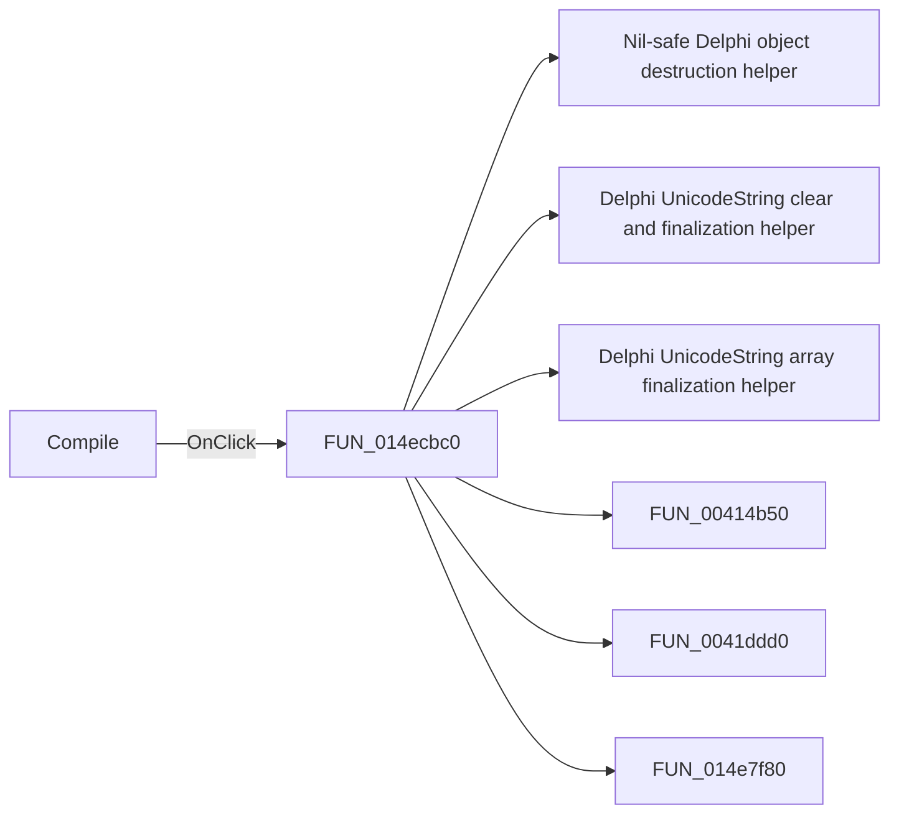

# Compile

> Analysis status: Pending individual source review.

## Control

| Property | Recovered value |
| --- | --- |
| Form | CompilePackage |
| Component path | CompilePackage.AdvancedPanel.gbXilinx.bPrimGen |
| Control class | TButton |
| Caption | Compile |
| Hint | Not present in the recovered resource. |
| Text | Not present in the recovered resource. |
| Handler name | bPrimGenClick |
| Handler address | 014ecbc0 |
| Graph node | `resource:dfm:CompilePackage/CompilePackage.AdvancedPanel.gbXilinx.bPrimGen` |
| Handler node | `function:014ecbc0` |
| Graph layer | UI |

## What happens when clicked

Pending individual analysis. An agent must read the recovered handler source and its relevant callees before it replaces this text.

## Click flow

## Handler evidence

- Source: [DecompiledSources/Tina16/functions/00000000014ECBC0__FUN_014ecbc0.c](../../../DecompiledSources/Tina16/functions/00000000014ECBC0__FUN_014ecbc0.c)
- Recovered role: Not present in the recovered resource.
- Current graph summary: Handles 1 Delphi UI event: CompilePackage.AdvancedPanel.gbXilinx.bPrimGen.OnClick.
- Current graph behavior: Not present in the recovered resource.
- Current graph evidence: Not present in the recovered resource.
- Complexity: complex
- Distinct outgoing calls: 11

## Direct calls

- `function:00410f20` — Nil-safe Delphi object destruction helper
- `function:00414480` — Delphi UnicodeString clear and finalization helper
- `function:00414560` — Delphi UnicodeString array finalization helper
- `function:00414b50` — FUN_00414b50
- `function:0041ddd0` — FUN_0041ddd0
- `function:014e7f80` — FUN_014e7f80
- `function:014e94d0` — FUN_014e94d0
- `function:014ea960` — FUN_014ea960
- `function:014ebd70` — FUN_014ebd70
- `function:014ebef0` — FUN_014ebef0
- `function:014ecfb0` — FUN_014ecfb0

## Resource evidence

- Kind: Not present in the recovered resource.
- Modal result: Not present in the recovered resource.
- Checked state: Not present in the recovered resource.
- List items: Not present in the recovered resource.
- Image reference: Not present in the recovered resource.
- Extracted glyph: None.

## Nearby label candidates

Nearby labels are layout candidates only. They are not proof of behavior.

- Rank 1: Xilinx home: at distance 145.

## Analysis limits

- Do not infer behavior from the control class, caption, hint, glyph, or nearby label alone.
- Do not replace the pending status until the handler source and relevant call path provide enough evidence.
