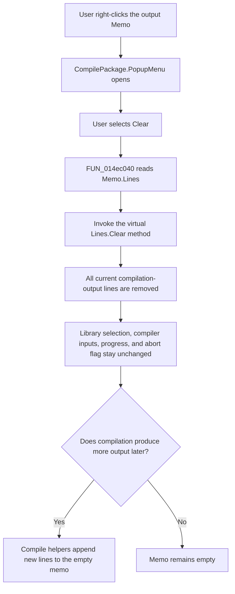

# Clear

> Analysis status: Reviewed from recovered source and dialog resource evidence.

## Control

| Property | Recovered value |
| --- | --- |
| Form | CompilePackage |
| Component path | CompilePackage.PopupMenu.mnClear |
| Control class | TMenuItem |
| Caption | Clear |
| Hint | Not present in the recovered resource. |
| Handler name | mnClearClick |
| Handler address | 014ec040 |
| Graph node | `resource:dfm:CompilePackage/CompilePackage.PopupMenu.mnClear` |
| Handler node | `function:014ec040` |
| Graph layer | UI |

## What happens when clicked

`mnClear` clears the read-only `Memo` in the bottom panel of the Manage Libraries dialog. This memo is the package-compilation output log. It is not the target-library combo box, the library-search edit, or the progress bar.

`FUN_014ec040` obtains `Memo.Lines` from the memo at form offset `+0x6c8`, then invokes the lines object's virtual `Clear` method. This removes all current output lines in one operation. The handler does not inspect the selected text, remove one line, or preserve a copy of the output.

The target identity is supported by both directions of use:

- `MemoMouseDown` converts a right-click position on the same form field `+0x6c8` and opens the popup menu at `+0x6d0`.
- `FUN_014ebd70` adds new compile messages to the same `+0x6c8` lines collection.
- `FUN_014ebde0` appends status text to the last line in the same collection.
- The single-file and Xilinx-library compile paths use those helpers for command, success, failure, abort, and progress-related output.

## Selection and other state

Clearing the lines removes the text that could be selected. The handler does not read or restore `SelStart`, `SelLength`, the caret, scroll position, or focus. The exact caret position after `TStrings.Clear` is VCL behavior and is not established by this application handler.

No other dialog state is changed. In particular, the handler does not change the selected target library, search-list text, Xilinx directory, small-library option, progress value, expanded-panel state, or any compiler input.

## Compile and abort interaction

The Clear command is independent of compilation control:

- `sbAbortClick` sets the form abort-request byte at `+0x2371`. `mnClearClick` does not read or write this byte, so clearing output neither requests nor cancels an abort.
- The compilation paths update progress through separate helpers and fields. The Clear handler does not access the progress bar.
- A compile operation that continues after the clear can add new lines through `FUN_014ebd70` or update its then-current last line through `FUN_014ebde0`. Therefore Clear removes only output that exists when it runs; it does not suppress future output.

## Click flow

## Handler evidence

- Primary source: [FUN_014ec040](../../../DecompiledSources/Tina16/functions/00000000014EC040__FUN_014ec040.c).
- Popup routing: [FUN_014ebfd0](../../../DecompiledSources/Tina16/functions/00000000014EBFD0__FUN_014ebfd0.c) handles `Memo.OnMouseDown` and opens the popup menu on a right-click.
- Output producers: [FUN_014ebd70](../../../DecompiledSources/Tina16/functions/00000000014EBD70__FUN_014ebd70.c) adds a line, while [FUN_014ebde0](../../../DecompiledSources/Tina16/functions/00000000014EBDE0__FUN_014ebde0.c) appends text to the last line.
- Single-file compilation: [FUN_014ec1f0](../../../DecompiledSources/Tina16/functions/00000000014EC1F0__FUN_014ec1f0.c) writes its initial, success, and failure output through those helpers.
- Xilinx-library compilation: [FUN_014ecbc0](../../../DecompiledSources/Tina16/functions/00000000014ECBC0__FUN_014ecbc0.c) and [FUN_014ecfb0](../../../DecompiledSources/Tina16/functions/00000000014ECFB0__FUN_014ecfb0.c) add compile and abort output and update progress separately.
- Abort command: [FUN_014ec7c0](../../../DecompiledSources/Tina16/functions/00000000014EC7C0__FUN_014ec7c0.c) only sets the abort-request byte.
- Complexity: simple; no distinct direct call edge is present in the graph.

## Direct calls

The recovered graph has no direct call edge for this handler. The source still proves one indirect virtual call: `Memo.Lines.Clear`. The call target is selected through the `TStrings` virtual table, so the graph does not resolve it to a recovered function node.

## Resource evidence

- The menu caption is `Clear`.
- Its parent is `CompilePackage.PopupMenu`.
- The popup is opened by the read-only `TMemo` in `CompilePackage.pnBottom`.
- The memo is next to `cgProgressBar`, but the source accesses only `Memo.Lines`.
- There is no hint, image reference, or extracted glyph for `mnClear`.

## Repeated, no-op, and error behavior

- The handler has no empty-list test. Selecting Clear when the memo is already empty calls `Lines.Clear` again and leaves it empty.
- The handler has no confirmation dialog, success message, or alternate branch.
- It does not stop a compile, reset an abort request, or prevent later output.
- It has no local exception handler. A failure from the VCL lines operation follows the application's normal Delphi exception path. The form resource and normal construction supply the memo and its lines object; this handler has no null check.

## Persistence limits

The handler changes only the live memo contents. It does not call a file, registry, package, or catalog API. The recovered source gives no evidence that the displayed log is stored elsewhere or restored after the dialog closes.

## Analysis limits

- The source establishes complete-line clearing, but not the exact VCL caret or scroll position after the clear.
- Message text and later compiler behavior are owned by the compile paths, not by this handler.
