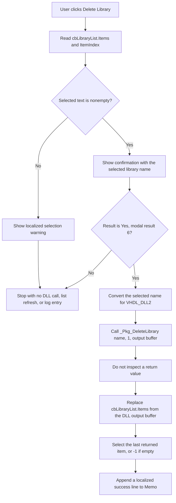

# Delete Library

> Analysis status: Reviewed from recovered source, form-resource, call-graph, and glyph evidence.

## Control

| Property | Recovered value |
| --- | --- |
| Form | CompilePackage |
| Component path | CompilePackage.SimplePanel.sbDeleteLibrary |
| Control class | TSpeedButton |
| Caption | Not present in the recovered resource. |
| Hint | Delete Library |
| Handler name | sbDeleteLibraryClick |
| Handler address | 014ec7d0 |
| Graph node | `resource:dfm:CompilePackage/CompilePackage.SimplePanel.sbDeleteLibrary` |
| Handler node | `function:014ec7d0` |
| Graph layer | UI |

## What happens when clicked

`sbDeleteLibraryClick` deletes the selected VHDL package library through `VHDL_DLL2.DLL`. The host application does not contain a direct file, directory, registry, or in-memory catalog deletion in this handler.

The handler gets the selected text from `cbLibraryList`. If that text is empty, it displays a shared localized warning and stops. Otherwise, it formats a confirmation message with the selected library name. Only the `Yes` result, recovered as modal result `6`, continues.

After confirmation, the handler converts the selected Delphi Unicode string to the buffer representation used by the external DLL. It calls `_Pkg_DeleteLibrary(selectedLibrary, 1, form+0xb6a)`. The second argument is the constant `1`. The recovered host code does not explain its meaning. The third argument is the form's reusable result buffer.

The DLL owns the actual destructive operation. The recovered import thunk does not show whether the DLL deletes a filesystem object, changes a package catalog, or updates another persistent store. It would be incorrect to describe this as a direct `DeleteFile` call.

## Selection and confirmation guards

`FUN_014ebd10` reads the combo box at form offset `+0x718`:

- If `Items.Count` is zero, it returns an empty string.
- Otherwise, it asks the combo box for its current `ItemIndex` and reads that item.

The form resource declares `cbLibraryList` as a `csDropDownList`, so the user cannot enter an arbitrary library name. However, the helper does not validate `ItemIndex` when the list is nonempty. An invalid index can therefore fail during the item lookup before the handler displays its warning or confirmation.

The copied selection is not trimmed or normalized. An empty string follows the warning branch. A nonempty string is used as-is in both the confirmation and the DLL call. Choosing `No`, closing the confirmation, or otherwise returning a value other than `6` performs no deletion, list refresh, or success-log append.

## List refresh and visible state

The handler does not request a fresh list in a separate `_Pkg_GetLibraryList` call. It assumes that `_Pkg_DeleteLibrary` wrote the complete post-operation library list into the output buffer at form offset `+0xb6a`.

`FUN_014ebf20` converts that buffer to a Delphi string, creates a string list from its text, and assigns the full collection to `cbLibraryList.Items`. It then selects `Items.Count - 1`. Therefore:

- a nonempty result selects the last returned library, not the previous row or its nearest neighbor;
- an empty result sets the combo-box index to `-1`;
- the complete displayed list is replaced rather than removing only the selected item.

After the list replacement, `FUN_014ebd70` appends a localized success-format line containing the deleted library name to the bottom `Memo` output log. The handler does not change compilation inputs, progress, or the abort-request flag.

## Ownership and persistence boundary

The Manage Libraries dialog is created, shown modally, and destroyed by its caller. It has no OK or Cancel transaction for library changes. This delete command calls the external DLL immediately, so closing this dialog or later canceling the parent options dialog does not roll the operation back.

`TCompilePackage.FormClose` calls a separate settings routine that stores the Xilinx home setting. It does not commit or undo this library deletion. The durable location and format of the library data are inside the DLL boundary and are not established by the recovered host source.

## Click flow

## Handler evidence

- Primary handler: [FUN_014ec7d0](../../../DecompiledSources/Tina16/functions/00000000014EC7D0__FUN_014ec7d0.c) contains the empty-selection branch, confirmation, DLL call, list refresh, and log append in that order.
- Selection helper: [FUN_014ebd10](../../../DecompiledSources/Tina16/functions/00000000014EBD10__FUN_014ebd10.c) reads `Items.Count`, `ItemIndex`, and the selected item from form field `+0x718`.
- DLL import: [_Pkg_DeleteLibrary](../../../DecompiledSources/Tina16/functions/0000000000E03CC0__VHDL_DLL2.DLL___Pkg_DeleteLibrary.c) is an external `VHDL_DLL2.DLL` thunk. Its body and storage effects are not recovered here.
- List refresh: [FUN_014ebf20](../../../DecompiledSources/Tina16/functions/00000000014EBF20__FUN_014ebf20.c) replaces the combo-box items from the output buffer and sets the index to `Count - 1`.
- Log append: [FUN_014ebd70](../../../DecompiledSources/Tina16/functions/00000000014EBD70__FUN_014ebd70.c) adds the supplied line to the `Memo.Lines` collection at form field `+0x6c8`.
- Warning path: [FUN_016fd940](../../../DecompiledSources/Tina16/functions/00000000016FD940__FUN_016fd940.c) displays the localized string supplied by the handler.
- Confirmation path: [FUN_0072d440](../../../DecompiledSources/Tina16/functions/000000000072D440__FUN_0072d440.c) returns the modal result tested against `6`.
- Form close: [FUN_014ec070](../../../DecompiledSources/Tina16/functions/00000000014EC070__FUN_014ec070.c) calls only the separate settings-persistence routine.
- Dialog owner: [FUN_014ef000](../../../DecompiledSources/Tina16/functions/00000000014EF000__FUN_014ef000.c) creates the manager, calls its modal method, ignores the modal result, and destroys the manager after it closes.
- Complexity: complex; 12 distinct outgoing calls are present in the graph.

## Resource and glyph evidence

- The `TSpeedButton` hint is `Delete Library`; it has no caption.
- `NumGlyphs` is `2`, so the 32-by-16 bitmap contains two button-state frames.
- The extracted [button glyph](../../../glyph/0037_CompilePackage_CompilePackage_SimplePanel_sbDeleteLibrary_Glyph_Data.png) has SHA-256 `f41c18c2dcae8478c9ce0ea7cf6e1f65e1b7f86c06314485b2c7d290ee1b2477`.
- The glyph is a small colored library/action image. It does not prove the target object or deletion mechanism. The hint and handler body supply that evidence.
- Nearby labels `Target Library` and `Library search list` support the local dialog context, but layout distance alone does not identify the deleted storage object.

## No-op, error, and partial-failure behavior

- An empty selection displays the warning and performs no destructive call.
- A confirmation result other than `Yes` is a no-op.
- The host does not inspect a success flag or error code from `_Pkg_DeleteLibrary`. It unconditionally treats the output buffer as the new complete list and then appends the success line.
- There is no local exception handler and no rollback. An exception in the DLL or buffer conversion can occur before the list changes. An exception during list assignment can occur after the DLL has changed persistent state. An exception during logging can occur after both the DLL call and list replacement.
- A DLL failure that returns normally but reports only through the output buffer cannot be distinguished by this handler. The UI can therefore replace its list and record success without independent verification.

## Analysis limits

- The recovered host establishes the DLL call and UI changes. It does not establish the DLL's filesystem, catalog, or database implementation.
- The source does not decode the localized warning and success text at their resource pointers, so this document does not invent their exact wording.
- The meaning of the constant DLL argument `1` is unknown.
