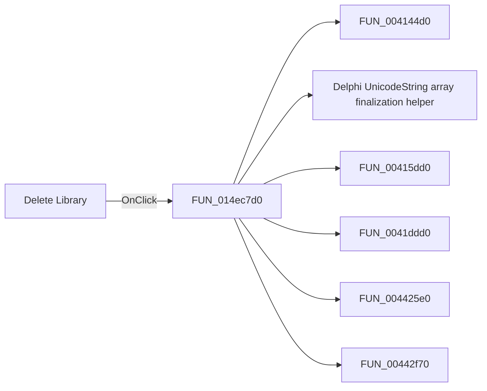

# Delete Library

> Analysis status: Pending individual source review.

## Control

| Property | Recovered value |
| --- | --- |
| Form | CompilePackage |
| Component path | CompilePackage.SimplePanel.sbDeleteLibrary |
| Control class | TSpeedButton |
| Caption | Not present in the recovered resource. |
| Hint | Delete Library |
| Text | Not present in the recovered resource. |
| Handler name | sbDeleteLibraryClick |
| Handler address | 014ec7d0 |
| Graph node | `resource:dfm:CompilePackage/CompilePackage.SimplePanel.sbDeleteLibrary` |
| Handler node | `function:014ec7d0` |
| Graph layer | UI |

## What happens when clicked

Pending individual analysis. An agent must read the recovered handler source and its relevant callees before it replaces this text.

## Click flow

## Handler evidence

- Source: [DecompiledSources/Tina16/functions/00000000014EC7D0__FUN_014ec7d0.c](../../../DecompiledSources/Tina16/functions/00000000014EC7D0__FUN_014ec7d0.c)
- Recovered role: Not present in the recovered resource.
- Current graph summary: Handles 1 Delphi UI event: CompilePackage.SimplePanel.sbDeleteLibrary.OnClick.
- Current graph behavior: Not present in the recovered resource.
- Current graph evidence: Not present in the recovered resource.
- Complexity: complex
- Distinct outgoing calls: 12

## Direct calls

- `function:004144d0` — FUN_004144d0
- `function:00414560` — Delphi UnicodeString array finalization helper
- `function:00415dd0` — FUN_00415dd0
- `function:0041ddd0` — FUN_0041ddd0
- `function:004425e0` — FUN_004425e0
- `function:00442f70` — FUN_00442f70
- `function:0072d440` — FUN_0072d440
- `function:00e03cc0` — Calls the VHDL_DLL2.DLL export _Pkg_DeleteLibrary.
- `function:014ebd10` — FUN_014ebd10
- `function:014ebd70` — FUN_014ebd70
- `function:014ebf20` — FUN_014ebf20
- `function:016fd940` — FUN_016fd940

## Resource evidence

- Kind: Not present in the recovered resource.
- Modal result: Not present in the recovered resource.
- Checked state: Not present in the recovered resource.
- List items: Not present in the recovered resource.
- Image reference: Not present in the recovered resource.
- Extracted glyph: [`0037_CompilePackage_CompilePackage_SimplePanel_sbDeleteLibrary_Glyph_Data.png`](../../../glyph/0037_CompilePackage_CompilePackage_SimplePanel_sbDeleteLibrary_Glyph_Data.png)

## Nearby label candidates

Nearby labels are layout candidates only. They are not proof of behavior.

- Rank 1: Target Library: at distance 71.
- Rank 2: Library search list:  at distance 107.

## Analysis limits

- Do not infer behavior from the control class, caption, hint, glyph, or nearby label alone.
- Do not replace the pending status until the handler source and relevant call path provide enough evidence.
