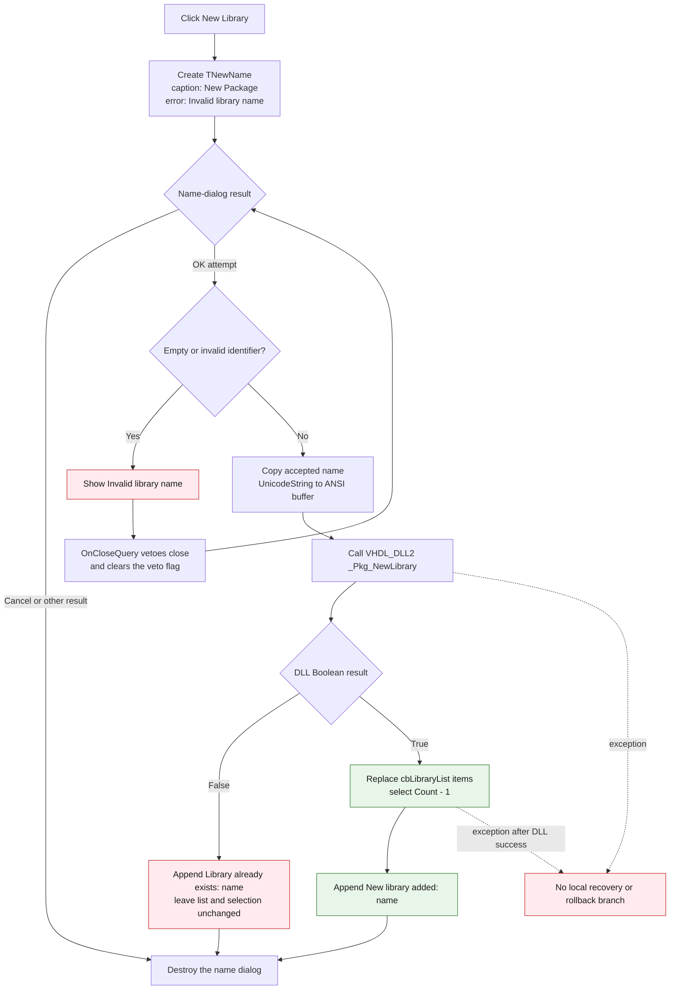

# New Library

> Analysis status: Complete. The recovered handler, name-dialog lifecycle,
> identifier validator, VHDL DLL call, returned-list update, messages, and glyph
> establish this behavior.

## Control

| Property | Recovered value |
| --- | --- |
| Form | CompilePackage |
| Form caption | Manage Libraries |
| Component path | CompilePackage.SimplePanel.sbNewLibrary |
| Control class | TSpeedButton |
| Caption | Not present in the recovered resource. |
| Hint | New Library |
| Handler name | sbNewLibraryClick |
| Handler address | 014ec9a0 |
| Graph node | `resource:dfm:CompilePackage/CompilePackage.SimplePanel.sbNewLibrary` |
| Handler node | `function:014ec9a0` |
| Graph layer | UI |

## What happens when clicked

The handler creates a new `TNewName` dialog and changes its caption to **New
Package**. It also sets the dialog's validation message to **Invalid library
name**. The dialog contains the **New name** edit, an OK button, and a Cancel
button.

The handler continues only when `ShowModal` returns `1`, the recovered OK
result. Cancel closes and destroys the name dialog without a DLL call, a list
change, or a status message.

After an accepted OK result, the handler gets the confirmed name, converts it
from a Delphi `UnicodeString` to the current-code-page `AnsiString`, and copies
the bytes to a NUL-terminated form buffer. It then calls the
`VHDL_DLL2.DLL` export `_Pkg_NewLibrary` with that name, the fixed value `1`,
and a second form buffer for the DLL output.

This is a request to the existing VHDL package DLL. The handler does not create
a Windows DLL file. The recovered DLL body is only an import thunk, so the
internal library-model creation steps are not available.

## Name validation

`TNewName.FormCreate` enables identifier-validation mode. Its OK handler
rejects an empty edit and calls `FUN_01055790` for a non-empty edit. That
validator accepts these characters:

- The first character must be an ASCII letter or underscore.
- Each later character must be an ASCII letter, underscore, or digit.

If validation fails, the OK handler displays **Invalid library name** and sets
a close-veto flag. `TNewName.FormCloseQuery` rejects that close attempt and
clears the flag, so the user can edit the name and try again. No DLL call occurs
until this dialog closes with a valid name.

This validation does not query the current target-library list and does not
check for a duplicate name. Duplicate handling occurs after the DLL call.

## DLL result and target-list update

`_Pkg_NewLibrary` returns a Boolean result and writes list text to its output
buffer.

- On a false result, the handler appends **Library already exists: _name_** to
  the manager memo. It does not replace `cbLibraryList.Items` and does not
  change its selection.
- On a true result, `FUN_014ebf20` converts the DLL output to a Delphi string
  list, replaces `cbLibraryList.Items`, and sets `ItemIndex` to `Count - 1`.
  Thus it selects the last returned library, or `-1` if the returned list is
  empty. The handler then appends **New library added: _name_** to the memo.

The selected target library and the **Library search list** edit are not inputs
to this command. Their nearby labels identify the manager context only.

## Click flow

## State, persistence, and boundary behavior

- The accepted operation is not staged until the Manage Libraries form closes.
  The DLL call runs immediately after the name dialog accepts the value.
- Closing Manage Libraries later does not commit or undo this action. Its
  `OnClose` path writes only the `XilinxHome` registry setting.
- The recovered source does not show where or how `VHDL_DLL2.DLL` persists a
  new library. It also does not prove the output-list order beyond the handler's
  selection of the last item.
- An empty or syntactically invalid name stays in the name dialog. A duplicate
  valid name closes the name dialog, receives the DLL's false result, and logs
  the duplicate message. The handler does not reopen the dialog automatically.
- The handler has no local exception message, retry, or rollback branch. If an
  exception occurs after DLL success but before the combo refresh or memo
  append completes, the recovered code does not undo the DLL operation. Any
  internal partial change inside the external DLL is not visible here.

## Handler evidence

- Click handler: [FUN_014ec9a0](../../../DecompiledSources/Tina16/functions/00000000014EC9A0__FUN_014ec9a0.c)
- Name-dialog OK handler: [FUN_0106bab0](../../../DecompiledSources/Tina16/functions/000000000106BAB0__FUN_0106bab0.c)
- Name-dialog close query: [FUN_0106ba80](../../../DecompiledSources/Tina16/functions/000000000106BA80__FUN_0106ba80.c)
- Identifier validator: [FUN_01055790](../../../DecompiledSources/Tina16/functions/0000000001055790__FUN_01055790.c)
- First or later letter-and-underscore test: [FUN_01b215c0](../../../DecompiledSources/Tina16/functions/0000000001B215C0__FUN_01b215c0.c)
- Digit test: [FUN_01b215f0](../../../DecompiledSources/Tina16/functions/0000000001B215F0__FUN_01b215f0.c)
- Imported package-library call: [_Pkg_NewLibrary](../../../DecompiledSources/Tina16/functions/0000000000E03CA0__VHDL_DLL2.DLL___Pkg_NewLibrary.c)
- Target-list replacement and selection: [FUN_014ebf20](../../../DecompiledSources/Tina16/functions/00000000014EBF20__FUN_014ebf20.c)
- Memo append: [FUN_014ebd70](../../../DecompiledSources/Tina16/functions/00000000014EBD70__FUN_014ebd70.c)
- Manager close handler: [FUN_014ec070](../../../DecompiledSources/Tina16/functions/00000000014EC070__FUN_014ec070.c)
- Recovered role: Validate a new VHDL library name, request its creation from
  `VHDL_DLL2.DLL`, and refresh the target-library combo on success.
- Likely Delphi method: `TCompilePackage.sbNewLibraryClick`.
- Complexity: complex
- Distinct outgoing calls: 14

## Resource and glyph evidence

- The speed button has the direct hint **New Library** and `ShowHint = true`.
- Its source is a 378-byte Delphi BMP resource. The extracted PNG is 32 by 16
  pixels because it contains the two 16-by-16 button states specified by
  `NumGlyphs = 2`.
- The bitmap shows two states of a small blue-and-yellow document or edit
  symbol. This visual is consistent with a new-item command, but the hint and
  handler data flow provide the specific library meaning.
- Extracted glyph: [0036_CompilePackage_CompilePackage_SimplePanel_sbNewLibrary_Glyph_Data.png](../../../glyph/0036_CompilePackage_CompilePackage_SimplePanel_sbNewLibrary_Glyph_Data.png)
- Glyph SHA-256: `c489c66079d1abadbd462674ad2ad42e2efc3fbe1bde843dc929300d7e20ebb3`.

## Analysis limits

- `_Pkg_NewLibrary` is an external DLL export. Its implementation, durable
  storage format, and rollback behavior are not in the recovered source.
- A false return is reported as an existing library by this handler. The
  external DLL does not expose a more detailed error code on this call path.
- Selecting `Count - 1` is proven. The recovered handler does not verify that
  this last returned item equals the requested name.
