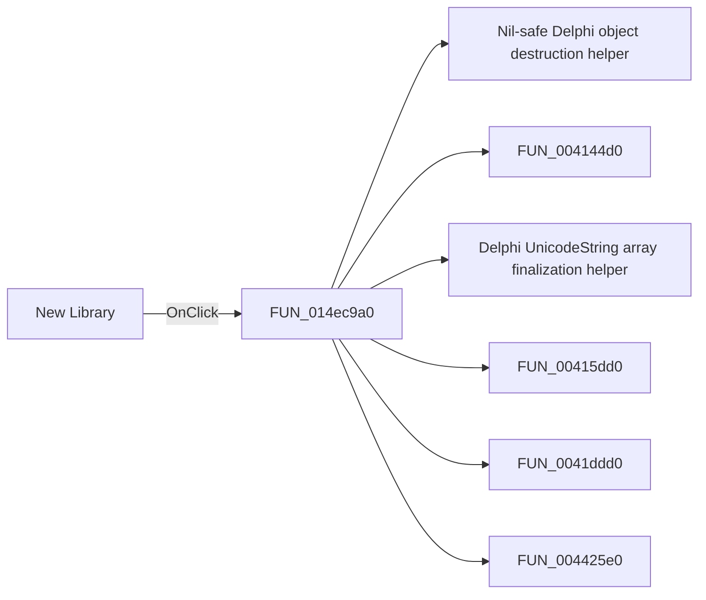

# New Library

> Analysis status: Pending individual source review.

## Control

| Property | Recovered value |
| --- | --- |
| Form | CompilePackage |
| Component path | CompilePackage.SimplePanel.sbNewLibrary |
| Control class | TSpeedButton |
| Caption | Not present in the recovered resource. |
| Hint | New Library |
| Text | Not present in the recovered resource. |
| Handler name | sbNewLibraryClick |
| Handler address | 014ec9a0 |
| Graph node | `resource:dfm:CompilePackage/CompilePackage.SimplePanel.sbNewLibrary` |
| Handler node | `function:014ec9a0` |
| Graph layer | UI |

## What happens when clicked

Pending individual analysis. An agent must read the recovered handler source and its relevant callees before it replaces this text.

## Click flow

## Handler evidence

- Source: [DecompiledSources/Tina16/functions/00000000014EC9A0__FUN_014ec9a0.c](../../../DecompiledSources/Tina16/functions/00000000014EC9A0__FUN_014ec9a0.c)
- Recovered role: Not present in the recovered resource.
- Current graph summary: Handles 1 Delphi UI event: CompilePackage.SimplePanel.sbNewLibrary.OnClick.
- Current graph behavior: Not present in the recovered resource.
- Current graph evidence: Not present in the recovered resource.
- Complexity: complex
- Distinct outgoing calls: 14

## Direct calls

- `function:00410f20` — Nil-safe Delphi object destruction helper
- `function:004144d0` — FUN_004144d0
- `function:00414560` — Delphi UnicodeString array finalization helper
- `function:00415dd0` — FUN_00415dd0
- `function:0041ddd0` — FUN_0041ddd0
- `function:004425e0` — FUN_004425e0
- `function:00442f70` — FUN_00442f70
- `function:007fc180` — FUN_007fc180
- `function:00e03ca0` — Calls the VHDL_DLL2.DLL export _Pkg_NewLibrary.
- `function:0106b870` — FUN_0106b870
- `function:0106b900` — FUN_0106b900
- `function:0106b9c0` — FUN_0106b9c0
- `function:014ebd70` — FUN_014ebd70
- `function:014ebf20` — FUN_014ebf20

## Resource evidence

- Kind: Not present in the recovered resource.
- Modal result: Not present in the recovered resource.
- Checked state: Not present in the recovered resource.
- List items: Not present in the recovered resource.
- Image reference: Not present in the recovered resource.
- Extracted glyph: [`0036_CompilePackage_CompilePackage_SimplePanel_sbNewLibrary_Glyph_Data.png`](../../../glyph/0036_CompilePackage_CompilePackage_SimplePanel_sbNewLibrary_Glyph_Data.png)

## Nearby label candidates

Nearby labels are layout candidates only. They are not proof of behavior.

- Rank 1: Target Library: at distance 47.
- Rank 2: Library search list:  at distance 83.

## Analysis limits

- Do not infer behavior from the control class, caption, hint, glyph, or nearby label alone.
- Do not replace the pending status until the handler source and relevant call path provide enough evidence.
