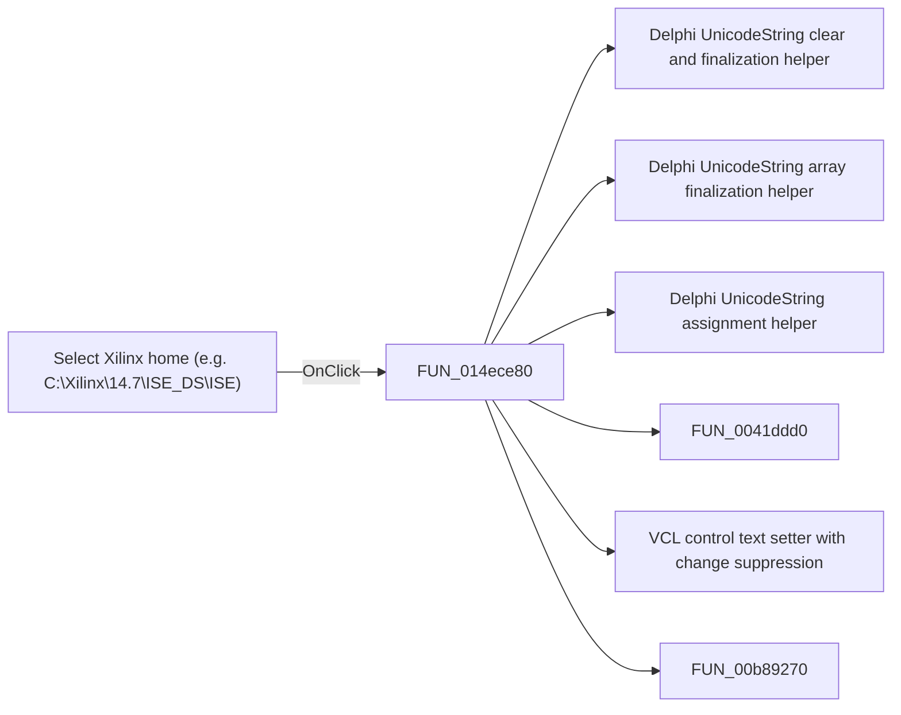

# Select Xilinx home (e.g. C:\Xilinx\14.7\ISE_DS\ISE)

> Analysis status: Pending individual source review.

## Control

| Property | Recovered value |
| --- | --- |
| Form | CompilePackage |
| Component path | CompilePackage.AdvancedPanel.gbXilinx.sbSelectToolHome |
| Control class | TSpeedButton |
| Caption | Not present in the recovered resource. |
| Hint | Select Xilinx home (e.g. C:\Xilinx\14.7\ISE_DS\ISE) |
| Text | Not present in the recovered resource. |
| Handler name | sbSelectToolHomeClick |
| Handler address | 014ece80 |
| Graph node | `resource:dfm:CompilePackage/CompilePackage.AdvancedPanel.gbXilinx.sbSelectToolHome` |
| Handler node | `function:014ece80` |
| Graph layer | UI |

## What happens when clicked

Pending individual analysis. An agent must read the recovered handler source and its relevant callees before it replaces this text.

## Click flow

## Handler evidence

- Source: [DecompiledSources/Tina16/functions/00000000014ECE80__FUN_014ece80.c](../../../DecompiledSources/Tina16/functions/00000000014ECE80__FUN_014ece80.c)
- Recovered role: Not present in the recovered resource.
- Current graph summary: Handles 1 Delphi UI event: CompilePackage.AdvancedPanel.gbXilinx.sbSelectToolHome.OnClick.
- Current graph behavior: Not present in the recovered resource.
- Current graph evidence: Not present in the recovered resource.
- Complexity: complex
- Distinct outgoing calls: 8

## Direct calls

- `function:00414480` — Delphi UnicodeString clear and finalization helper
- `function:00414560` — Delphi UnicodeString array finalization helper
- `function:00414ad0` — Delphi UnicodeString assignment helper
- `function:0041ddd0` — FUN_0041ddd0
- `function:0064de00` — VCL control text setter with change suppression
- `function:00b89270` — FUN_00b89270
- `function:00b8e650` — FUN_00b8e650
- `function:00d30800` — FUN_00d30800

## Resource evidence

- Kind: Not present in the recovered resource.
- Modal result: Not present in the recovered resource.
- Checked state: Not present in the recovered resource.
- List items: Not present in the recovered resource.
- Image reference: Not present in the recovered resource.
- Extracted glyph: [`0038_CompilePackage_CompilePackage_AdvancedPanel_gbXilinx_sbSelectToolHome_Glyph_Data.png`](../../../glyph/0038_CompilePackage_CompilePackage_AdvancedPanel_gbXilinx_sbSelectToolHome_Glyph_Data.png)

## Nearby label candidates

Nearby labels are layout candidates only. They are not proof of behavior.

- Rank 1: Xilinx home: at distance 294.

## Analysis limits

- Do not infer behavior from the control class, caption, hint, glyph, or nearby label alone.
- Do not replace the pending status until the handler source and relevant call path provide enough evidence.
