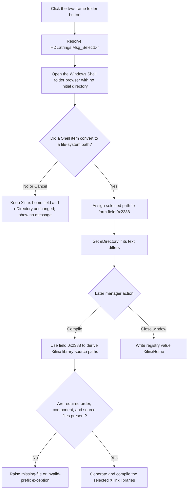

# Select the Xilinx library-source root

> Analysis status: Source reviewed. The recovered click handler, Windows Shell
> folder helper, form lifecycle, registry path, and Xilinx library compiler
> support the documented selection and later-use behavior.

## Control

| Property | Recovered value |
| --- | --- |
| Form | CompilePackage |
| Form caption | Manage Libraries |
| Component path | CompilePackage.AdvancedPanel.gbXilinx.sbSelectToolHome |
| Control class | TSpeedButton |
| Caption | Not present in the recovered resource. |
| Hint | Select Xilinx home (e.g. `C:\Xilinx\14.7\ISE_DS\ISE`) |
| Handler name | sbSelectToolHomeClick |
| Handler address | 014ece80 |
| Target edit | CompilePackage.AdvancedPanel.gbXilinx.eDirectory |
| Graph node | `resource:dfm:CompilePackage/CompilePackage.AdvancedPanel.gbXilinx.sbSelectToolHome` |
| Handler node | `function:014ece80` |
| Graph layer | UI |

## What happens when clicked

`FUN_014ece80` opens a Windows Shell folder browser and stages an accepted
directory as the Xilinx home for this Manage Libraries form.

The handler first gets the shared localization manager. It resolves resource
key `HDLStrings.Msg_SelectDir` and uses the localized value as the browser
title. A recovered fallback string is also supplied, but its text is not named
in the exported source. The exact displayed title therefore depends on the
active language resources.

The folder helper receives `0` as its initial-directory argument. The browser
is not seeded from the current `eDirectory` text, the saved registry value, or
the in-memory Xilinx-home field.

If the Shell browser returns a file-system directory, the handler performs two
updates in order:

1. Assign the selected directory to form-owned UnicodeString field `+0x2388`.
2. Set the `eDirectory` edit at form field `+0x730` from `+0x2388`.

The VCL text setter compares the new and current edit text. It sends the normal
text-change path only when they differ. The form-owned string is the
authoritative value for later compilation and persistence.

## Initial state and folder validation

`TCompilePackage.FormCreate` loads registry value `XilinxHome` from the
application registry key into field `+0x2388`. If that field is empty, it uses
`D:\Xilinx\14.7\ISE_DS\ISE` as the in-memory default. `FormShow` then copies
the field to `eDirectory`.

The selection click performs no Xilinx-specific validation. It does not search
for ISE executables, library source folders, analysis-order files, or component
files. The Shell helper only proves that the selected Shell item converted to
a file-system path.

Validation occurs when the user later clicks **Compile** in the Xilinx
Libraries group. That handler passes field `+0x2388` to the primitive-library
worker. The worker derives one of these source roots, based on the active
language and library mode:

- `vhdl\src\simprims\primitive\other\`
- `vhdl\src\unisims\primitive\`
- `verilog\src\simprims\`
- `verilog\src\unisims\`

It then requires the selected analysis-order file, relevant
`simprim_Vcomponents.vhd` or `unisim_VCOMP.vhd` file for VHDL modes, and each
listed primitive source file. It raises an exception with a path followed by
`is missing` when a required file is absent. It can also raise `Invalid prefix`
for an unsupported prefix mode.

The recovered compile path validates the Xilinx library-source hierarchy. It
does not prove a check for `ise.exe` or another Xilinx tool executable.

## State, persistence, and later use

An accepted folder is usable immediately. The Xilinx **Compile** handler reads
field `+0x2388`; the user does not need to close and reopen the manager first.

The selection click does not write the registry. `TCompilePackage.FormClose`
writes the current field `+0x2388` as registry value `XilinxHome`. The Manage
Libraries form has no local OK or Cancel buttons. Closing its window ends the
modal manager and persists this value independent of the modal result that its
opener ignores.

The DFM gives `eDirectory` no change event. The Compile handler and registry
writer read field `+0x2388`, not the edit text. Therefore, this recovered path
proves that a folder-button selection updates both values. It does not prove
that direct typing in `eDirectory` transfers text back to the field.

## Selection flow

## Cancel and error behavior

- The folder helper returns false when the user cancels, the Shell browser
  returns no item, or the selected item cannot be converted to a file-system
  path. The handler takes the same no-change branch for all three cases and
  displays no message.
- The handler has no local exception branch. Localization, Shell, allocation,
  or string-assignment exceptions follow the Delphi application exception
  path.
- The form-owned field is assigned before the edit setter. An exception during
  the edit update can therefore leave field `+0x2388` changed while the visible
  edit still has its prior text. There is no rollback. Later Compile or
  FormClose can consume that changed field.
- An accepted directory that lacks the expected Xilinx files is not rejected
  by this click. The later Compile action can create working directories before
  it reaches its missing-file checks; it has no selection-click rollback.

## Evidence

- [Selection handler `FUN_014ece80`](../../../DecompiledSources/Tina16/functions/00000000014ECE80__FUN_014ece80.c)
  resolves the title, passes initial directory `0` to the folder helper, and
  updates `+0x2388` and control `+0x730` only on a true result.
- [Folder helper `FUN_00d30800`](../../../DecompiledSources/Tina16/functions/0000000000D30800__FUN_00d30800.c)
  calls the Windows Shell browser, converts its returned item to a file-system
  path, clears the output on failure, and returns the conversion result.
- [VCL text setter `FUN_0064de00`](../../../DecompiledSources/Tina16/functions/000000000064DE00__FUN_0064de00.c)
  compares the requested and current text before it sends the change path.
- [FormCreate `FUN_014ec080`](../../../DecompiledSources/Tina16/functions/00000000014EC080__FUN_014ec080.c)
  calls the registry reader before it initializes other manager state.
- [Registry reader `FUN_014ed840`](../../../DecompiledSources/Tina16/functions/00000000014ED840__FUN_014ed840.c)
  reads `XilinxHome` and installs the `D:\Xilinx\14.7\ISE_DS\ISE` fallback when
  the resulting field is empty.
- [FormShow `FUN_014ec0d0`](../../../DecompiledSources/Tina16/functions/00000000014EC0D0__FUN_014ec0d0.c)
  copies field `+0x2388` to control `+0x730`.
- [FormClose `FUN_014ec070`](../../../DecompiledSources/Tina16/functions/00000000014EC070__FUN_014ec070.c)
  calls the registry writer when the manager closes.
- [Registry writer `FUN_014ed760`](../../../DecompiledSources/Tina16/functions/00000000014ED760__FUN_014ed760.c)
  writes field `+0x2388` under value name `XilinxHome`.
- [Compile handler `FUN_014ecbc0`](../../../DecompiledSources/Tina16/functions/00000000014ECBC0__FUN_014ecbc0.c)
  passes field `+0x2388` to the Xilinx primitive-library worker.
- [Library-source validator `FUN_014e94d0`](../../../DecompiledSources/Tina16/functions/00000000014E94D0__FUN_014e94d0.c)
  derives the Xilinx library-source paths and raises for missing required files
  or an invalid prefix.

## Graph and resource evidence

The graph resolves this one `OnClick` event to `FUN_014ece80` in the UI layer.
It records eight direct call edges: localization manager access, localized
string resolution, the Shell folder helper, the edit setter, three
UnicodeString operations, and one string-resource conversion.

- The enclosing group caption is `Xilinx Libraries`.
- The adjacent label is `Xilinx home:` and the target control is `eDirectory`.
- The hint gives `C:\Xilinx\14.7\ISE_DS\ISE` as an example.
- The 32-by-16 extracted PNG contains two folder-button states, consistent with
  DFM `NumGlyphs = 2`. The glyph supports folder selection, but the handler
  establishes the target and state changes.
- Extracted glyph:
  [`0038_CompilePackage_CompilePackage_AdvancedPanel_gbXilinx_sbSelectToolHome_Glyph_Data.png`](../../../glyph/0038_CompilePackage_CompilePackage_AdvancedPanel_gbXilinx_sbSelectToolHome_Glyph_Data.png)

## Analysis limits

- The active-language value for `HDLStrings.Msg_SelectDir` and the fallback
  resource text are not present as named strings in the exported source.
- The registry root and value name are recovered, but the pointer-based
  application subkey is not named in this function set. This article does not
  invent a subkey path.
- The click validates only Shell path conversion. The later compile worker
  validates library sources, not a specific Xilinx executable.
- Shared folder-browser code is already owned by its canonical annotation.
  Form lifecycle and the separate Compile control are downstream evidence and
  are not duplicated in this control's annotation fragment.
