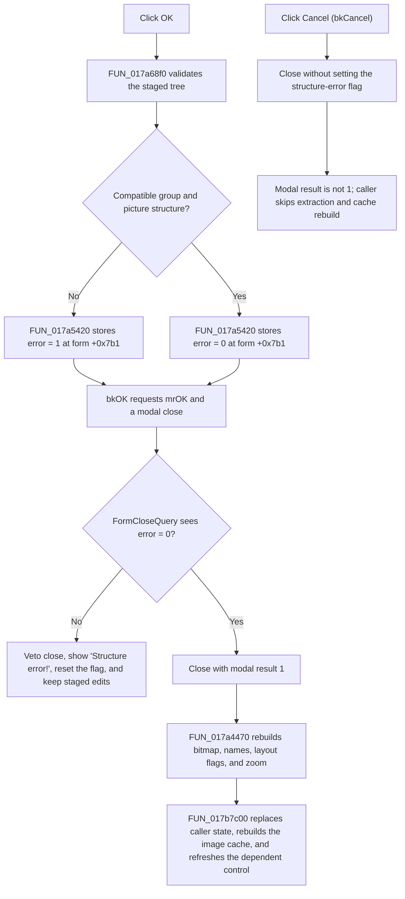

# Accept a validated component-bitmap mapping

> Analysis status: Complete. The recovered click handler, structure validator, close-query handler, modal caller, and bitmap extraction path support this behavior.

## Control

| Property | Recovered value |
| --- | --- |
| Form | ComponentBitmapManager |
| Form caption | Component Bitmaps |
| Component path | ComponentBitmapManager.pnlButtons.pnlStdButtons.btnOK |
| Control class | TBitBtn |
| Kind | bkOK |
| Caption | Supplied by the standard `bkOK` button kind; no explicit caption is stored in the recovered form resource. |
| Handler name | btnOKClick |
| Handler address | 017a5420 |
| Graph node | `resource:dfm:ComponentBitmapManager/ComponentBitmapManager.pnlButtons.pnlStdButtons.btnOK` |
| Handler node | `function:017a5420` |
| Graph layer | UI |

## What happens when clicked

`TComponentBitmapManager.btnOKClick` validates the tree that describes the dialog's staged bitmap mapping. [`FUN_017a5420`](../../../DecompiledSources/Tina16/functions/00000000017A5420__FUN_017a5420.c) stores the Boolean result from [`FUN_017a68f0`](../../../DecompiledSources/Tina16/functions/00000000017A68F0__FUN_017a68f0.c) in form byte `+0x7b1`. In this field, zero means that the structure is accepted and nonzero means that it has an error.

The handler does not copy a bitmap, rebuild a cache, write a file, or directly set `ModalResult`. The button resource has `Kind = bkOK`, so the standard VCL button behavior supplies the accepted modal result and requests that the dialog close. The form's [`OnCloseQuery` handler](../../../DecompiledSources/Tina16/functions/00000000017A4860__FUN_017a4860.c) reads `+0x7b1`. It permits the close when the field is zero. When the field is nonzero, it vetoes the close, displays `Structure error!`, and resets the field to zero for the next close attempt.

Only an accepted modal result crosses the commit boundary. [`FUN_017b7c00`](../../../DecompiledSources/Tina16/functions/00000000017B7C00__FUN_017b7c00.c) owns the dialog and tests the modal result for value `1`. On that branch, it replaces its prior bitmap and optional name-list objects with data extracted from the dialog, rebuilds its image cache and derived counts, and requests a dependent-control refresh. Any other modal result skips this copy-back.

## Accept flow

## Structure validation

The tree uses recovered type values that are assigned by the same form code:

- Top-level bitmap variants use type `0x64`.
- Group nodes use type `0x65` and are created with names such as `Group #...`.
- Picture nodes use type `0x66` and are created with names such as `Picture #...`.

[`FUN_017a67d0`](../../../DecompiledSources/Tina16/functions/00000000017A67D0__FUN_017a67d0.c) rejects a top-level variant whose children mix the group and picture layouts, and it rejects sibling groups with different child counts. [`FUN_017a6870`](../../../DecompiledSources/Tina16/functions/00000000017A6870__FUN_017a6870.c) recursively flattens each node's recovered type byte. The validator compares this sequence for the available top-level variants. A mismatch makes the validation result nonzero.

The validator allocates two temporary byte buffers from the tree-node count and releases both before it returns. It does not modify the staged tree, bitmap image list, caller-owned bitmap, or cache.

## Staged state and committed output

Before the dialog opens, [`FUN_017a4190`](../../../DecompiledSources/Tina16/functions/00000000017A4190__FUN_017a4190.c) copies the caller's bitmap, optional picture names, layout flags, and zoom into the form's tree and image list. Add, Modify, Delete, Delete All, Group, and picture-name actions operate on this dialog-owned working state.

After a valid OK close, the caller first releases its old bitmap and name-list fields. [`FUN_017a4470`](../../../DecompiledSources/Tina16/functions/00000000017A4470__FUN_017a4470.c) then reconstructs these outputs from the three top-level tree branches:

- the combined bitmap image;
- the optional ordered picture-name list;
- picture and group counts;
- flags that identify the additional top-level variants; and
- the picture zoom value.

The extraction path parses the zoom edit after the modal close. It clamps a parsed value less than or equal to `1.0` to `1.0`; larger values are retained. The modal caller then clears and repopulates its image cache, recalculates bitmap and name counts plus a derived size, and calls a virtual refresh method on the dependent UI object.

This path commits only in-memory application state. The recovered handler, validator, extraction helper, and modal caller do not write a bitmap file, project file, registry value, or database row. Durable persistence, if any, occurs outside this path.

## Cancel, errors, and partial state

- `btnCancel` is a standard `bkCancel` button with no recovered custom click handler. It does not run the OK structure validator. Because it does not set the error flag, `FormCloseQuery` permits the cancel close, and the caller skips all copy-back because the result is not `1`.
- A structure error does not discard the user's working tree. It keeps the dialog open, shows `Structure error!`, resets only the close-veto flag, and leaves the staged mapping available for correction.
- Structure validation has no local exception handler. Allocation or tree-access failures therefore propagate through the click path. No caller-owned bitmap has been replaced at that point.
- Bitmap extraction and zoom parsing occur after the caller has released its prior bitmap and name-list objects. These operations have no visible rollback guard. An exception during extraction or the later cache rebuild can therefore leave caller-owned state only partly replaced or refreshed.
- A zoom conversion error is not part of the structure check. It can occur in the accepted-result extraction path when the float edit is read.
- Cancel discards the dialog's staged mapping when the caller destroys the form. It does not restore data because the caller-owned mapping was not changed before acceptance.

## Handler evidence

- OK handler: [FUN_017a5420](../../../DecompiledSources/Tina16/functions/00000000017A5420__FUN_017a5420.c)
- Structure validator: [FUN_017a68f0](../../../DecompiledSources/Tina16/functions/00000000017A68F0__FUN_017a68f0.c)
- Close-query veto: [FUN_017a4860](../../../DecompiledSources/Tina16/functions/00000000017A4860__FUN_017a4860.c)
- Dialog input staging: [FUN_017a4190](../../../DecompiledSources/Tina16/functions/00000000017A4190__FUN_017a4190.c)
- Dialog output extraction: [FUN_017a4470](../../../DecompiledSources/Tina16/functions/00000000017A4470__FUN_017a4470.c)
- Modal owner and accepted-result commit: [FUN_017b7c00](../../../DecompiledSources/Tina16/functions/00000000017B7C00__FUN_017b7c00.c)
- Recovered form evidence: [ui-evidence.json](../../../DecompiledSources/Tina16/resources/dfm/ui-evidence.json)
- Complexity: simple
- Distinct outgoing calls: 1

## Direct call

- `function:017a68f0` — Validates the staged bitmap-tree structure and returns a structure-error flag.

## Analysis limits

- The recovered type values and traversal prove compatible group/picture topology. The decompiled tree helper names are unresolved, so this article does not assign stronger Delphi names to the individual layout rules.
- The standard `bkOK` and `bkCancel` modal behavior is established by the recovered resource kinds and by the caller's explicit test for accepted result `1`; it is not an explicit modal-result assignment in `FUN_017a5420`.
- The final virtual refresh target is clear from its position after cache reconstruction, but the recovered source does not supply its Delphi member name.
