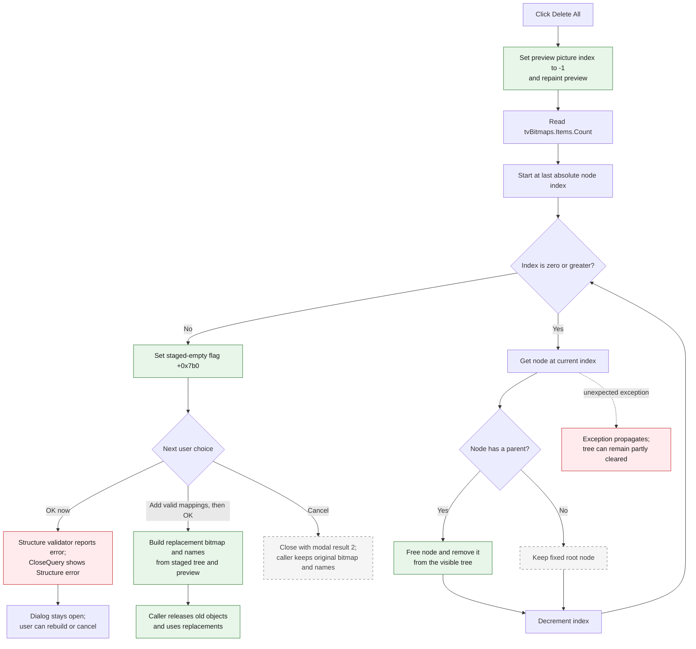

# Delete All

> Analysis status: Complete. The recovered handler, tree construction and extraction paths, preview helper, OK validation, modal caller, and form resource agree on this control's behavior.

## Control

| Property | Recovered value |
| --- | --- |
| Form | ComponentBitmapManager |
| Form class | `TComponentBitmapManager` |
| Form caption | Component Bitmaps |
| Component path | ComponentBitmapManager.pnlButtons.btnReset |
| Control class | TButton |
| Caption | Delete All |
| Hint | Not present in the recovered resource. |
| Handler name | btnResetClick |
| Handler address | 017a5390 |
| Graph node | `resource:dfm:ComponentBitmapManager/ComponentBitmapManager.pnlButtons.btnReset` |
| Handler node | `function:017a5390` |
| Graph layer | UI |

## What happens when clicked

The button removes all staged component-bitmap mappings from the dialog. It does not delete the three fixed category roots, write a file, or immediately replace the caller's bitmap resources.

`FUN_017a5390` performs these operations without a confirmation prompt:

1. It calls `FUN_007d6450` on the dialog's bitmap-preview object at `+0x780`. This assigns preview index `-1` and repaints the preview, so no mapped picture remains selected.
2. It gets `tvBitmaps.Items.Count` from the tree view at `+0x6f0`.
3. It walks the nodes from the last absolute index to index `0`.
4. For each node, it gets the node's parent. A node with a parent is freed and removed from the tree. A node without a parent is kept.
5. After the loop completes, it sets form byte `+0x7b0` to true. The Add path uses this byte to initialize the preview dimensions and format from the first replacement bitmap.

Walking backward keeps the remaining absolute indexes valid while nodes are removed. The handler has no selected-node guard: the result is the same for a root, group, picture, or empty selection.

## Exact reset scope

The dialog tree uses three node kinds:

| Recovered node value | Role | Delete All result |
| --- | --- | --- |
| `100` | One of three fixed root categories | Kept because its parent is null. |
| `101` | A generated `Group #n` mapping node | Removed because it is below a root. |
| `102` | A generated or named `Picture #n` mapping node with a preview bitmap index | Removed because it is below a root or group. |

The form population path creates or uses the three root nodes, then adds all group and picture mappings below them. Thus, the parent test removes every user mapping in all three categories while preserving the dialog's required top-level structure.

The preview reset changes the current preview index. The click handler does not free the preview component or explicitly erase its internal pixel surface. The now-empty tree is the authoritative staged mapping. If the user adds a new picture, the true `+0x7b0` flag makes that first Add operation reinitialize the preview from the selected bitmap.

## Click, validation, and commit flow

## Staged state and the OK or Cancel boundary

`FUN_017b7c00` proves that this dialog edits staged state:

- It constructs the modal Component Bitmap Manager and calls `FUN_017a4190` to populate the dialog tree and preview from the caller's existing bitmap, names, layout values, and zoom.
- It calls `ShowModal`.
- It replaces caller-owned data only when `ShowModal` returns `1`, the OK result.
- For Cancel or any other result, it destroys the form and leaves the caller's bitmap, optional name list, layout values, zoom, and preview unchanged.

The built-in Cancel button has `Kind=bkCancel` and no custom click handler. Therefore, Cancel after Delete All discards the empty staged tree.

The built-in OK button calls `FUN_017a68f0` before the modal form can close. That function validates the tree structure. Immediately after Delete All, the first fixed root has no child mapping, so validation reports an error. `FormCloseQuery` then shows **Structure error!** and keeps the dialog open. It resets the error byte after this rejected close attempt, so the user can add valid mappings or cancel.

If the user rebuilds a valid structure and then selects OK, `FUN_017a4470` allocates replacement bitmap and name objects and copies only picture mappings present in the staged tree. The modal caller releases its old bitmap and optional name list and installs these replacements. Delete All itself never crosses this ownership boundary.

## UI and state effects

| Field or control | Proven effect |
| --- | --- |
| Bitmap preview at `+0x780` | Current picture index becomes `-1`; the component is repainted. Its object and pixel surface are not freed by this handler. |
| `tvBitmaps` at `+0x6f0` | All descendant group and picture nodes are removed. The three parentless roots remain visible. |
| `edName` and `fleZoom` | The handler does not assign them directly. Tree selection-change handling disables them when the resulting selection is not a picture node. |
| Empty-map byte at `+0x7b0` | Set true after a complete reset. The first later Add initializes the preview dimensions, format, and reference value, then clears this byte. |
| OK validation byte at `+0x7b1` | Not changed by Delete All. OK validation sets it when the empty tree is structurally invalid; CloseQuery consumes and clears it. |
| Caller-owned bitmap and name list | Unchanged until a later valid OK result. Cancel keeps them unchanged. |

Action-update handlers derive their state from the selected node and its parent. With only root nodes left, **Delete** cannot delete a root. **Group** can remain available for a selected root, and **Add** can rebuild mappings. Delete All does not close or disable the dialog.

## Confirmation, no-op, and boundary behavior

- Confirmation: none. The click begins the staged reset immediately.
- Empty mapped tree: the loop sees only the three roots, keeps them, clears the preview selection, and sets `+0x7b0` true again.
- No tree selection: the handler still resets all descendants because it uses the full node count, not the selection.
- One mapping: that node is removed; the roots remain.
- Nested groups: reverse iteration removes picture descendants and then their group nodes.
- Repeated click: after the first completed reset, the second click keeps the same three roots and repeats the preview and flag updates.
- Immediate OK: rejected with **Structure error!**. The empty mapping cannot be committed.
- Cancel: closes the modal dialog and preserves all caller-owned input objects.

## Ownership and errors

The TreeView owns its `TTreeNode` objects. `FUN_006de140` frees a node only when its deletion flag is clear; VCL destruction removes it from the tree. The reverse loop does not keep pointers to freed nodes. The three root nodes remain owned by the TreeView and are destroyed with the form.

The preview object is a form-owned component. Delete All only sets its current picture index to `-1`; it does not transfer or release preview ownership. The original bitmap and optional names remain caller-owned throughout the modal edit. A valid OK result is the only normal path that releases and replaces those caller objects.

The reset handler has no local exception handler and no rollback:

- If the preview-index update raises, no tree node has been removed.
- If node lookup, parent lookup, or node destruction raises during the loop, earlier nodes stay deleted and later nodes remain. The final `+0x7b0` assignment is not reached.
- No local error message describes a partial reset. The exception propagates through the Delphi runtime.
- A later accepted extraction and caller replacement also have no transaction in the recovered caller. Delete All does not start that work; it occurs only after a structurally valid OK result.

## Evidence

- Delete All handler: [FUN_017a5390](../../../DecompiledSources/Tina16/functions/00000000017A5390__FUN_017a5390.c)
- Preview-index clear wrapper: [FUN_007d6450](../../../DecompiledSources/Tina16/functions/00000000007D6450__FUN_007d6450.c)
- Preview index assignment and repaint: [FUN_007d6390](../../../DecompiledSources/Tina16/functions/00000000007D6390__FUN_007d6390.c)
- Tree node count: [FUN_006decb0](../../../DecompiledSources/Tina16/functions/00000000006DECB0__FUN_006decb0.c)
- Tree absolute-index lookup: [FUN_006df500](../../../DecompiledSources/Tina16/functions/00000000006DF500__FUN_006df500.c)
- Tree parent lookup: [FUN_006dd390](../../../DecompiledSources/Tina16/functions/00000000006DD390__FUN_006dd390.c)
- Tree node release: [FUN_006de140](../../../DecompiledSources/Tina16/functions/00000000006DE140__FUN_006de140.c)
- Initial tree and preview population: [FUN_017a4190](../../../DecompiledSources/Tina16/functions/00000000017A4190__FUN_017a4190.c)
- Group and picture-node construction: [FUN_017a3ee0](../../../DecompiledSources/Tina16/functions/00000000017A3EE0__FUN_017a3ee0.c)
- Add-after-empty initialization: [FUN_017a48e0](../../../DecompiledSources/Tina16/functions/00000000017A48E0__FUN_017a48e0.c)
- OK click validation route: [FUN_017a5420](../../../DecompiledSources/Tina16/functions/00000000017A5420__FUN_017a5420.c)
- Structure validator: [FUN_017a68f0](../../../DecompiledSources/Tina16/functions/00000000017A68F0__FUN_017a68f0.c)
- Close-query error gate: [FUN_017a4860](../../../DecompiledSources/Tina16/functions/00000000017A4860__FUN_017a4860.c)
- Accepted output reconstruction: [FUN_017a4470](../../../DecompiledSources/Tina16/functions/00000000017A4470__FUN_017a4470.c)
- Modal caller and commit boundary: [FUN_017b7c00](../../../DecompiledSources/Tina16/functions/00000000017B7C00__FUN_017b7c00.c)

The recovered DFM supplies the direct **Delete All** caption and `btnResetClick` binding. It supplies no hint or glyph. The nearby labels **3D Part Name** and **Picture zoom** describe the picture-edit fields; proximity alone is not used as reset evidence.

## Analysis limits

- The recovered source does not expose Delphi names or captions for the three fixed root categories. Their parentless position, node kind, construction, and use establish their structural role.
- The custom preview component's Delphi class name is not recovered. Its index setter, bitmap-copy paths, and repaint call establish the behavior used here.
- The handler does not explicitly choose the TreeView selection after deletion. VCL node destruction and selection-change events control the exact remaining selected root or null selection.
