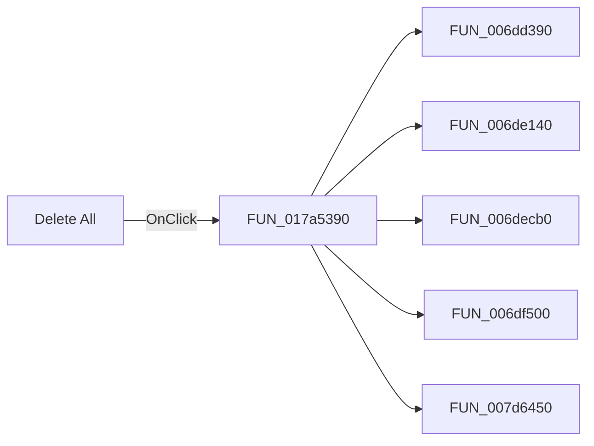

# Delete All

> Analysis status: Pending individual source review.

## Control

| Property | Recovered value |
| --- | --- |
| Form | ComponentBitmapManager |
| Component path | ComponentBitmapManager.pnlButtons.btnReset |
| Control class | TButton |
| Caption | Delete All |
| Hint | Not present in the recovered resource. |
| Text | Not present in the recovered resource. |
| Handler name | btnResetClick |
| Handler address | 017a5390 |
| Graph node | `resource:dfm:ComponentBitmapManager/ComponentBitmapManager.pnlButtons.btnReset` |
| Handler node | `function:017a5390` |
| Graph layer | UI |

## What happens when clicked

Pending individual analysis. An agent must read the recovered handler source and its relevant callees before it replaces this text.

## Click flow

## Handler evidence

- Source: [DecompiledSources/Tina16/functions/00000000017A5390__FUN_017a5390.c](../../../DecompiledSources/Tina16/functions/00000000017A5390__FUN_017a5390.c)
- Recovered role: Not present in the recovered resource.
- Current graph summary: Handles 1 Delphi UI event: ComponentBitmapManager.pnlButtons.btnReset.OnClick.
- Current graph behavior: Not present in the recovered resource.
- Current graph evidence: Not present in the recovered resource.
- Complexity: complex
- Distinct outgoing calls: 5

## Direct calls

- `function:006dd390` — FUN_006dd390
- `function:006de140` — FUN_006de140
- `function:006decb0` — FUN_006decb0
- `function:006df500` — FUN_006df500
- `function:007d6450` — FUN_007d6450

## Resource evidence

- Kind: Not present in the recovered resource.
- Modal result: Not present in the recovered resource.
- Checked state: Not present in the recovered resource.
- List items: Not present in the recovered resource.
- Image reference: Not present in the recovered resource.
- Extracted glyph: None.

## Nearby label candidates

Nearby labels are layout candidates only. They are not proof of behavior.

- Rank 1: 3D Part Name at distance 71.
- Rank 2: Picture zoom at distance 109.

## Analysis limits

- Do not infer behavior from the control class, caption, hint, glyph, or nearby label alone.
- Do not replace the pending status until the handler source and relevant call path provide enough evidence.
