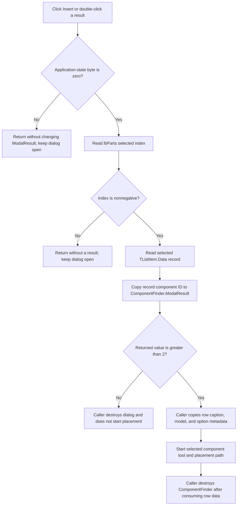

# Insert the selected component search result

> Analysis status: Source reviewed. Selection guards, modal-result transfer, caller-owned placement, search and list relationships, close behavior, and error boundaries are documented.

## Control

| Property | Recovered value |
| --- | --- |
| Form | ComponentFinder |
| Form caption | Find Component |
| Component path | ComponentFinder.btnInsert |
| Control class | TBitBtn |
| Caption | &Insert... |
| Initial state | Disabled |
| Handler name | btnInsertClick |
| Handler address | 01bad1e0 |
| Resource graph node | `resource:dfm:ComponentFinder/ComponentFinder.btnInsert` |
| Handler graph node | `function:01bad1e0` |
| Resource graph layer | tina.exe |
| Handler graph layer | UI |

## What happens when clicked

`FUN_01bad1e0` does not have a separate Insert implementation. It calls
`FUN_01bacfd0`, the handler for `lbParts.OnDblClick`. The button and a double
click on a result therefore use the same selection and result-transfer path.

The shared handler follows these steps:

1. It reads a process-wide application-state byte at offset `+0x218` from the
   object returned by `FUN_019a4600`. If this byte is nonzero, it returns.
2. It gets the selected index from `lbParts` at form offset `+0x700`. If the
   index is negative, it returns.
3. It gets `lbParts.Items[index]`, reads the record attached to the item's
   `Data` field at item offset `+0x40`, and reads the record's first 32-bit
   value.
4. It writes that value to the form field at `+0x508`. The modal caller proves
   that this field is the form's `ModalResult` and that the value is the
   selected component identifier.

The handler does not copy the component into the schematic. It publishes the
identifier and lets the modal form return to its owner.

## Search and selection relationship

The DFM starts Insert disabled. `cbEdit.OnChange` and
`rgPatternPos.OnClick` clear `lbParts` and disable Insert through
`FUN_01bacf50`.

`btnSearchClick` rebuilds the result list. Each row gets a display caption and
an attached result record. Search enables Insert only when at least one result
exists and the same application-state byte permits insertion. It then selects
row zero. This normal path gives Insert a valid initial selection.

`lbParts.OnClick` only updates the hidden `current/total` label. It does not
publish a component identifier. `lbParts.OnKeyPress` implements incremental
list selection. It also does not publish an identifier. A list double click or
the Insert button is required to run `FUN_01bacfd0`.

The shared handler repeats the state and selected-index checks. A stale or
programmatic click therefore does not rely only on the button's enabled state.

## Modal result and placement ownership

`FUN_01c979b0` is the recovered handler for **Schematic Editor > Tools > Find
Component**. It constructs ComponentFinder and calls `ShowModal`. It owns the
result and all later placement work.

If the modal result is greater than `2`, the caller:

- stores the returned component identifier in schematic-editor state at
  `+0x1840`;
- reads the still-selected list row and copies its caption to `+0x1848`;
- reads the row's attached record and copies its model and option metadata to
  the editor;
- initializes the model text to `<Auto>`;
- calls `FUN_01c6ec30` with either the selected identifier or the recovered
  special component code `0x39`, according to the selected record's metadata.

`FUN_01c6ec30` owns the component-tool transition. Its accepted path clears
the previous tool state, constructs the selected component object, adds it to
the current design, positions it at the current editor location, and stores it
as the active insertion object. It can return before this work if the editor
or document state does not allow insertion.

The caller consumes the selected row and its attached record before it
destroys ComponentFinder. Form destruction frees the form's result-record
list. This ordering keeps ownership in the dialog while the caller reads the
selection and prevents use of the row after the dialog is destroyed.

## Close, cancel, and no-result behavior

The shared handler does not call `Close` or `Hide`. A nonzero assignment to
`ModalResult` makes the VCL modal form return. The caller then destroys the
dialog on every result path.

`btnClose` has `Kind = bkCancel` and returns modal result `2`. The schematic
editor accepts only values greater than `2`, so Cancel does not read selection
metadata and does not start placement.

The recovered boundaries are:

- A nonzero application-state byte causes a no-op. The dialog stays open
  because the handler does not change `ModalResult`.
- A negative selected index also causes a no-op and keeps the dialog open.
- A selected record value of `0` writes modal result zero, which does not
  request a modal return.
- Values `1` or `2` can close the dialog, but the caller rejects them as
  component identifiers and does not start placement.
- Values greater than `2` are treated as component identifiers. The handler
  does not validate the identifier against a separate range.

## Click flow

## Handler and call evidence

- [Insert wrapper `FUN_01bad1e0`](../../../DecompiledSources/Tina16/functions/0000000001BAD1E0__FUN_01bad1e0.c)
  contains only the call to the list double-click handler.
- [Selected-result handler `FUN_01bacfd0`](../../../DecompiledSources/Tina16/functions/0000000001BACFD0__FUN_01bacfd0.c)
  checks the application-state byte and selected index, retrieves the selected
  item, and writes the attached record's first value to form offset `+0x508`.
- [Search handler `FUN_01bac450`](../../../DecompiledSources/Tina16/functions/0000000001BAC450__FUN_01bac450.c)
  owns result-record lifetime, rebuilds `lbParts`, attaches each record to its
  list item, selects the first row, and controls Insert availability.
- [Query or match-mode change handler `FUN_01bacf50`](../../../DecompiledSources/Tina16/functions/0000000001BACF50__FUN_01bacf50.c)
  clears the list and disables Insert.
- [List click handler `FUN_01bad1f0`](../../../DecompiledSources/Tina16/functions/0000000001BAD1F0__FUN_01bad1f0.c)
  formats the current index and total count for the status label.
- [List key handler `FUN_01bad060`](../../../DecompiledSources/Tina16/functions/0000000001BAD060__FUN_01bad060.c)
  implements timed incremental selection and consumes handled characters.
- [Finder destruction handler `FUN_01bace90`](../../../DecompiledSources/Tina16/functions/0000000001BACE90__FUN_01bace90.c)
  frees every stored result record and its container.
- [Schematic-editor modal caller `FUN_01c979b0`](../../../DecompiledSources/Tina16/functions/0000000001C979B0__FUN_01c979b0.c)
  accepts only results greater than `2`, consumes the selected row, starts the
  placement transition, and destroys the dialog.
- [Placement transition `FUN_01c6ec30`](../../../DecompiledSources/Tina16/functions/0000000001C6EC30__FUN_01c6ec30.c)
  validates editor state and owns component construction, design insertion,
  initial position, and active insertion state.

The graph records one direct call from `FUN_01bad1e0` to `FUN_01bacfd0`. It
also records the `btnInsert.OnClick` trigger and the separate
`lbParts.OnDblClick` trigger to the shared handler.

## Resource evidence

- `btnInsert` is a `TBitBtn` with caption `&Insert...`, initial
  `Enabled = false`, two glyph frames, and no recovered hint or embedded glyph.
- `lbParts` is a read-only `TListView` with click, double-click, information-tip,
  and key-press handlers.
- `cbEdit` is the query control. The nearby label is **Component to find:**.
- `rgPatternPos` supplies the match choices `start`, `anywhere`, and `end`.
- `btnClose` has `Kind = bkCancel` and no custom click handler.

## Error and validation boundaries

- The handler has no direct error message and no local exception handler.
- It checks the selected index, but it does not check the selected item, its
  `Data` pointer, or the attached record before dereferencing them. The normal
  search path creates and attaches these records. A corrupt or externally
  modified row can therefore fail in VCL access or record dereference.
- The application-state byte's exact Delphi field name is not recovered. Its
  behavior is proven because Search uses it to gate Insert availability and
  the shared result handler checks it again.
- No file, registry, database, or catalogue write occurs in the button or
  shared result handler. Later schematic changes belong to the modal caller
  and placement routine.
