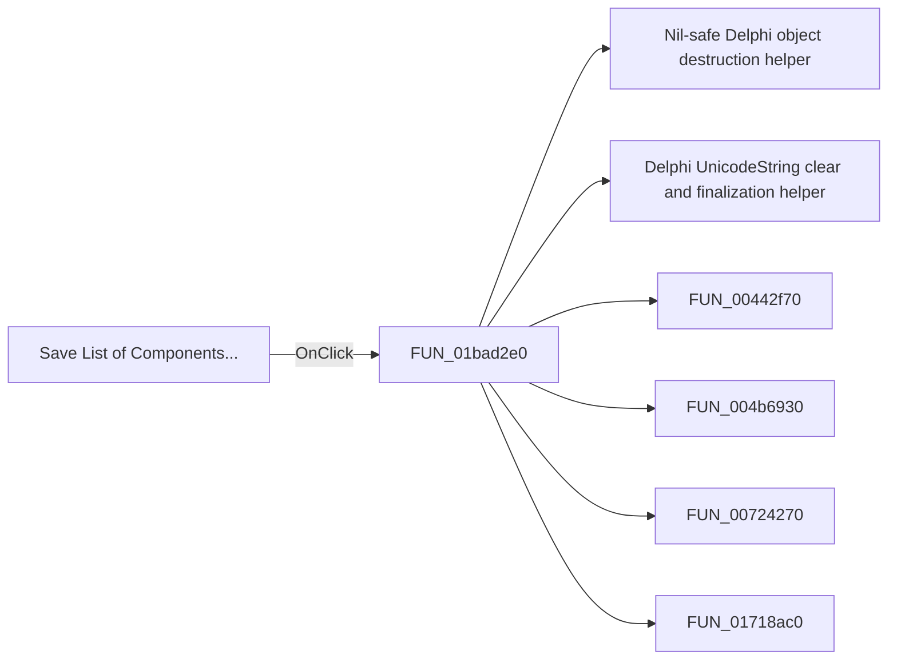

# Save List of Components...

> Analysis status: Pending individual source review.

## Control

| Property | Recovered value |
| --- | --- |
| Form | ComponentFinder |
| Component path | ComponentFinder.btnListComponents |
| Control class | TButton |
| Caption | Save List of Components... |
| Hint | Not present in the recovered resource. |
| Text | Not present in the recovered resource. |
| Handler name | btnListComponentsClick |
| Handler address | 01bad2e0 |
| Graph node | `resource:dfm:ComponentFinder/ComponentFinder.btnListComponents` |
| Handler node | `function:01bad2e0` |
| Graph layer | UI |

## What happens when clicked

Pending individual analysis. An agent must read the recovered handler source and its relevant callees before it replaces this text.

## Click flow

## Handler evidence

- Source: [DecompiledSources/Tina16/functions/0000000001BAD2E0__FUN_01bad2e0.c](../../../DecompiledSources/Tina16/functions/0000000001BAD2E0__FUN_01bad2e0.c)
- Recovered role: Not present in the recovered resource.
- Current graph summary: Handles 1 Delphi UI event: ComponentFinder.btnListComponents.OnClick.
- Current graph behavior: Not present in the recovered resource.
- Current graph evidence: Not present in the recovered resource.
- Complexity: complex
- Distinct outgoing calls: 7

## Direct calls

- `function:00410f20` — Nil-safe Delphi object destruction helper
- `function:00414480` — Delphi UnicodeString clear and finalization helper
- `function:00442f70` — FUN_00442f70
- `function:004b6930` — FUN_004b6930
- `function:00724270` — FUN_00724270
- `function:01718ac0` — FUN_01718ac0
- `function:0172f660` — FUN_0172f660

## Resource evidence

- Kind: Not present in the recovered resource.
- Modal result: Not present in the recovered resource.
- Checked state: Not present in the recovered resource.
- List items: Not present in the recovered resource.
- Image reference: Not present in the recovered resource.
- Extracted glyph: None.

## Nearby label candidates

Nearby labels are layout candidates only. They are not proof of behavior.

- Rank 1: 00000/00000 at distance 91.
- Rank 2: Component to find: at distance 335.

## Analysis limits

- Do not infer behavior from the control class, caption, hint, glyph, or nearby label alone.
- Do not replace the pending status until the handler source and relevant call path provide enough evidence.
