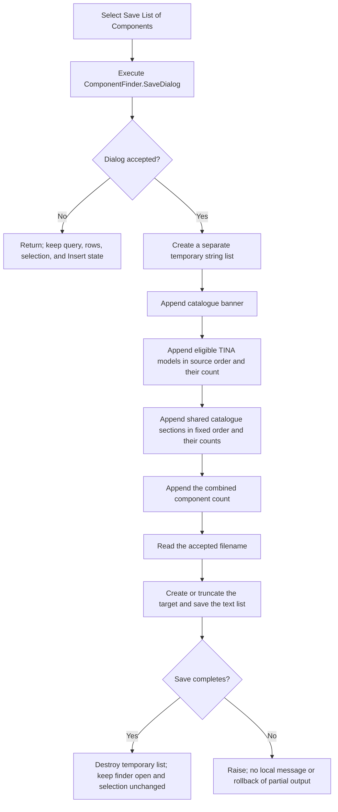

# Save the complete component catalogue as a text list

> Analysis status: Source reviewed. The save-dialog gate, catalogue inputs, output order, counts, list and selection boundaries, shared ownership, Insert contrast, and error boundary are documented.

## Control

| Property | Recovered value |
| --- | --- |
| Form | ComponentFinder |
| Form caption | Find Component |
| Component path | ComponentFinder.btnListComponents |
| Control class | TButton |
| Caption | Save List of Components... |
| Hint | Not present in the recovered resource. |
| Handler name | btnListComponentsClick |
| Handler address | 01bad2e0 |
| Resource graph node | `resource:dfm:ComponentFinder/ComponentFinder.btnListComponents` |
| Handler graph node | `function:01bad2e0` |
| Resource graph layer | tina.exe |
| Handler graph layer | UI |

## What happens when clicked

`FUN_01bad2e0` first executes the form's `TSaveDialog` at offset `0x6F8`.
Cancel returns immediately. It does not allocate the output list, enumerate a
catalogue, or open a file.

After acceptance, the handler creates a separate in-memory string list and
appends this banner:

```text
****************************************************
********** Components in TINA catalogue ************
****************************************************
```

It then appends two catalogue groups and their counts:

1. `FUN_0172f660` adds the `TINA Models` section from the global TINA model
   tables. It scans the recovered table in increasing source index, applies
   the recovered eligibility checks, emits the accepted display names in
   four padded columns per output line, and adds
   `#Number of TINA Models : %d`.
2. `FUN_01718ac0` adds catalogue sections from the shared catalogue object at
   form offset `0x730`. The visible fixed order starts with `%SPICE
   Subcircuits`, `%SPICE .MODELs`, `%S-parameter /4 poles/`, and
   `%S-parameter /2 poles/`, followed by four data-driven category headings.
   Its section helper walks each stored list in index order, omits entries
   marked `[Internal]`, applies a category filter when supplied, and formats
   accepted names in two columns. Each section gets a count, followed by a
   Spice-catalogue count.

The handler adds the two returned counts and writes
`#Total number of components: %d`. It reads the accepted dialog filename with
`FUN_00724270` and calls the temporary string list's one-argument
`SaveToFile`. The temporary list is destroyed after the normal save path.

## Query and visible-result boundary

This command does not export the current search result. The handler does not
read:

- the `cbEdit` component-name query;
- the `rgPatternPos` choice (`start`, `anywhere`, or `end`);
- the search backing list at form offset `0x718`;
- the `lbParts` rows or current selected row.

It reads only `SaveDialog` and the shared catalogue field, while the TINA-model
helper reads the global model tables. Therefore, the output is the complete
eligible catalogue view produced by the two export helpers. Search text,
match position, the number of visible results, and selection do not filter it.

The export also does not clear or rebuild `lbParts`, reset its selected index,
change the hidden `00000/00000` result label, or enable or disable `Insert`.
The current result rows and selection remain available after cancel or a
normal save.

## Catalogue ownership and later Insert use

`ComponentFinder.FormCreate` obtains the object stored at `0x730` through
`FUN_017105e0`. That accessor lazily creates one process-wide catalogue,
registers `<COMMONCATDIR>` and `<CATALOGDIR>`, loads it, caches it in
`DAT_0210ff88`, and returns the cached object on later calls. Form destruction
does not destroy this field. The export reads the shared object and does not
change its section lists.

Search uses this same catalogue through different matching routines and puts
matching records in `lbParts`. This produces the rows that the later Insert
command uses, but the saved text file is not an Insert input.

`btnInsertClick` delegates to the list double-click handler. When a row is
selected and the recovered application-state guard allows insertion, that
handler reads the selected row's attached record and copies its first 32-bit
component identifier to the form result field at `0x508`. The
`SchematicEditor` Find Component caller receives that value as the modal
result, then reads more metadata from the selected row and starts component
insertion. Clicking Save List does not set this result field or close the
finder, so it does not insert a component.

## File format, progress, and errors

- The output is line-oriented text from the temporary string list. The handler
  does not select a text encoding or preamble. The recovered VCL save path uses
  the list's current encoding, or its default encoding when the current value
  is null, and writes a preamble only when the list's preamble option is set.
- The whole catalogue list is constructed before `SaveToFile` creates or
  truncates the target. An enumeration or formatting exception therefore
  occurs before this handler opens the selected file.
- The handler has no application overwrite check. The recovered DFM does not
  show `SaveDialog.Options`, so a native overwrite prompt is not proven. After
  dialog acceptance, the VCL file stream uses its create/truncate mode.
- File creation, encoding, and writing have no local exception handler,
  success message, backup, temporary output file, atomic rename, or rollback.
  A failure after create/truncate can leave a truncated file, a preamble, or a
  partial payload. The VCL complete-write helper raises when a write is
  negative or cannot make progress.
- The handler has no catalogue-build progress dialog and no cancel check after
  the save dialog. This differs from `btnSearchClick`, which creates a visible
  `Searching...` progress form. A large export runs synchronously until it
  saves or raises.
- The application code does not validate an accepted filename before passing
  it to `SaveToFile`. Path, access, and storage errors remain file-system or
  VCL exceptions.

## Click flow



## Handler and call evidence

- [Save-list handler `FUN_01bad2e0`](../../../DecompiledSources/Tina16/functions/0000000001BAD2E0__FUN_01bad2e0.c)
  gates all work on `SaveDialog.Execute`, builds the temporary list, adds both
  helper counts, reads the filename, saves the list, and destroys it.
- [TINA-model list builder `FUN_0172f660`](../../../DecompiledSources/Tina16/functions/000000000172F660__FUN_0172f660.c)
  supplies the `TINA Models` heading, table scan, four-column lines, and count.
- [Shared-catalogue list builder `FUN_01718ac0`](../../../DecompiledSources/Tina16/functions/0000000001718AC0__FUN_01718ac0.c)
  appends the ordered SPICE and data-driven sections and returns their combined
  count.
- [Catalogue section formatter `FUN_0171a190`](../../../DecompiledSources/Tina16/functions/000000000171A190__FUN_0171a190.c)
  walks stored entries in order, excludes `[Internal]`, applies its optional
  category filter, and emits two-column lines.
- [ComponentFinder creation handler `FUN_01bacc80`](../../../DecompiledSources/Tina16/functions/0000000001BACC80__FUN_01bacc80.c)
  obtains and stores the shared catalogue and initializes other form-local
  state.
- [Shared catalogue accessor `FUN_017105e0`](../../../DecompiledSources/Tina16/functions/00000000017105E0__FUN_017105e0.c)
  creates, loads, caches, and returns the process-wide catalogue.
- [Insert wrapper `FUN_01bad1e0`](../../../DecompiledSources/Tina16/functions/0000000001BAD1E0__FUN_01bad1e0.c)
  delegates Insert to the list double-click handler.
- [Selected-row result handler `FUN_01bacfd0`](../../../DecompiledSources/Tina16/functions/0000000001BACFD0__FUN_01bacfd0.c)
  copies the selected row's component identifier to the form result field.
- [Schematic editor consumer `FUN_01c979b0`](../../../DecompiledSources/Tina16/functions/0000000001C979B0__FUN_01c979b0.c)
  shows ComponentFinder, tests its returned identifier, and consumes selected
  row metadata for component insertion.
- [VCL one-argument SaveToFile `FUN_004b4900`](../../../DecompiledSources/Tina16/functions/00000000004B4900__FUN_004b4900.c)
  forwards the string list's current encoding.
- [VCL file SaveToFile `FUN_004b4920`](../../../DecompiledSources/Tina16/functions/00000000004B4920__FUN_004b4920.c)
  creates or truncates the target before stream serialization.
- [VCL text serializer `FUN_004b49c0`](../../../DecompiledSources/Tina16/functions/00000000004B49C0__FUN_004b49c0.c)
  selects current/default encoding, optionally writes a preamble, and writes
  the encoded text.

The graph records seven direct calls from `FUN_01bad2e0`: two catalogue
builders, dialog filename retrieval, string-list construction, integer text
formatting, temporary-object destruction, and UnicodeString cleanup. The VCL
`SaveToFile` target is reached through a virtual call and is not a direct graph
edge from the handler.

## Resource evidence

- `btnListComponents` is an anchored `TButton` with caption `Save List of
  Components...`, tab order 4, and no recovered hint, image, or embedded glyph.
- `SaveDialog` is a `TSaveDialog`; only its layout coordinates are present in
  the recovered DFM.
- `lbParts` is a read-only `TListView`. `btnInsert` starts disabled and has the
  caption `&Insert...`. These controls support the search-and-insert workflow,
  but the export handler does not access them.

## Analysis limits

- Four shared-catalogue section headings are data-driven and are not decoded in
  this source. Their iteration order and counts are proven, but their exact
  displayed names are not.
- Some TINA-model eligibility tests are implemented by deeper catalogue
  helpers. The article does not assign business meanings to their opaque flags.
- The form initializes `SaveDialog.FileName` during `FormCreate`, but the
  composed default path text is not decoded. The exact native overwrite prompt,
  final encoding, preamble, and line separator depend on dialog or VCL runtime
  state.
