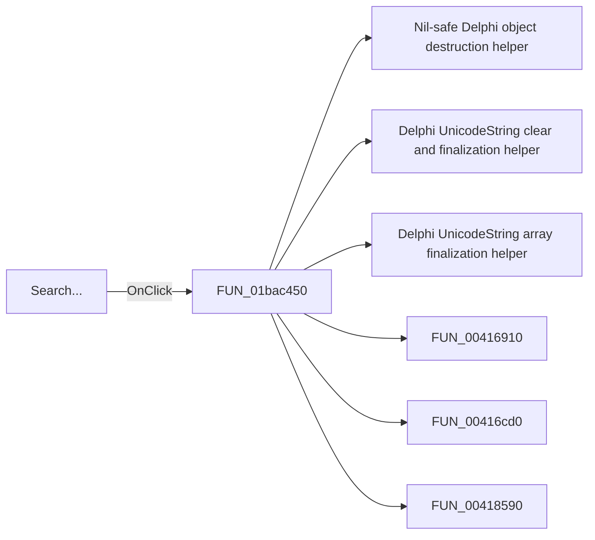

# Search...

> Analysis status: Pending individual source review.

## Control

| Property | Recovered value |
| --- | --- |
| Form | ComponentFinder |
| Component path | ComponentFinder.btnSearch |
| Control class | TButton |
| Caption | Search... |
| Hint | Not present in the recovered resource. |
| Text | Not present in the recovered resource. |
| Handler name | btnSearchClick |
| Handler address | 01bac450 |
| Graph node | `resource:dfm:ComponentFinder/ComponentFinder.btnSearch` |
| Handler node | `function:01bac450` |
| Graph layer | UI |

## What happens when clicked

Pending individual analysis. An agent must read the recovered handler source and its relevant callees before it replaces this text.

## Click flow

## Handler evidence

- Source: [DecompiledSources/Tina16/functions/0000000001BAC450__FUN_01bac450.c](../../../DecompiledSources/Tina16/functions/0000000001BAC450__FUN_01bac450.c)
- Recovered role: Not present in the recovered resource.
- Current graph summary: Handles 1 Delphi UI event: ComponentFinder.btnSearch.OnClick.
- Current graph behavior: Not present in the recovered resource.
- Current graph evidence: Not present in the recovered resource.
- Complexity: complex
- Distinct outgoing calls: 30

## Direct calls

- `function:00410f20` — Nil-safe Delphi object destruction helper
- `function:00414480` — Delphi UnicodeString clear and finalization helper
- `function:00414560` — Delphi UnicodeString array finalization helper
- `function:00416910` — FUN_00416910
- `function:00416cd0` — FUN_00416cd0
- `function:00418590` — FUN_00418590
- `function:0043e130` — FUN_0043e130
- `function:0043f750` — FUN_0043f750
- `function:004b3cf0` — Delphi string-list name getter
- `function:004b5390` — Delphi string-list value getter
- `function:0064dbe0` — FUN_0064dbe0
- `function:0064dd90` — VCL control Unicode text reader
- `function:0064de00` — VCL control text setter with change suppression
- `function:00688430` — FUN_00688430
- `function:006ef050` — FUN_006ef050
- `function:006ef160` — FUN_006ef160
- `function:006efb70` — FUN_006efb70
- `function:006efc30` — FUN_006efc30
- `function:006f6890` — FUN_006f6890
- `function:007fc180` — FUN_007fc180
- `function:008059a0` — FUN_008059a0
- `function:0080cc70` — FUN_0080cc70
- `function:00b89270` — FUN_00b89270
- `function:00b8e520` — FUN_00b8e520
- `function:00c54370` — FUN_00c54370
- `function:016fd940` — FUN_016fd940
- `function:017189e0` — FUN_017189e0
- `function:0172ece0` — FUN_0172ece0
- `function:019a4600` — FUN_019a4600
- `function:01bab4e0` — FUN_01bab4e0

## Resource evidence

- Kind: Not present in the recovered resource.
- Modal result: Not present in the recovered resource.
- Checked state: Not present in the recovered resource.
- List items: Not present in the recovered resource.
- Image reference: Not present in the recovered resource.
- Extracted glyph: None.

## Nearby label candidates

Nearby labels are layout candidates only. They are not proof of behavior.

- Rank 1: Component to find: at distance 201.
- Rank 2: 00000/00000 at distance 315.

## Analysis limits

- Do not infer behavior from the control class, caption, hint, glyph, or nearby label alone.
- Do not replace the pending status until the handler source and relevant call path provide enough evidence.
