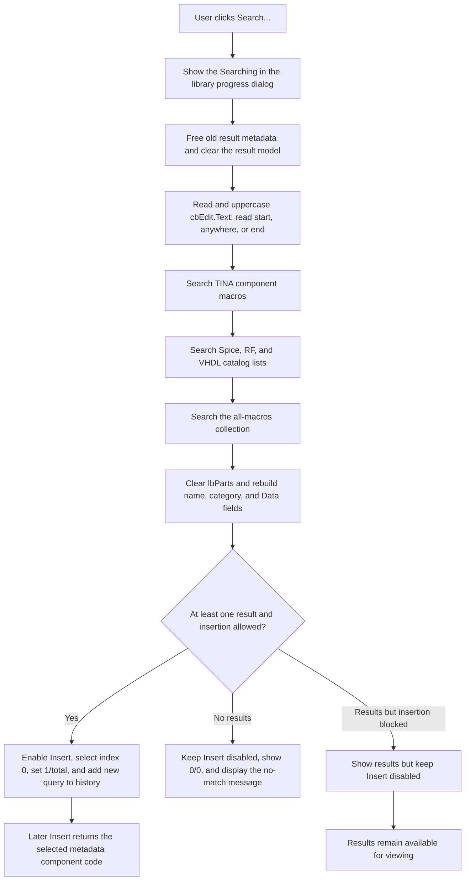

# Search...

> Analysis status: Reviewed from recovered source and dialog resource evidence.

## Control

| Property | Recovered value |
| --- | --- |
| Form | ComponentFinder |
| Component path | ComponentFinder.btnSearch |
| Control class | TButton |
| Caption | Search... |
| Hint | Not present in the recovered resource. |
| Handler name | btnSearchClick |
| Handler address | 01bac450 |
| Graph node | `resource:dfm:ComponentFinder/ComponentFinder.btnSearch` |
| Handler node | `function:01bac450` |
| Graph layer | UI |

## What happens when clicked

`btnSearch` replaces the current component results with matches for the text in `cbEdit`. The `rgPatternPos` radio group controls where that text must occur in a component name. The recovered choices are `start`, `anywhere`, and `end`.

The handler performs these operations:

1. It creates and shows a progress dialog with the texts `Searching...` and `Searching in the library...`.
2. It destroys every metadata record owned by the previous result model, then clears that model. A search does not preserve the old result selection or results.
3. It reads `cbEdit.Text`, converts ASCII `a` through `z` to uppercase, and copies at most 255 characters into the short-string pattern used by the catalog helpers.
4. It passes the current `rgPatternPos.ItemIndex` to three search passes. These append matches to the result model in pass and source order.
5. It clears `lbParts` and rebuilds it from the result model. Each model entry has a `name|category` string and an owned metadata record. The text before `|` becomes the list-item caption, the text after `|` becomes its category subitem, and the metadata pointer becomes `TListItem.Data`.
6. It enables `btnInsert` only when at least one result exists and the application's insertion mode allows it. It makes Insert the default button when enabled; otherwise Search remains the default.
7. With results, it selects the first item and writes `1/total` to the status label. The label is visible only when the result count exceeds the list view's visible capacity. With no results, it leaves the list empty, writes `0/0`, hides the label, and shows a localized no-match message that includes the query.

If a successful query is not already in `cbEdit.Items`, the handler inserts it at history index 0. A duplicate remains at its existing position. A query with no results is not added to the history.

## Search sources, categories, and order

There is no category-filter control in this form. Search always runs all three source passes, and category is an output column:

1. `FUN_0172ece0` traverses the recovered TINA component catalog and appends matching macro entries as `Tina Macro`.
2. `FUN_017189e0` traverses five lists in fixed order: `Spice Macro`, `Spice Model`, `RF 2 port`, `RF 1 port`, and `VHDL Macro`.
3. `FUN_01bab4e0` traverses the `[All]` macro collection and appends matches as `Tina Macro`.

The handler does not sort the combined model or the list view after these passes. Results therefore retain the source traversal order within each pass and the pass order shown above.

## Pattern-position semantics

All three search paths use the radio-group index as follows:

- `start` (`0`): the first occurrence of the pattern must be at 1-based position 1.
- `anywhere` (`1`): the first occurrence must be greater than zero.
- `end` (`2`): the pattern must be shorter than the candidate, and its first occurrence must equal `candidate length - pattern length + 1`.

The exact `end` implementation has two visible limits. An equal-length pattern does not match. If the pattern occurs earlier and also at the end, the earlier first occurrence prevents the end match. An empty pattern returns no match in these helpers.

## Result selection and later Insert

Every new successful search selects result index 0. It does not preserve a prior component selection. Later clicks in `lbParts` update the status label to `selected index + 1 / total`.

`btnInsertClick` delegates to `FUN_01bacfd0`. When insertion is allowed and a list item is selected, that routine reads the selected item's metadata record from `TListItem.Data` and writes its first 32-bit component code to the form's modal-result field. Thus Search prepares the record that Insert returns to the caller; Search itself does not place a component in a schematic.

The same metadata provides the list item's information-tip text. The next search and form destruction free these records, so they are dialog-owned search results rather than persisted catalog changes.

## Click flow

## Handler evidence

- Primary source: [FUN_01bac450](../../../DecompiledSources/Tina16/functions/0000000001BAC450__FUN_01bac450.c).
- Form setup: [FUN_01bacc80](../../../DecompiledSources/Tina16/functions/0000000001BACC80__FUN_01bacc80.c) creates the `name|category` result model, sets `|` as its separator, initializes Search as the default button, and obtains the multi-list catalog object.
- TINA catalog pass: [FUN_0172ece0](../../../DecompiledSources/Tina16/functions/000000000172ECE0__FUN_0172ece0.c) traverses catalog entries, applies the pattern matcher, creates metadata, and appends `Tina Macro` results.
- Spice, RF, and VHDL pass: [FUN_017189e0](../../../DecompiledSources/Tina16/functions/00000000017189E0__FUN_017189e0.c) invokes [FUN_01718360](../../../DecompiledSources/Tina16/functions/0000000001718360__FUN_01718360.c) for its five lists and category labels.
- All-macros pass: [FUN_01bab4e0](../../../DecompiledSources/Tina16/functions/0000000001BAB4E0__FUN_01bab4e0.c) traverses the `[All]` collection and appends metadata-backed `Tina Macro` results.
- Matcher evidence: [FUN_0172e6e0](../../../DecompiledSources/Tina16/functions/000000000172E6E0__FUN_0172e6e0.c), [FUN_01718230](../../../DecompiledSources/Tina16/functions/0000000001718230__FUN_01718230.c), and [FUN_01bab140](../../../DecompiledSources/Tina16/functions/0000000001BAB140__FUN_01bab140.c) implement the same start, anywhere, and end decisions.
- Insert boundary: [FUN_01bacfd0](../../../DecompiledSources/Tina16/functions/0000000001BACFD0__FUN_01bacfd0.c) returns the selected metadata code through the modal-result field; [FUN_01bad1e0](../../../DecompiledSources/Tina16/functions/0000000001BAD1E0__FUN_01bad1e0.c) is the button wrapper.
- Selection status: [FUN_01bad1f0](../../../DecompiledSources/Tina16/functions/0000000001BAD1F0__FUN_01bad1f0.c) formats the later selected index and total.
- Cleanup: [FUN_01bace90](../../../DecompiledSources/Tina16/functions/0000000001BACE90__FUN_01bace90.c) frees result metadata and saves the query history back to the shared list when the form is destroyed.
- Complexity: complex; 30 distinct outgoing calls.

## Important direct calls

- `function:00418590` - destroys each old result metadata record before the model is cleared.
- `function:0043e130` - converts ASCII lowercase letters in the query to uppercase.
- `function:004b3cf0` and `function:004b5390` - split each `name|category` result for the list view.
- `function:0064dd90` - reads `cbEdit.Text`.
- `function:006efb70`, `function:006ef050`, and `function:006ef160` - create a list item, set its caption, and attach its metadata pointer.
- `function:0172ece0` - appends matches from the TINA component catalog.
- `function:017189e0` - appends Spice, RF, and VHDL matches.
- `function:01bab4e0` - appends matches from the all-macros collection.
- `function:016fd940` - displays the localized no-match message.

## Resource evidence

- `cbEdit` is next to the label `Component to find:`.
- `rgPatternPos` is captioned `Match at` and contains `start`, `anywhere`, and `end`.
- `lbParts` is a read-only `TListView` and supplies selection, double-click, keyboard, and information-tip handlers.
- `btnInsert` starts disabled and is enabled from the result count and insertion mode after search.
- `Label2` starts hidden with placeholder `00000/00000` and becomes the current-result indicator when needed.
- Search has no hint, image reference, or extracted glyph.

## Empty, repeated, and error behavior

- An empty query has no early guard. The handler still clears the old results, runs every search pass, and reaches the no-match path.
- Repeating a search frees and rebuilds all results. It is not a no-op, even when the query and pattern position did not change.
- No results produce an empty list, disabled Insert, `0/0`, and a localized message. The prior selection and results are not restored.
- Results can be displayed while insertion is blocked by the application mode; in that case Insert remains disabled.
- The handler has no local catalog-error dialog or recovery branch. Exceptions from catalog traversal, allocation, or VCL updates follow the application's normal Delphi exception path.

## Persistence limits

Search does not modify component catalogs or insert a component. Result records live until the next search or form destruction. Successful query text is retained in the shared combo-box history when the form is destroyed; no-match queries are not added by this handler.

## Analysis limits

- Recovered catalog class and field names are unavailable; the source-established category labels and traversal order are used instead.
- The application mode byte that blocks Insert is proven by both Search and Insert, but its user-facing mode name is not recovered.
