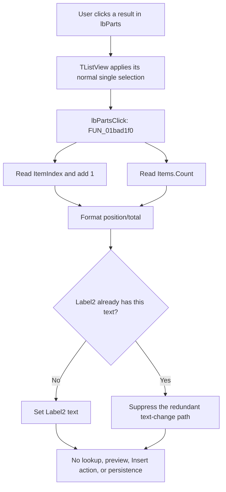

# lbParts

> Analysis status: Reviewed from recovered source and dialog resource evidence.

## Control

| Property | Recovered value |
| --- | --- |
| Form | ComponentFinder |
| Component path | ComponentFinder.lbParts |
| Control class | TListView |
| Caption | Not present in the recovered resource. |
| Hint | Not present in the recovered resource. |
| Text | Not present in the recovered resource. |
| Handler name | lbPartsClick |
| Handler address | 01bad1f0 |
| Graph node | `resource:dfm:ComponentFinder/ComponentFinder.lbParts` |
| Handler node | `function:01bad1f0` |
| Graph layer | UI |

## What happens when clicked

`lbParts` shows the component matches from the most recent search. A single click lets the list view change its normal selection. The application handler then updates the result-position label only.

The handler reads the current zero-based item index, adds one, reads the total item count, and formats the text as `position/total`. For example, selected index `0` with 25 results produces `1/25`. It writes this text to `Label2`, whose recovered placeholder is `00000/00000`.

The click handler does not change `Label2.Visible`. The Search handler decides whether the label is visible based on whether all results fit in the list. Thus a click can update the label while it remains hidden.

The click handler also does not read the selected item's metadata, update a preview, enable Insert, insert a component, or persist a selection. Search controls Insert availability. The separate double-click path and the Insert button read `TListItem.Data` and return the selected component code through the form's modal-result field.

## Click flow

## Handler evidence

- Primary source: [FUN_01bad1f0](../../../DecompiledSources/Tina16/functions/0000000001BAD1F0__FUN_01bad1f0.c) reads `lbParts` at form offset `0x700`, calls its item-index getter, adds one, reads the list-item count, joins both decimal strings with a separator, and passes the result to the text setter for the control at form offset `0x6e8`.
- Search-path field mapping: [FUN_01bac450](../../../DecompiledSources/Tina16/functions/0000000001BAC450__FUN_01bac450.c) uses the same offsets to select the first `lbParts` item, calculate `1/total`, set the text of offset `0x6e8`, and control that field's visibility. This maps offset `0x6e8` to `Label2` and confirms its position-count purpose.
- Decimal conversion: [FUN_0043f750](../../../DecompiledSources/Tina16/functions/000000000043F750__FUN_0043f750.c) formats each signed integer as a decimal Unicode string.
- Text update: [FUN_0064de00](../../../DecompiledSources/Tina16/functions/000000000064DE00__FUN_0064de00.c) compares the requested text with the current text and sends the VCL text-change path only when they differ.
- Separate action path: [FUN_01bacfd0](../../../DecompiledSources/Tina16/functions/0000000001BACFD0__FUN_01bacfd0.c) is the recovered `lbParts.OnDblClick` handler. It checks that insertion is allowed and that an item is selected, then reads the item's attached metadata code. [FUN_01bad1e0](../../../DecompiledSources/Tina16/functions/0000000001BAD1E0__FUN_01bad1e0.c) makes the Insert button use that same path.
- Complexity: complex; 5 distinct outgoing calls.

## Direct calls

- `function:00414560` - finalizes the three temporary Unicode strings.
- `function:00416cd0` - joins the position string, separator, and total string.
- `function:0043f750` - converts the two integers to decimal strings.
- `function:0064de00` - updates `Label2` only when its text differs.
- `function:006efc30` - obtains the list view's item count.

## Resource evidence

- `lbParts` is a read-only `TListView` with `OnClick`, `OnDblClick`, `OnInfoTip`, and `OnKeyPress` handlers. The resource does not set `MultiSelect`, so it keeps the VCL default single-selection mode.
- `Label2` has the placeholder caption `00000/00000`, starts hidden, and has enough width for a position and count.
- `btnInsert` is a separate button. It is captioned `&Insert...`, starts disabled, and has its own `OnClick` handler.
- `lbParts` has no recovered caption, hint text, image reference, or extracted glyph. Its information-tip handler obtains tip text from the selected result metadata; the click handler does not.

## Boundary, repeated-click, and error behavior

- If the list reports no selected item, its index is `-1`; the handler adds one and therefore displays position `0`. An empty list consequently produces `0/0`.
- Repeating a click on the same selected item calculates the same status. The text setter detects the equal string and suppresses the redundant VCL text-change path.
- The handler contains no branch for multiple selection and the DFM keeps the default single-selection mode.
- The handler has no application error dialog or recovery branch. Any exception from string allocation or a VCL call follows the normal Delphi exception path.

## Persistence limits

The handler changes only the form's status text. It does not modify the component catalog, result metadata, search history, schematic, or other persisted state. The list selection and status label remain form-local UI state.

## Analysis limits

- The separator is referenced as recovered static data, not as a named source constant. The `00000/00000` resource caption and the identical Search formatting establish that its displayed meaning is a slash-separated position and total.
- No preview control is present in the recovered ComponentFinder resource. The result metadata supplies information tips and the later Insert result, but a single click does not read it.
