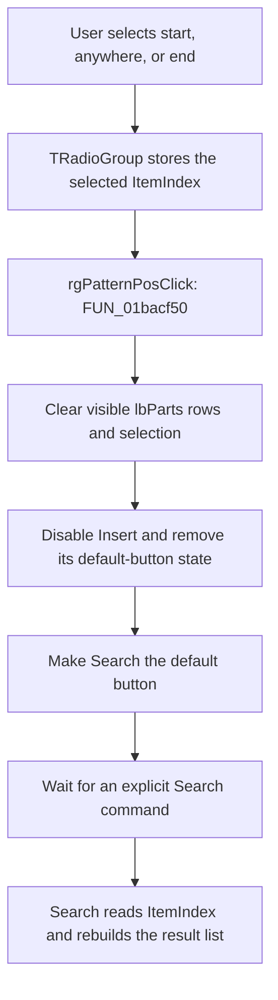

# Match at

> Analysis status: Reviewed from recovered source and dialog resource evidence.

## Control

| Property | Recovered value |
| --- | --- |
| Form | ComponentFinder |
| Component path | ComponentFinder.rgPatternPos |
| Control class | TRadioGroup |
| Caption | `Match at` |
| Items | `start`, `anywhere`, `end` |
| Hint | Not present in the recovered resource. |
| Handler name | rgPatternPosClick |
| Handler address | 01bacf50 |
| Graph node | `resource:dfm:ComponentFinder/ComponentFinder.rgPatternPos` |
| Handler node | `function:01bacf50` |
| Graph layer | UI |

## What happens when clicked

The radio group selects where the component-name pattern must occur. Its item order maps the `ItemIndex` values as follows:

- `start` (`0`): the first occurrence must be at 1-based position 1;
- `anywhere` (`1`): the first occurrence must be greater than zero;
- `end` (`2`): the pattern must be shorter than the candidate, and its first occurrence must be at `candidate length - pattern length + 1`.

The click handler does not run the search. It invalidates the result UI after the radio-group selection changes:

1. It clears all visible rows from `lbParts`. This also removes the visible selection.
2. It disables `btnInsert`.
3. It removes the default-button state from Insert and makes `btnSearch` the default button.

The next Search click reads the current `rgPatternPos.ItemIndex`, passes it to all three catalog-search passes, rebuilds `lbParts`, and recalculates Insert availability. The pattern-position choice therefore affects the next explicit search. It does not filter or rebuild the current list immediately.

## Match details

The three recovered matchers implement the same mode mapping. Their `end` rule has two limits that can affect results:

- a pattern with the same length as the candidate does not match;
- if the pattern occurs earlier and also at the end, the earlier first occurrence prevents the end match.

The target handler does not read or validate `ItemIndex`. Values other than `0`, `1`, and `2` still cause the same UI invalidation, but the later matcher outcome is not defined by the recovered branches.

## Click flow

## Handler evidence

- Primary source: [FUN_01bacf50](../../../DecompiledSources/Tina16/functions/0000000001BACF50__FUN_01bacf50.c) clears the list view at form offset `+0x700`, calls the enabled-state setter for the button at `+0x6e0` with false, and updates the default states of the buttons at `+0x6e0` and `+0x6c8`.
- Search-path field mapping: [FUN_01bac450](../../../DecompiledSources/Tina16/functions/0000000001BAC450__FUN_01bac450.c) maps `+0x700` to `lbParts`, `+0x6e0` to `btnInsert`, `+0x6c8` to `btnSearch`, and `+0x6d0` to `rgPatternPos`. It reads `ItemIndex` from `+0x6d0 + 0x4a8` only when Search runs.
- Enabled-state setter: [FUN_0064dc60](../../../DecompiledSources/Tina16/functions/000000000064DC60__FUN_0064dc60.c) writes the control enabled byte and sends `CM_ENABLEDCHANGED` (`0xb00c`) only when the value changes. The target reaches this setter through the `btnInsert` virtual method at offset `0x128`.
- Default-button setter: [FUN_00688430](../../../DecompiledSources/Tina16/functions/0000000000688430__FUN_00688430.c) stores the button default byte at `+0x4a8` and notifies the owning form. [FUN_0082bc30](../../../DecompiledSources/Tina16/functions/000000000082BC30__FUN_0082bc30.c) uses the same helper when a standard `TBitBtn` kind defines a default button.
- Matcher evidence: [FUN_0172e6e0](../../../DecompiledSources/Tina16/functions/000000000172E6E0__FUN_0172e6e0.c), [FUN_01718230](../../../DecompiledSources/Tina16/functions/0000000001718230__FUN_01718230.c), and [FUN_01bab140](../../../DecompiledSources/Tina16/functions/0000000001BAB140__FUN_01bab140.c) implement the recovered start, anywhere, and end decisions.
- Shared invalidation path: [FUN_01bad1d0](../../../DecompiledSources/Tina16/functions/0000000001BAD1D0__FUN_01bad1d0.c), the `cbEdit.OnChange` handler, delegates to `FUN_01bacf50`. A query-text change and a match-mode change therefore invalidate the result UI in the same way.
- Complexity: simple; one distinct statically recovered outgoing call.

## Model, status, and persistence boundaries

`FUN_01bacf50` clears only the visible `lbParts` items. It does not clear or destroy the private result model at form offset `+0x718`. The next Search handler destroys those old result records before it builds a new model. Form destruction also releases them. Thus the click hides stale results immediately but defers their model cleanup.

The handler does not update the `Label2` position text or its visibility. It also does not preserve a selected row, add a query to history, insert a component, or change a component catalog. Those operations belong to the list, Search, Insert, and form-destruction paths.

The recovered DFM does not contain an initial `ItemIndex`, and `ComponentFinder` form creation does not assign one. The initial selected item therefore cannot be established from the current evidence. The handler contains no settings, file, registry, or catalog write for the radio choice. The choice is form-local UI state, not proven persistent state.

## Repeated, empty, and error behavior

- The handler has no same-index guard. Every delivered click clears the visible list, disables Insert, and restores Search as the default action.
- The same invalidation runs when `cbEdit` changes, including an empty query. This handler does not validate the query. A later Search runs its normal passes and takes the no-match path when the empty pattern produces no result.
- If the list is already empty and Insert is already disabled, the enabled-state setter suppresses its redundant notification. The handler still reapplies the default-button states.
- The handler has no local error dialog, recovery branch, or exception handler. Exceptions from the VCL calls follow the normal Delphi exception path.

## Resource evidence

- `rgPatternPos` is captioned `Match at` and contains `start`, `anywhere`, and `end` in that order.
- `btnSearch` is captioned `Search...`.
- `btnInsert` is captioned `&Insert...` and starts disabled in the recovered DFM.
- `lbParts` is a read-only `TListView` with separate click, double-click, information-tip, and key-press handlers.
- The radio group has no recovered hint, text property, image reference, or extracted glyph.

## Analysis limits

- The current resource extractor does not expose an initial radio-group selection, so this article does not infer one from Delphi defaults.
- The recovered handler has no sender-dependent branch. Its radio-specific meaning comes from the DFM binding and from the later Search handler's use of `rgPatternPos.ItemIndex`.
