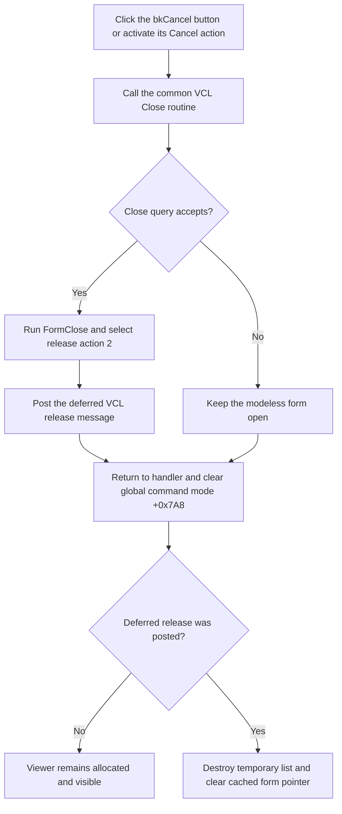

# Close and release the component-parameter viewer

> Analysis status: Source reviewed and behavior traced.

## Control

| Property | Recovered value |
| --- | --- |
| Form | ComponentParamsDlg |
| Component path | ComponentParamsDlg.CancelBtn |
| Control class | TBitBtn |
| Kind | bkCancel |
| Handler name | CancelBtnClick |
| Handler address | 010f2b80 |
| Graph node | `resource:dfm:ComponentParamsDlg/ComponentParamsDlg.CancelBtn` |
| Handler node | `function:010f2b80` |
| Graph layer | UI |

## What happens when clicked

`FUN_010f2b80` performs two operations in order:

1. Call the common VCL form-close routine `FUN_00805200` for the current
   `TComponentParamsDlg` instance.
2. After that call returns, clear byte `+0x7A8` on the global controller reached
   through `PTR_DAT_02001e00`.

The second write clears the controller's active command or interaction mode.
The recovered component-parameter launch command (`FUN_010f99c0`) writes
`0x15` to the same controller offset before it enters the viewer-opening call
path.
The recovered controller dispatcher (`FUN_010faf40`) reads this byte as a
command code and resets it after other completed interactions. The same
ComponentParams dialog opener clears it when there is no component data to
show.

This handler does not read the component list, inspect the grid, validate a
parameter, copy data to a caller, set a modal result, or show an error.

## Modeless close and ownership path

`FUN_010f2ba0` is the recovered opener. It creates one
`TComponentParamsDlg` with the application as owner and caches the form in
global `DAT_0202fd68`. It stores borrowed references to the selected component
collection at form offset `+0x6E0` and its associated context at `+0x6E8`. When
the data is eligible, it calls the VCL modeless Show wrapper
`FUN_008059a0`; it never calls `ShowModal` and it never reads a modal result.

The common close routine runs the VCL close-query and close-action pipeline.
The form's `OnClose` handler (`FUN_010f20a0`) always writes close action 2. The
shared close routine maps that action to `FUN_00805ad0`, which posts the VCL
release message. Thus, the accepted Cancel path releases this modeless form; it
does not only hide it.

Release is deferred through the window-message queue. When destruction occurs,
`FUN_010f2080` destroys the form-owned temporary string list at `+0x6F8` and
clears `DAT_0202fd68`. A later opener can then create a new viewer. The
destructor does not free the borrowed component collection or context.

## Cancel flow

## Parameter state and validation bypass

The recovered form is a parameter viewer:

- `FormShow` enumerates the borrowed component collection and adds component
  names to the ListBox.
- `ListBoxClick` clears both columns of the `TViewGrid`, reads parameter
  metadata for the selected component, formats it, and writes display strings
  to grid cells.
- No recovered handler reads grid cells back into the component collection.
- The form has no recovered OK, Apply, grid-edit, or parameter-commit event.

There is therefore no recovered staged parameter object for Cancel to roll
back. Selection, ListBox contents, and grid cell text are form-local display
state and disappear when the form is released. Even if the inherited grid
class permits a user to alter a cell, no recovered ComponentParamsDlg path
consumes that altered value.

Cancel bypasses all component and parameter validation because it does not call
the data-formatting path. It does not verify that the borrowed model is still
valid and it does not test whether grid text is complete. This is safe for the
recovered viewer path because the form has no copy-back operation.

## Retained side effects and edge cases

- Clearing the global command byte is a retained side effect. It occurs after
  the close routine returns even if a close query rejects the request and the
  viewer stays visible.
- The DFM has no `OnCloseQuery` event for this form, so the ordinary recovered
  path uses the inherited close-query result. The shared VCL routine still has
  a rejection branch, which is why the rejected path is shown above.
- If the close routine raises an exception instead of returning, the following
  command-byte clear is not reached. The Cancel handler has no local exception
  handler or recovery logic.
- The release action posts a message. The cached global form pointer is not
  cleared until `OnDestroy`, so it can remain nonzero for part of the message
  cycle after the click.
- Cancel does not restore changes made elsewhere to the borrowed component
  model while the viewer was open. It only discards this form's display state.
- Repeated Cancel activation before destruction can request close again. The
  shared close routine owns its destroying-state guard; this handler does not
  add another guard.

## Evidence

- [Cancel handler `FUN_010f2b80`](../../../DecompiledSources/Tina16/functions/00000000010F2B80__FUN_010f2b80.c)
  calls the VCL close routine and then clears the global controller byte.
- [Common VCL close routine `FUN_00805200`](../../../DecompiledSources/Tina16/functions/0000000000805200__FUN_00805200.c)
  runs close query, dispatches `OnClose`, and applies the selected close action.
- [Deferred release helper `FUN_00805ad0`](../../../DecompiledSources/Tina16/functions/0000000000805AD0__FUN_00805ad0.c)
  posts the recovered VCL release message to the form window.
- [Form close handler `FUN_010f20a0`](../../../DecompiledSources/Tina16/functions/00000000010F20A0__FUN_010f20a0.c)
  selects close action 2, which the shared close routine routes to release.
- [Form destroy handler `FUN_010f2080`](../../../DecompiledSources/Tina16/functions/00000000010F2080__FUN_010f2080.c)
  destroys the form-owned string list and clears the cached global form pointer.
- [Modeless opener `FUN_010f2ba0`](../../../DecompiledSources/Tina16/functions/00000000010F2BA0__FUN_010f2ba0.c)
  creates the cached form, assigns borrowed model references, validates whether
  it can show data, and uses modeless Show.
- [Form show population `FUN_010f1f60`](../../../DecompiledSources/Tina16/functions/00000000010F1F60__FUN_010f1f60.c)
  reads the component collection and populates the ListBox with names.
- [List selection renderer `FUN_010f27c0`](../../../DecompiledSources/Tina16/functions/00000000010F27C0__FUN_010f27c0.c)
  rebuilds the two display-grid columns from selected component metadata.
- [Controller command dispatcher `FUN_010faf40`](../../../DecompiledSources/Tina16/functions/00000000010FAF40__FUN_010faf40.c)
  reads and clears the same controller byte as it completes other interaction
  modes.
- [Component-parameter launch command `FUN_010f99c0`](../../../DecompiledSources/Tina16/functions/00000000010F99C0__FUN_010f99c0.c)
  assigns command code `0x15` at the same offset before it enters the recovered
  component-parameter opening path.

## Resource evidence and limits

- `CancelBtn` is a `TBitBtn` with built-in kind `bkCancel`. The recovered
  resource does not store a separate caption, hint, action, or glyph.
- The form is captioned `Component Parameters` and contains a component ListBox
  and a custom `TViewGrid` below matching labels.
- Only the ListBox has a data-related event. The grid has no recovered event
  binding.
- The exact Delphi name of the global controller class and the semantic name of
  its byte at `+0x7A8` are not recovered. Its use as a command or interaction
  code is established by the dispatcher and the dialog opener.
- `FUN_00805200` already has its canonical Delphi VCL annotation in
  `TIARA-diz.6.7.65`; this control's fragment does not duplicate it.

## Annotation scope

The fragment describes only the control-specific Cancel handler. The shared
VCL close pipeline and the form's display/population helpers are documented by
source links without duplicate annotations.
