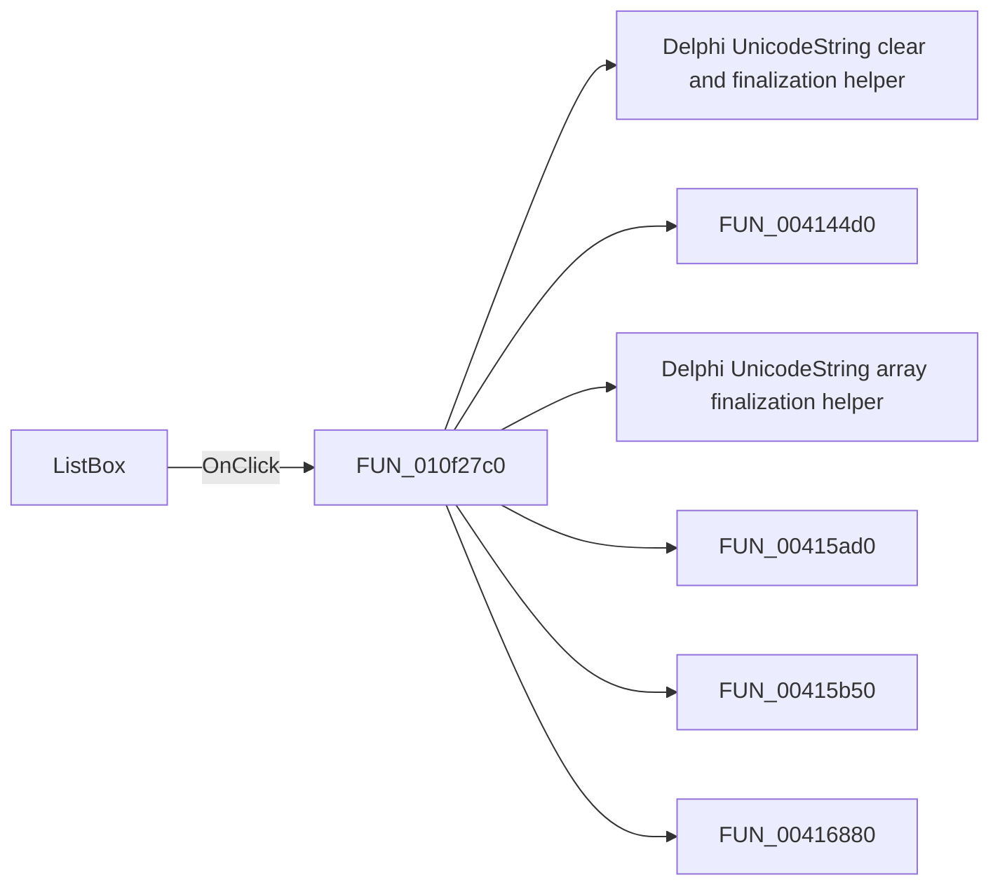

# ListBox

> Analysis status: Pending individual source review.

## Control

| Property | Recovered value |
| --- | --- |
| Form | ComponentParamsDlg |
| Component path | ComponentParamsDlg.ListBox |
| Control class | TListBox |
| Caption | Not present in the recovered resource. |
| Hint | Not present in the recovered resource. |
| Text | Not present in the recovered resource. |
| Handler name | ListBoxClick |
| Handler address | 010f27c0 |
| Graph node | `resource:dfm:ComponentParamsDlg/ComponentParamsDlg.ListBox` |
| Handler node | `function:010f27c0` |
| Graph layer | UI |

## What happens when clicked

Pending individual analysis. An agent must read the recovered handler source and its relevant callees before it replaces this text.

## Click flow

## Handler evidence

- Source: [DecompiledSources/Tina16/functions/00000000010F27C0__FUN_010f27c0.c](../../../DecompiledSources/Tina16/functions/00000000010F27C0__FUN_010f27c0.c)
- Recovered role: Not present in the recovered resource.
- Current graph summary: Handles 1 Delphi UI event: ComponentParamsDlg.ListBox.OnClick.
- Current graph behavior: Not present in the recovered resource.
- Current graph evidence: Not present in the recovered resource.
- Complexity: complex
- Distinct outgoing calls: 14

## Direct calls

- `function:00414480` — Delphi UnicodeString clear and finalization helper
- `function:004144d0` — FUN_004144d0
- `function:00414560` — Delphi UnicodeString array finalization helper
- `function:00415ad0` — FUN_00415ad0
- `function:00415b50` — FUN_00415b50
- `function:00416880` — FUN_00416880
- `function:00416dc0` — FUN_00416dc0
- `function:00416e20` — FUN_00416e20
- `function:004170c0` — FUN_004170c0
- `function:00848a70` — FUN_00848a70
- `function:0084e370` — FUN_0084e370
- `function:0084e3e0` — FUN_0084e3e0
- `function:010f20b0` — FUN_010f20b0
- `function:01d347d0` — FUN_01d347d0

## Resource evidence

- Kind: Not present in the recovered resource.
- Modal result: Not present in the recovered resource.
- Checked state: Not present in the recovered resource.
- List items: Not present in the recovered resource.
- Image reference: Not present in the recovered resource.
- Extracted glyph: None.

## Nearby label candidates

Nearby labels are layout candidates only. They are not proof of behavior.

- Rank 1: C&omponents at distance 21.
- Rank 2: Component Parameters at distance 143.

## Analysis limits

- Do not infer behavior from the control class, caption, hint, glyph, or nearby label alone.
- Do not replace the pending status until the handler source and relevant call path provide enough evidence.
