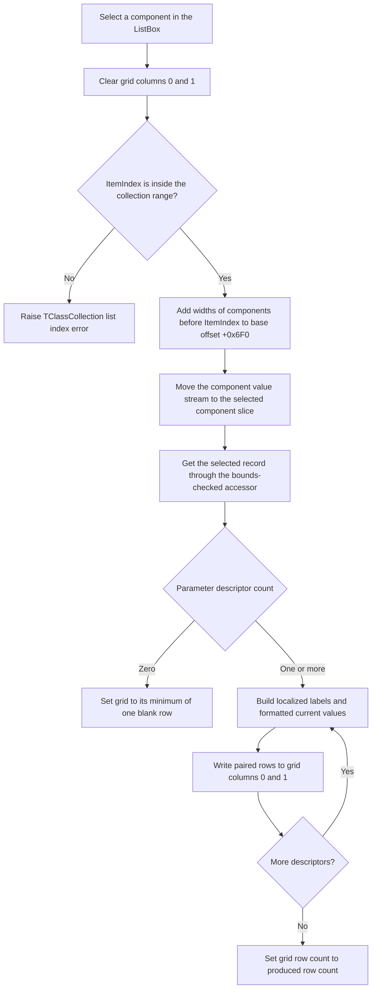

# Select a component and rebuild its parameter display

> Analysis status: Source reviewed and behavior traced.

## Control

| Property | Recovered value |
| --- | --- |
| Form | ComponentParamsDlg |
| Component path | ComponentParamsDlg.ListBox |
| Control class | TListBox |
| Caption | Not present in the recovered resource. |
| Hint | Not present in the recovered resource. |
| Handler name | ListBoxClick |
| Handler address | 010f27c0 |
| Graph node | `resource:dfm:ComponentParamsDlg/ComponentParamsDlg.ListBox` |
| Handler node | `function:010f27c0` |
| Graph layer | UI |

The nearby label `C&omponents` is 21 layout units from this ListBox. The source
confirms this label's meaning: `FormShow` adds one recovered component name for
each record in the supplied collection. The selected ListBox entry is therefore
a component, not a parameter category. Its parameters appear in the adjacent
`TViewGrid`.

## What happens when the selection changes

`FUN_010f27c0` rebuilds the parameter display for the current component:

1. It clears the stored strings for grid columns 0 and 1.
2. It reads `ListBox.ItemIndex`.
3. It starts at the form's calculated value-stream base offset at `+0x6F0`.
   For each component before the selected component, it adds that record's
   16-bit value width at record offset `+0x12`.
4. It moves the collection's value stream at collection offset `+0x438` to the
   calculated position.
5. It gets the selected component record through the bounds-checked collection
   accessor `FUN_01d347d0` and reads the parameter-descriptor count from record
   offset `+0x14`.
6. For each descriptor, it calls `FUN_010f20b0`. That helper maps the packed
   descriptor to parameter metadata, obtains localized labels when required,
   reads the current 8-byte value from the stream, and formats that value for
   display. Some descriptor forms expand to more than one label and value row.
7. The handler splits the helper's paired separator-delimited strings. It puts
   each label or description in grid column 0 and its formatted current value
   in column 1 at the same row.
8. It sets the grid row count to the number of produced rows.

The handler changes the stream cursor and the form's grid contents. It does not
write a parameter value, update the selected component record, or copy grid text
back to the supplied collection.

## Selection flow

## Inputs and dependent display state

The dialog opener `FUN_010f2ba0` supplies two borrowed references:

- Form field `+0x6E0` receives the component-record collection.
- Form field `+0x6E8` receives the associated owner or context object.

`FormShow` enumerates the collection, adds each component name to the ListBox,
and accumulates each component record's width in form field `+0x6F4`.
`FormActivate` selects ListBox item 0 and calculates `+0x6F0` as that total
width multiplied by the context value at `+0x158`. The click handler then uses
this base and the widths of earlier records to locate the selected component's
current values.

The only dependent UI output is `StringGrid`, a recovered `TViewGrid`. The DFM
contains no separate parameter editor, description panel, or value control.
Column 0 receives parameter labels or descriptions. Column 1 receives formatted
current values. The source does not establish user-facing names for these two
columns.

## Empty and invalid selections

- The opener does not call this handler when the collection is empty or the
  supplied context is in the rejected state. It clears both grid columns and
  the ListBox instead.
- The handler has no local `ItemIndex` guard. `FUN_01d347d0` rejects a negative
  or out-of-range index and calls the routine that raises
  `TClassCollection: List index error`.
- The columns are cleared before the bounds-checked lookup. A selection error
  during prior-record traversal or the selected-record lookup can therefore
  leave the grid blank. The handler has no local catch or rollback path.
- A valid component with zero parameter descriptors produces no cell writes.
  `FUN_00848a70` clamps the requested row count to at least one, so the cleared
  grid contains one blank row.
- Metadata lookup, value-stream reads, string allocation, localization, and
  grid writes can also raise through their called routines. The handler has no
  local recovery path, so a failure can leave a partly rebuilt display.

## Staging, acceptance, and cancellation

This form is a modeless viewer. `FUN_010f2ba0` caches one form instance, assigns
the borrowed references, and calls the modeless Show path. It does not call
`ShowModal` or read a modal result.

The recovered DFM has Cancel and Help buttons, but no OK or Apply button. No
recovered `ComponentParamsDlg` handler reads grid cells back into the component
collection. The ListBox selection and generated grid strings are transient
display state; there is no staged parameter change for a later OK or Cancel
operation to accept or reject.

Cancel uses the common VCL close pipeline. The form's `OnClose` selects the
release action, and `OnDestroy` destroys the temporary string list at `+0x6F8`
and clears the cached form pointer. The borrowed component collection and
context are not owned or freed by this form. See the
[Cancel control analysis](cancelbtn-0f4f71be9b.md) for that close path.

## Evidence

- [ListBox selection handler `FUN_010f27c0`](../../../DecompiledSources/Tina16/functions/00000000010F27C0__FUN_010f27c0.c)
  clears both grid columns, calculates the selected record offset, formats all
  descriptors, writes paired cells, and sets the row count.
- [Parameter display formatter `FUN_010f20b0`](../../../DecompiledSources/Tina16/functions/00000000010F20B0__FUN_010f20b0.c)
  maps one packed descriptor, reads current values, loads localized labels, and
  returns one or more display rows.
- [Form show handler `FUN_010f1f60`](../../../DecompiledSources/Tina16/functions/00000000010F1F60__FUN_010f1f60.c)
  adds component names to the ListBox and accumulates record widths.
- [Form activate handler `FUN_010f2040`](../../../DecompiledSources/Tina16/functions/00000000010F2040__FUN_010f2040.c)
  selects the first component and calculates the value-stream base offset.
- [Dialog opener `FUN_010f2ba0`](../../../DecompiledSources/Tina16/functions/00000000010F2BA0__FUN_010f2ba0.c)
  assigns the borrowed collection and context, handles unavailable data, shows
  the form modelessly, and requests the initial grid refresh.
- [Bounds-checked record accessor `FUN_01d347d0`](../../../DecompiledSources/Tina16/functions/0000000001D347D0__FUN_01d347d0.c)
  rejects negative and out-of-range record indexes.
- [Collection range-error routine `FUN_01d34ef0`](../../../DecompiledSources/Tina16/functions/0000000001D34EF0__FUN_01d34ef0.c)
  raises the recovered `TClassCollection: List index error`.
- [Grid row-count helper `FUN_00848a70`](../../../DecompiledSources/Tina16/functions/0000000000848A70__FUN_00848a70.c)
  clamps the grid to at least one row.
- [Grid cell writer `FUN_0084e3e0`](../../../DecompiledSources/Tina16/functions/000000000084E3E0__FUN_0084e3e0.c)
  writes one cell and invalidates its display.
- [Recovered UI evidence](../../../DecompiledSources/Tina16/resources/dfm/ui-evidence.json)
  identifies the ListBox event, the adjacent `TViewGrid`, the two labels, and
  the absence of an OK or Apply control.

## Analysis limits

- Recovered class and field names are not available for the objects at form
  offsets `+0x6E0` and `+0x6E8`. Their collection and context roles come from
  opener assignments and the later reads described above.
- The semantic names of the packed descriptor bytes and the separator token are
  not recovered. This article describes their observed use, not guessed Delphi
  declarations.
- The grid class may provide inherited editing behavior, but no recovered
  application path consumes altered grid text. This is evidence for a viewer
  workflow, not proof that the base grid can never accept keyboard input.

## Annotation scope

The fragment owns the unique ListBox handler `FUN_010f27c0` and its
dialog-specific parameter-row formatter `FUN_010f20b0`. Shared VCL, string,
collection, localization, and grid helpers remain documented by source links
without duplicate annotations.
