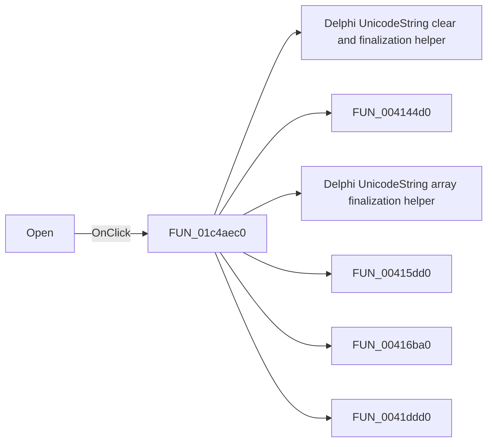

# Open

> Analysis status: Pending individual source review.

## Control

| Property | Recovered value |
| --- | --- |
| Form | ConvertersDlg |
| Component path | ConvertersDlg.OKBtn |
| Control class | TBitBtn |
| Caption | Open |
| Hint | Not present in the recovered resource. |
| Text | Not present in the recovered resource. |
| Handler name | OKBtnClick |
| Handler address | 01c4aec0 |
| Graph node | `resource:dfm:ConvertersDlg/ConvertersDlg.OKBtn` |
| Handler node | `function:01c4aec0` |
| Graph layer | UI |

## What happens when clicked

Pending individual analysis. An agent must read the recovered handler source and its relevant callees before it replaces this text.

## Click flow

## Handler evidence

- Source: [DecompiledSources/Tina16/functions/0000000001C4AEC0__FUN_01c4aec0.c](../../../DecompiledSources/Tina16/functions/0000000001C4AEC0__FUN_01c4aec0.c)
- Recovered role: Not present in the recovered resource.
- Current graph summary: Handles 2 Delphi UI events: ConvertersDlg.ConvertersGrid.OnDblClick, ConvertersDlg.OKBtn.OnClick.
- Current graph behavior: Not present in the recovered resource.
- Current graph evidence: Not present in the recovered resource.
- Complexity: complex
- Distinct outgoing calls: 13

## Direct calls

- `function:00414480` — Delphi UnicodeString clear and finalization helper
- `function:004144d0` — FUN_004144d0
- `function:00414560` — Delphi UnicodeString array finalization helper
- `function:00415dd0` — FUN_00415dd0
- `function:00416ba0` — FUN_00416ba0
- `function:0041ddd0` — FUN_0041ddd0
- `function:00440a20` — FUN_00440a20
- `function:00442620` — FUN_00442620
- `function:00450070` — FUN_00450070
- `function:0065b870` — FUN_0065b870
- `function:0072d440` — FUN_0072d440
- `function:0084e320` — FUN_0084e320
- `function:00d309d0` — Delimited text-line splitter

## Resource evidence

- Kind: bkOK
- Modal result: Not present in the recovered resource.
- Checked state: Not present in the recovered resource.
- List items: Not present in the recovered resource.
- Image reference: Not present in the recovered resource.
- Extracted glyph: None.

## Nearby label candidates

Nearby labels are layout candidates only. They are not proof of behavior.

- Rank 1: Max Output Current at distance 420.
- Rank 2: Output Voltage at distance 446.
- Rank 3: Max Input Voltage at distance 476.

## Analysis limits

- Do not infer behavior from the control class, caption, hint, glyph, or nearby label alone.
- Do not replace the pending status until the handler source and relevant call path provide enough evidence.
