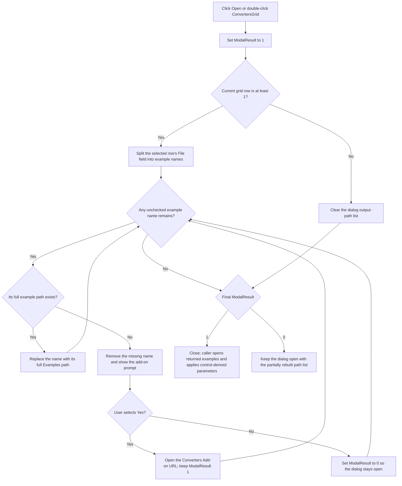

# Open

> Analysis status: Reviewed from recovered source, dialog resources, and caller paths.

## Control

| Property | Recovered value |
| --- | --- |
| Form | ConvertersDlg |
| Component path | ConvertersDlg.OKBtn |
| Control class | TBitBtn |
| Caption | Open |
| Kind | `bkOK` |
| Hint | Not present in the recovered resource. |
| Handler name | OKBtnClick |
| Handler address | 01c4aec0 |
| Other binding | `ConvertersGrid.OnDblClick` |
| Graph node | `resource:dfm:ConvertersDlg/ConvertersDlg.OKBtn` |
| Handler node | `function:01c4aec0` |
| Graph layer | UI |

## What happens when clicked

The button opens example designs for the converter selected in `ConvertersGrid`. It does not execute a power conversion and does not copy one converted numeric value back to the caller.

`FUN_01c4aec0` starts by setting the form modal result to 1. It then reads the grid's current row:

- If the current row is less than 1, it clears the dialog-owned output-path list and leaves modal result 1. The dialog can close successfully with no example to open.
- Otherwise, it reads column 0 of the selected row. Form population stores the converter XML element's text in this hidden `File` column. The handler splits that text at the recovered delimiter into one or more example-file names.

For each parsed name, the handler builds `<application examples directory>\Examples\<name>` and checks that path. Existing names are changed to full paths in the dialog-owned list. Missing names are removed and cause an add-on prompt:

- If the user answers Yes, the handler opens `https://order.tina.com/download/Converters%20Add-on.exe` with the system shell. Modal result remains 1, so the dialog can close with only the remaining existing paths.
- If the user does not answer Yes, the handler changes modal result to 0. It continues checking any other names, but the final zero result keeps the dialog open.

Clicking the grid twice invokes the same handler and follows the same selected-row behavior.

## Input and converter validation boundary

OK does not re-read or revalidate topology, manufacturer, automotive, PMBus, voltage, current, or frequency fields. Those fields are search filters:

- `FUN_01c4b500`, called by form creation and the Search button, traverses converter XML and fills the grid.
- `FUN_01c4a8f0` tests topology and optional feature flags. It also checks requested minimum and maximum input voltage, output voltage, output current, and switching-frequency limits against each converter's recovered XML attributes.
- Manufacturer selection restricts the XML query before those tests.

Therefore OK trusts the selected grid result. It validates only the example-file list for that row. It does not test that a current edit value still satisfies the converter after the last search, and it does not enforce a minimum-versus-maximum relationship itself.

## Caller ownership and accepted-state use

The output string list at form offset `+0x798` is created and destroyed by `ConvertersDlg`. Accepted callers read it while the dialog object is still alive:

1. They proceed only when `ShowModal` returns 1.
2. They open each returned example path with `FUN_01c681b0`.
3. `FUN_01c4c580` then reads the dialog's numeric controls. It derives `V_in` from the average of both input-voltage bounds, `F_sw` from the average of both frequency bounds, and takes `V_out` and `I_out` directly when present.
4. The caller applies those parameter assignments to the opened example and then destroys the dialog.

This is caller-owned execution. `OKBtnClick` only prepares accepted paths and the modal result. It does not open the example itself or apply the numeric settings.

## Click flow

## Handler evidence

- Primary source: [FUN_01c4aec0](../../../DecompiledSources/Tina16/functions/0000000001C4AEC0__FUN_01c4aec0.c).
- Grid population and search: [FUN_01c4b500](../../../DecompiledSources/Tina16/functions/0000000001C4B500__FUN_01c4b500.c) defines the hidden File column, reads converter XML, applies filters, and selects the first result row.
- Filter semantics: [FUN_01c4a8f0](../../../DecompiledSources/Tina16/functions/0000000001C4A8F0__FUN_01c4a8f0.c) checks topology, automotive, PMBus, and numeric limits.
- Input preload: [FUN_01c4cc00](../../../DecompiledSources/Tina16/functions/0000000001C4CC00__FUN_01c4cc00.c) maps caller parameter names and values into the dialog controls before search.
- Caller use: [FUN_01c76290](../../../DecompiledSources/Tina16/functions/0000000001C76290__FUN_01c76290.c) and [FUN_01c76610](../../../DecompiledSources/Tina16/functions/0000000001C76610__FUN_01c76610.c) consume the accepted output-path list, open examples, apply parameters, and destroy the dialog.
- Parameter derivation: [FUN_01c4c580](../../../DecompiledSources/Tina16/functions/0000000001C4C580__FUN_01c4c580.c) builds `V_in`, `V_out`, `I_out`, and `F_sw` assignments from the controls.
- Form lifecycle: [FUN_01c4a6d0](../../../DecompiledSources/Tina16/functions/0000000001C4A6D0__FUN_01c4a6d0.c) creates the output list; [FUN_01c4a740](../../../DecompiledSources/Tina16/functions/0000000001C4A740__FUN_01c4a740.c) destroys it.
- Complexity: complex; 13 distinct outgoing calls.

## Important direct calls

- `function:0084e320` - reads the selected grid row's hidden File cell.
- `function:00d309d0` - clears and splits the output list at the recovered delimiter.
- `function:00440a20` - checks whether a constructed example path exists and is accessible.
- `function:00450070` - replaces a parsed name with its full path in the output-list text.
- `function:0072d440` - shows the add-on confirmation prompt.
- `function:00442620` and the shell call - prepare and open the converter add-on URL.

## Resource evidence

- The button caption is `Open`, and its built-in kind is `bkOK`.
- The same handler is bound to `ConvertersGrid.OnDblClick`, which confirms that it acts on the current converter row.
- The grid is populated with File, Manufacturer, Name, Topology, input/output, current, and frequency columns in source.
- The numeric-control labels describe search criteria: Min Input Voltage, Max Input Voltage, Output Voltage, Max Output Current, and minimum/maximum Frequency.
- There is no hint, image reference, or extracted custom glyph for this button.

## Cancel contrast

`CancelBtn` is the built-in `bkCancel` button and has no custom click handler. It does not run the example-file parsing or path checks. The recovered callers process the output list only after modal result 1, so a cancel result does not open an example or apply dialog parameters. A partial list left by a prior failed OK attempt is ignored when the user later cancels.

## Partial state, repeated use, and errors

- Modal result is set to 1 before row and file checks. Missing names are removed as they are found; existing names can already be converted to full paths before a later prompt changes the result to 0. There is no rollback.
- If a missing-file prompt keeps the dialog open, another OK attempt rebuilds the list from the selected grid cell and checks it again.
- If the user accepts the download prompt, the handler does not wait for installation and does not restore the missing example. It closes with any paths that already exist.
- The shell-open return value is not checked. A browser or installer-launch failure does not change modal result.
- The handler has no local exception recovery. File, allocation, VCL, or shell exceptions follow the application's normal Delphi exception path.

## Persistence limits

The handler does not edit converter XML, write numeric settings, or generate a converted design. It only updates a temporary path list and can launch an external download URL. File opening and parameter application happen later in the caller after acceptance.

## Analysis limits

- The delimiter used inside the converter File field is recovered as a data address, not as a named source constant.
- The source proves the caller's parameter assignments, but it does not establish a manufacturer-specific conversion algorithm in this OK handler.
