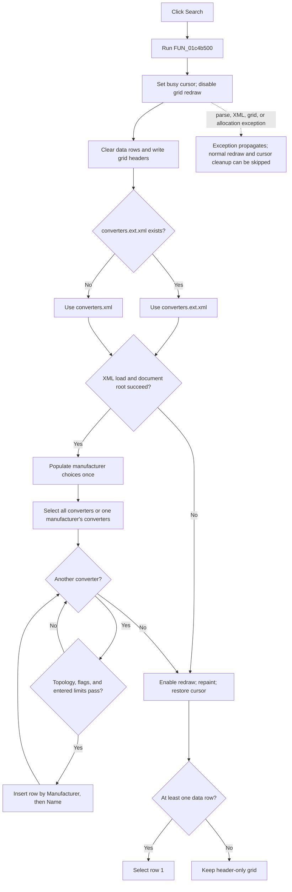

# Search

> Analysis status: Reviewed from recovered source, dialog resources, catalog traversal, and the Open-button path.

## Control

| Property | Recovered value |
| --- | --- |
| Form | ConvertersDlg |
| Component path | ConvertersDlg.SearchBtn |
| Control class | TBitBtn |
| Caption | Search |
| Hint | Not present in the recovered resource. |
| Handler name | SearchBtnClick |
| Handler address | 01c4b320 |
| Graph node | `resource:dfm:ConvertersDlg/ConvertersDlg.SearchBtn` |
| Handler node | `function:01c4b320` |
| Graph layer | UI |

## What happens when clicked

The click rebuilds `ConvertersGrid` from the converter XML catalog and the current filter controls. It does not append to the previous results. It clears the result rows first, reloads the catalog from disk, inserts matching converters in sorted order, and selects the first result when one exists.

`FUN_01c4b320` is a one-call event wrapper. It calls `FUN_01c4b500`, which also runs during form creation. Therefore, the dialog performs an initial search when it opens. The button repeats the same search after the user changes a filter.

## Search inputs

There is no free-text search box. The worker reads these controls:

| Control | Search rule |
| --- | --- |
| Topology | Always active. The selected item is Buck, Boost, Buck-Boost, or Inverting. The selected index plus one must be present in the converter's recovered `topology` code. |
| Automotive | When checked, the converter must have `auto = 1`. |
| Manufacturer | `All Manufacturers` searches every converter. Another selection restricts the XML query to that named manufacturer. |
| PMBus | When checked, the converter must have `pmbus = 1`. |
| Min Input Voltage | When nonempty, the converter's `vinmin` must be less than or equal to the entered value. |
| Max Input Voltage | When nonempty, the entered value must be less than or equal to the converter's `vinmax`. |
| Output Voltage | When nonempty, the entered value must be within the converter's `voutmin` to `voutmax` range. |
| Max Output Current | When nonempty, the entered value must be less than or equal to the converter's `iout`. |
| Min Frequency | When nonempty, the converter's `freqmin` must be less than or equal to the entered value. |
| Max Frequency | When nonempty, the entered value must be less than or equal to the converter's `freqmax`. |

An empty numeric control disables only that numeric test. Topology is always active. Form creation selects Buck and clears Automotive and PMBus. It also starts with `All Manufacturers`.

## Catalog selection and traversal

The worker first checks for `converters.ext.xml` in the recovered application data directory. It uses that file when it exists. Otherwise, it uses `converters.xml`. It does not merge the two files.

The worker loads the selected file and traverses converter elements in the XML document:

- With `All Manufacturers`, it selects `manufacturer/converter`.
- With one named manufacturer, it selects `manufacturer[@name='%s']/converter`.
- On the first successful load, it adds each catalog manufacturer name to `ManufacturerCB` when the combo box still contains only its initial item. Later searches do not add the names again.
- `FUN_01c4a8f0` applies topology, Automotive, PMBus, and numeric filters to each candidate.

The selected manufacturer's name is inserted into the XPath format without a separate escaping step in this function. The recovered form only offers names that came from the catalog.

## Result grid, order, and selection

Before XML loading, the worker disables grid redraw, reduces the grid to its header row, and writes these columns: File, Manufacturer, Name, Topology, Vin, Vout, Iout, and Frequency.

For every match, it inserts one row with:

- the converter element's text in the hidden or internal File column;
- the parent manufacturer name and converter name;
- the display text for the recovered topology code;
- formatted input-voltage, output-voltage, output-current, and frequency values.

`FUN_01c4b330` finds an insertion position by Manufacturer and then Name. Its comparison path uses the Windows locale-aware, case-insensitive string comparison. `FUN_01c4b490` shifts existing grid rows down before the new row is written. The result grid is therefore sorted by manufacturer and converter name, not left in catalog order.

After normal completion, the worker enables redraw, asks the grid to repaint, and restores the default cursor. If the grid has at least one data row, it selects row 1, which is the first sorted result. If no converter matches, the grid keeps only its header row. The worker does not show a separate no-results message.

## Click flow

## How Open uses a search result

Search does not open an example or close the dialog. The Open button and a grid double-click later run `FUN_01c4aec0`. That handler reads the selected row's File column, resolves its example names under the application `Examples` directory, and prepares the dialog-owned output-path list. Accepted callers then open those paths and derive design parameters from the dialog controls.

Open does not rerun Search. If the user changes a filter after the last search and then clicks Open, Open still uses the currently selected row from the prior result set.

## Empty, repeated, and failure behavior

- A repeated click clears and reloads the grid. It does not retain or append old data rows.
- Empty numeric edits cause no numeric restriction. They do not stop the search.
- A missing `converters.ext.xml` is not an error; the worker falls back to `converters.xml`.
- A failed XML load or missing document root completes with a header-only grid and no message when the XML API reports failure normally.
- Numeric XML attributes use a recovered default text of `0` when absent.
- Nonempty numeric edits are parsed during filtering. Invalid or out-of-range input can raise the standard localized numeric-input exception.
- The worker has no local exception handler and no `finally` cleanup. An exception after the grid was cleared can leave partial results. It can also leave the busy cursor active and grid redraw disabled.
- Search does not change the converter XML catalog, write settings, or persist filter values.

## Resource and glyph evidence

- The recovered caption is `Search`. There is no hint or action binding.
- The extracted [Search glyph](../../../glyph/0039_ConvertersDlg_ConvertersDlg_SearchBtn_Glyph_Data.png) is a 36-by-18 bitmap with two 18-by-18 button-state frames. It shows paired circular arrows. This supports repeat or refresh intent, but it does not identify the catalog or filters by itself.
- The nearby `A` and `V` labels belong to numeric units. They do not describe the Search button.
- The form resource supplies the topology items, the `All Manufacturers` item, feature check boxes, and numeric-field labels. The recovered worker connects those controls to the catalog fields.

## Handler evidence

- Event wrapper: [FUN_01c4b320](../../../DecompiledSources/Tina16/functions/0000000001C4B320__FUN_01c4b320.c) calls only the search worker.
- Search worker: [FUN_01c4b500](../../../DecompiledSources/Tina16/functions/0000000001C4B500__FUN_01c4b500.c) chooses and loads the catalog, rebuilds the grid, and restores UI state on normal exit.
- Manufacturer query: [FUN_01c4a760](../../../DecompiledSources/Tina16/functions/0000000001C4A760__FUN_01c4a760.c) builds the all-manufacturer or selected-manufacturer XPath.
- Filter evaluation: [FUN_01c4a8f0](../../../DecompiledSources/Tina16/functions/0000000001C4A8F0__FUN_01c4a8f0.c) evaluates topology, feature flags, and optional numeric limits.
- Numeric XML value: [FUN_01c4a5e0](../../../DecompiledSources/Tina16/functions/0000000001C4A5E0__FUN_01c4a5e0.c) reads and parses one floating-point XML attribute.
- Sorted insertion: [FUN_01c4b330](../../../DecompiledSources/Tina16/functions/0000000001C4B330__FUN_01c4b330.c) finds a row position; [FUN_01c4b490](../../../DecompiledSources/Tina16/functions/0000000001C4B490__FUN_01c4b490.c) shifts rows for insertion.
- Form initialization: [FUN_01c4a6d0](../../../DecompiledSources/Tina16/functions/0000000001C4A6D0__FUN_01c4a6d0.c) sets the default filters and runs the same worker.
- Later result use: [FUN_01c4aec0](../../../DecompiledSources/Tina16/functions/0000000001C4AEC0__FUN_01c4aec0.c) consumes the selected File cell when Open is invoked.

## Analysis limits

- Recovered field offsets and the form resource establish the control mapping. Original Delphi field declarations are not available.
- The recovered source does not show a result count or status text.
- The exact XML parser diagnostics and global exception presentation occur outside this handler.
