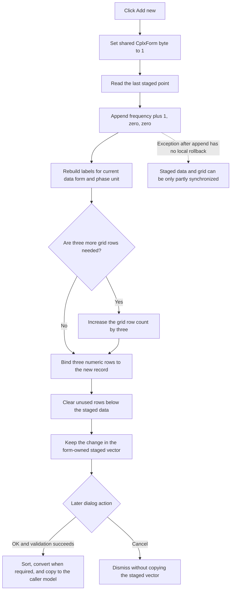

# Add a new staged complex point

`Add &new` appends one point to the parameter editor's staged data. The new point has a frequency that is one greater than the last staged frequency. Its two value fields are zero. The click refreshes the three grid rows for that point, but it does not validate, sort, commit, save, or close the dialog.

## Control

| Property | Recovered value |
| --- | --- |
| Form | `CplxForm` (`Parameter Editor`) |
| Component path | `CplxForm.addnew` |
| Control class | `TButton` |
| Caption | `Add &new` |
| Hint | Not present in the recovered resource. |
| Handler | `addnewClick` at `01406e80` |
| Resource node | `resource:dfm:CplxForm/CplxForm.addnew` |
| Handler node | `function:01406e80` |
| Graph layer | UI |

The recovered resource has no glyph or image for this button. Its caption and its position near `Remove &last`, `Clear &all`, and `Arrange` identify the editor command group, but the handler provides the behavior evidence.

## Click behavior

The handler performs these operations in order:

1. It sets the shared byte at `DAT_021084b2` to `1`. The same byte is set by `Clear all`, but the recovered source does not identify its exact purpose.
2. It reads the last record in the form-owned point vector at form offset `+0x7A8`.
3. It appends the three-double record `(last frequency + 1.0, 0.0, 0.0)`.
4. It rebuilds the row-label list with `FUN_01404f30`.
5. It increases the attribute grid by three rows when the saved row capacity is no longer sufficient.
6. It creates three numeric editors. The editors bind directly to the appended record's frequency, first value, and second value fields. It installs them with the rebuilt labels at row indexes `3 * last point index`, `+1`, and `+2`.
7. It clears both visible columns in any unused rows below the staged data.

The button therefore appends to the end of the current order. It does not insert at the selected row and does not sort the frequencies. `Arrange` and successful `OK` processing are the recovered operations that sort the staged vector.

## Data form and phase unit

Each point always occupies three doubles and three vertical attribute-grid rows:

- frequency;
- the first complex-value field;
- the second complex-value field.

The selected `formofdata` radio item defines how the last two fields are shown. Index `0` uses real and imaginary labels. Index `1` uses magnitude and phase labels. In magnitude-and-phase mode, the phase-unit state selects the degree or radian label. The appended pair is zero in either representation, so a unit conversion does not change the initial value.

`FUN_01404f30` clears and rebuilds all row labels after the append. It creates one set of three labels for every staged point and uses the current data-form and phase-unit state. The click then binds only the newly appended three rows; it does not rebuild every existing numeric editor.

## Input and validation boundary

This click does not parse text from the active grid cell. Its nine direct calls contain vector access and append operations, label construction, grid sizing, numeric-editor construction, row binding, cell clearing, and string cleanup. The handler does not call the attribute-grid validation routine used by `Arrange` and `OK`.

There is no explicit invalid-input branch and no message in this handler. Whether the VCL commits an active cell edit before it dispatches the button click is not recoverable from this handler. A later `Arrange` or `OK` action performs the explicit grid validation.

## Staged model, OK, and Cancel

Form creation copies the caller's complex-point vector into the form-owned vector at `+0x7A8`. `Add &new` changes this staged vector and its grid bindings immediately. It does not copy the change to the caller's object.

The recovered `OK` handler validates the grid. On its normal success path, it sorts the staged points by frequency. For magnitude-and-phase data, it converts the staged values back to real and imaginary parts, with the selected phase unit applied, and then copies the staged vector to the caller's model. The recovered Cancel click handler is empty; the `bkCancel` button supplies the modal dismissal, and no staged vector copy occurs on that path. No file write or other persistence occurs in `Add &new`.

## No-op and error behavior

There is no normal no-op branch. The handler assumes that the staged vector contains at least one point because it reads the last record before it appends. Form creation, `Clear all`, and `Remove last` preserve that invariant: `Clear all` restores one record, and `Remove last` does not remove the sole remaining record.

The handler has no local exception handler and no rollback. It appends the record before it rebuilds labels and grid rows. If allocation, label construction, grid growth, or row binding raises an exception, the recovered code provides no atomic recovery and can leave the staged vector changed before the grid update completes. The source does not recover the final UI state after such an exception.

## Click flow

## Evidence

- [Add-new handler](../../../DecompiledSources/Tina16/functions/0000000001406E80__FUN_01406e80.c): reads the last staged record, appends `(frequency + 1.0, 0, 0)`, rebuilds labels, grows the grid when needed, binds three numeric rows, and clears unused rows.
- [Mode-aware row-label builder](../../../DecompiledSources/Tina16/functions/0000000001404F30__FUN_01404f30.c): creates three labels per staged point and selects real/imaginary or magnitude/phase labels, including the phase-unit choice.
- [Form initialization](../../../DecompiledSources/Tina16/functions/0000000001405E00__FUN_01405e00.c): creates the staged working vector and the initial grid bindings.
- [Data-form switch](../../../DecompiledSources/Tina16/functions/0000000001406A40__FUN_01406a40.c) and [degree/radian switch](../../../DecompiledSources/Tina16/functions/00000000014061C0__FUN_014061c0.c): convert the staged value representation and refresh the labels and grid.
- [Arrange handler](../../../DecompiledSources/Tina16/functions/0000000001408020__FUN_01408020.c): validates and sorts the staged points.
- [OK handler](../../../DecompiledSources/Tina16/functions/00000000014063E0__FUN_014063e0.c): validates, sorts, converts when required, and copies staged data to the caller's object.
- [Cancel handler](../../../DecompiledSources/Tina16/functions/00000000014063D0__FUN_014063d0.c): contains no data-copy operation.
- [Remove-last handler](../../../DecompiledSources/Tina16/functions/0000000001407100__FUN_01407100.c) and [clear-all handler](../../../DecompiledSources/Tina16/functions/0000000001407220__FUN_01407220.c): preserve a minimum of one staged point.
- [Recovered Delphi UI evidence](../../../DecompiledSources/Tina16/resources/dfm/ui-evidence.json): binds `CplxForm.addnew.OnClick` to `addnewClick` at `01406e80` and supplies the control and neighboring-label properties.

## Analysis limits

- The exact meaning of `DAT_021084b2` is not recovered. Calling it a dirty flag would be an inference.
- The source does not show how an active cell editor reacts to focus loss immediately before the click event.
- The handler has no application error text, so no specific displayed error can be recovered for an append or grid-update failure.
