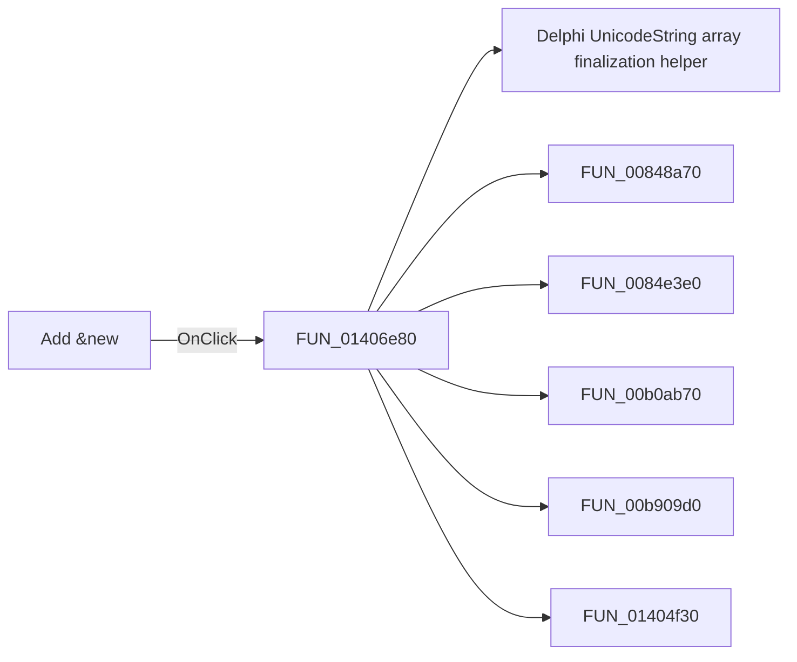

# Add &new

> Analysis status: Pending individual source review.

## Control

| Property | Recovered value |
| --- | --- |
| Form | CplxForm |
| Component path | CplxForm.addnew |
| Control class | TButton |
| Caption | Add &new |
| Hint | Not present in the recovered resource. |
| Text | Not present in the recovered resource. |
| Handler name | addnewClick |
| Handler address | 01406e80 |
| Graph node | `resource:dfm:CplxForm/CplxForm.addnew` |
| Handler node | `function:01406e80` |
| Graph layer | UI |

## What happens when clicked

Pending individual analysis. An agent must read the recovered handler source and its relevant callees before it replaces this text.

## Click flow

## Handler evidence

- Source: [DecompiledSources/Tina16/functions/0000000001406E80__FUN_01406e80.c](../../../DecompiledSources/Tina16/functions/0000000001406E80__FUN_01406e80.c)
- Recovered role: Not present in the recovered resource.
- Current graph summary: Handles 1 Delphi UI event: CplxForm.addnew.OnClick.
- Current graph behavior: Not present in the recovered resource.
- Current graph evidence: Not present in the recovered resource.
- Complexity: complex
- Distinct outgoing calls: 9

## Direct calls

- `function:00414560` — Delphi UnicodeString array finalization helper
- `function:00848a70` — FUN_00848a70
- `function:0084e3e0` — FUN_0084e3e0
- `function:00b0ab70` — FUN_00b0ab70
- `function:00b909d0` — FUN_00b909d0
- `function:01404f30` — FUN_01404f30
- `function:014313c0` — FUN_014313c0
- `function:01d3c210` — FUN_01d3c210
- `function:01d3c230` — FUN_01d3c230

## Resource evidence

- Kind: Not present in the recovered resource.
- Modal result: Not present in the recovered resource.
- Checked state: Not present in the recovered resource.
- List items: Not present in the recovered resource.
- Image reference: Not present in the recovered resource.
- Extracted glyph: None.

## Nearby label candidates

Nearby labels are layout candidates only. They are not proof of behavior.

- Rank 1: Frequency at distance 264.
- Rank 2: Imaginary part at distance 336.
- Rank 3: Phase[deg] at distance 352.

## Analysis limits

- Do not infer behavior from the control class, caption, hint, glyph, or nearby label alone.
- Do not replace the pending status until the handler source and relevant call path provide enough evidence.
