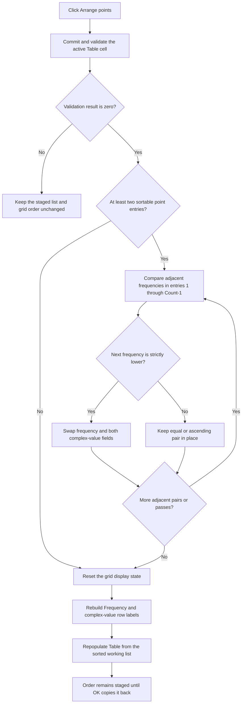

# Arrange points

> Analysis status: Reviewed from recovered source, form-resource, and call-graph evidence.

## Control

| Property | Recovered value |
| --- | --- |
| Form | CplxForm |
| Form caption | Parameter Editor |
| Component path | CplxForm.arrange |
| Control class | TButton |
| Caption | Arrange points |
| Hint | Not present in the recovered resource. |
| Handler name | arrangeClick |
| Handler address | 01408020 |
| Graph node | `resource:dfm:CplxForm/CplxForm.arrange` |
| Handler node | `function:01408020` |
| Graph layer | UI |

## What happens when clicked

`arrangeClick` validates and commits the active `Table` cell, sorts the staged complex-point records by frequency, and rebuilds the visible attribute grid. It does not commit the staged list to the caller.

The working list is at form offset `+0x7a8`. Each entry contains three consecutive `double` values. For entries `1` and later, the grid labels and population routine establish these fields as:

1. frequency;
2. real part or magnitude, according to the selected data form;
3. imaginary part or phase, according to the selected data form.

Entry `0` is a special base record. The handler never compares or moves it. It sorts only entries `1..Count-1`.

## Validation before sorting

The handler first calls `FUN_00b0a890` for the `TAttributeGrid` at form offset `+0x6d8`. If no cell editor is active, the helper returns `0`. If an editor is active, it tries to commit the current text through the grid validation path and returns that result. The handler stores it in the form byte at `+0x7b0`.

A nonzero result stops the handler. It does not reorder the working list, reset the grid, rebuild labels, or repopulate cells. The invalid editor and its validation feedback remain under the grid's control.

A zero result means that the current cell is committed or no editor needs a commit. Sorting then uses the current staged values, including the just-accepted edit.

## Sort order and stability

The nested loops perform an adjacent-swap bubble sort over entries `1..Count-1`. For each adjacent pair, the handler swaps when:

`next.frequency <= previous.frequency` and `previous.frequency != next.frequency`

For ordinary numeric values, this is a strict `next.frequency < previous.frequency` test. The result is ascending frequency order.

The handler swaps all three `double` fields. Frequency therefore stays paired with its real/imaginary or magnitude/phase values. Equal frequency values are not swapped, so their input order is stable. The source has no special branch for NaN values; comparisons involving NaN do not establish a useful order.

If the working list contains at most two entries, there are fewer than two sortable point entries after the reserved entry `0`. The comparison loops do nothing, but the successful refresh path still runs.

## Grid and model synchronization

Sorting changes the working list directly. After all swaps finish, the handler performs these UI updates:

- `FUN_00b0ae40` closes the grid editor, clears its tracked editor coordinates, and invalidates or resets the displayed cells and column state.
- `FUN_01404f30` rebuilds the row-name list. It uses `Frequency` for the first field of each point and selects `Real part`/`Imaginary part` or `Magnitude`/`Phase` labels from the current display mode and angle unit.
- `FUN_01405a00` writes the `Name` and `Value` headers, writes the three values for each point from the now-sorted working list, and blanks unused rows in the retained grid capacity.

The handler does not track a point identity across the reorder. It does not restore an active editor, caret, or selected logical point after the reset. The exact selected grid coordinate after refresh is internal grid behavior and is not established by this source. Even if a coordinate remains selected, a different point can occupy it after the sort.

## Staged state, OK, and Cancel

`CplxForm.FormCreate` creates the working list at `+0x7a8` and copies the caller-supplied complex table into it. `arrangeClick` changes only this private working list and its grid presentation.

`okClick` separately validates the grid and repeats the same ascending sort before it clears and copies the working list back to the caller-supplied table. Therefore Arrange is a preview/edit operation, not the persistence boundary, and OK does not depend on the user clicking Arrange first.

The Cancel button is the resource-defined `bkCancel` button, and its recovered application handler returns without copying data. Cancel therefore leaves the caller-supplied table unchanged. It discards the staged order when the modal editor is closed and destroyed.

## Click flow

## Handler evidence

- Primary handler: [FUN_01408020](../../../DecompiledSources/Tina16/functions/0000000001408020__FUN_01408020.c) contains the validation gate, adjacent comparisons, three-field swaps, and refresh calls.
- Grid commit: [FUN_00b0a890](../../../DecompiledSources/Tina16/functions/0000000000B0A890__FUN_00b0a890.c) commits the active editor through the cell-validation helper and returns its result.
- Cell validation: [FUN_00b0a150](../../../DecompiledSources/Tina16/functions/0000000000B0A150__FUN_00b0a150.c) reads the editor text, updates the cell and callbacks on a valid location, and returns `0`; it returns `1` when the location check fails.
- Grid reset: [FUN_00b0ae40](../../../DecompiledSources/Tina16/functions/0000000000B0AE40__FUN_00b0ae40.c) hides the editor, resets two tracked indices to `-1`, invalidates visible cells, clears per-column state, and records the visible-row base.
- Row labels: [FUN_01404f30](../../../DecompiledSources/Tina16/functions/0000000001404F30__FUN_01404f30.c) builds the names that identify the sorted first field as `Frequency` and the paired complex fields according to display mode.
- Grid population: [FUN_01405a00](../../../DecompiledSources/Tina16/functions/0000000001405A00__FUN_01405a00.c) writes the headers and staged record fields into the grid and blanks unused rows.
- Working-list access: [FUN_01d3c210](../../../DecompiledSources/Tina16/functions/0000000001D3C210__FUN_01d3c210.c) returns the payload address for a list entry.
- Working-copy initialization: [FUN_01405e00](../../../DecompiledSources/Tina16/functions/0000000001405E00__FUN_01405e00.c) allocates the form-owned working list and copies the supplied table into it before the initial label and grid population.
- Commit boundary: [FUN_014063e0](../../../DecompiledSources/Tina16/functions/00000000014063E0__FUN_014063e0.c) repeats validation and sorting in `okClick`, then replaces the supplied table only on validation success.
- Cancel handler: [FUN_014063d0](../../../DecompiledSources/Tina16/functions/00000000014063D0__FUN_014063d0.c) contains only `return`; the resource supplies its `bkCancel` behavior.
- Complexity: complex; five distinct outgoing calls are present in the graph.

## Resource evidence

- The button caption is `Arrange points`. It has no hint, action, image reference, or extracted glyph.
- The target control is the `TAttributeGrid` named `Table`.
- The form caption is `Parameter Editor`.
- The nearby `Frequency`, `Real part`, `Imaginary part`, `Magnitude`, `Phase[deg]`, and `Phase[rad]` labels agree with the row-name helper. Their layout positions alone are not the proof of field meaning.

## No-op, error, and partial-failure behavior

- A validation failure is a no-sort path. No refresh helper runs.
- With zero or one sortable point, the list order is unchanged, but the grid reset and repopulation still run after successful validation.
- An already sorted list and a list with equal adjacent frequencies keep their order. The UI still refreshes.
- The handler has no local exception handler or rollback. An exception during comparison or a three-field swap can leave a partial staged reorder. An exception after sorting but during label or grid rebuilding can leave the model sorted while the visible grid is stale or only partly rebuilt.
- Arrange does not write the caller-supplied table. A later Cancel still leaves that table unchanged, even if the working list or grid refresh is incomplete.

## Analysis limits

- The exact selected grid coordinate, scroll position, and caret after the reset are grid implementation details not proven by this handler.
- The source establishes ascending order for ordinary numeric frequencies. It does not define a separate NaN policy.
- Arrange affects staged complex-point data only. External storage or downstream use begins after the caller accepts the editor and is outside this handler.
