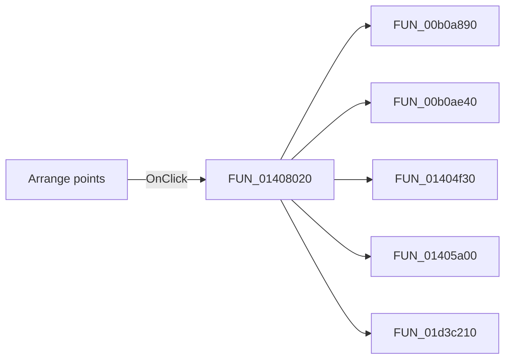

# Arrange points

> Analysis status: Pending individual source review.

## Control

| Property | Recovered value |
| --- | --- |
| Form | CplxForm |
| Component path | CplxForm.arrange |
| Control class | TButton |
| Caption | Arrange points |
| Hint | Not present in the recovered resource. |
| Text | Not present in the recovered resource. |
| Handler name | arrangeClick |
| Handler address | 01408020 |
| Graph node | `resource:dfm:CplxForm/CplxForm.arrange` |
| Handler node | `function:01408020` |
| Graph layer | UI |

## What happens when clicked

Pending individual analysis. An agent must read the recovered handler source and its relevant callees before it replaces this text.

## Click flow

## Handler evidence

- Source: [DecompiledSources/Tina16/functions/0000000001408020__FUN_01408020.c](../../../DecompiledSources/Tina16/functions/0000000001408020__FUN_01408020.c)
- Recovered role: Not present in the recovered resource.
- Current graph summary: Handles 1 Delphi UI event: CplxForm.arrange.OnClick.
- Current graph behavior: Not present in the recovered resource.
- Current graph evidence: Not present in the recovered resource.
- Complexity: complex
- Distinct outgoing calls: 5

## Direct calls

- `function:00b0a890` — FUN_00b0a890
- `function:00b0ae40` — FUN_00b0ae40
- `function:01404f30` — FUN_01404f30
- `function:01405a00` — FUN_01405a00
- `function:01d3c210` — FUN_01d3c210

## Resource evidence

- Kind: Not present in the recovered resource.
- Modal result: Not present in the recovered resource.
- Checked state: Not present in the recovered resource.
- List items: Not present in the recovered resource.
- Image reference: Not present in the recovered resource.
- Extracted glyph: None.

## Nearby label candidates

Nearby labels are layout candidates only. They are not proof of behavior.

- Rank 1: Frequency at distance 80.
- Rank 2: Phase[rad] at distance 120.
- Rank 3: Phase[deg] at distance 136.

## Analysis limits

- Do not infer behavior from the control class, caption, hint, glyph, or nearby label alone.
- Do not replace the pending status until the handler source and relevant call path provide enough evidence.
