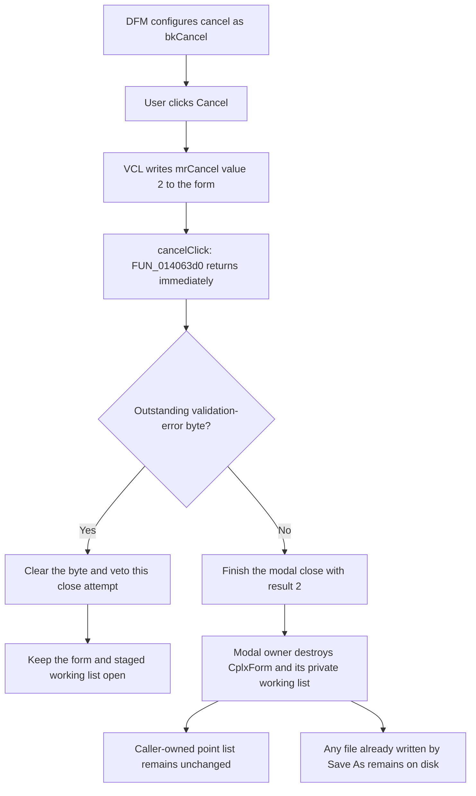

# Cancel

> Analysis status: Reviewed from recovered application, VCL, modal-owner, and form-resource evidence.

## Control

| Property | Recovered value |
| --- | --- |
| Form | CplxForm |
| Form caption | Parameter Editor |
| Component path | CplxForm.cancel |
| Control class | TBitBtn |
| Button kind | bkCancel |
| Framework modal result | 2 (`mrCancel`) |
| Handler name | cancelClick |
| Handler address | 014063d0 |
| Graph node | `resource:dfm:CplxForm/CplxForm.cancel` |
| Handler node | `function:014063d0` |
| Graph layer | UI |

## What happens when clicked

The recovered `TCplxForm.cancelClick` application handler does nothing: [`FUN_014063d0`](../../../DecompiledSources/Tina16/functions/00000000014063D0__FUN_014063d0.c) returns without a call, read, write, or branch. Cancel still works because the DFM defines the button as `bkCancel`.

The recovered VCL path configures `bkCancel` with modal result `2` and the form-cancel state. On a click, the inherited button path finds the parent form and writes result `2` to the form before it dispatches `cancelClick`. The empty handler leaves that result unchanged. The modal form can then close without running `okClick`.

Cancel does not call the attribute-grid validator. It does not commit the active cell, sort the points, convert values, copy staged data to the caller, or undo each prior edit. Its rejection behavior is implemented by not running the OK copy-back path.

## Cancel flow

## Modal-result and close evidence

- [`FUN_0082bc30`](../../../DecompiledSources/Tina16/functions/000000000082BC30__FUN_0082bc30.c), the recovered `TBitBtn.SetKind` path, applies the standard caption, modal-result table entry, glyph, and default or cancel state for a noncustom button kind. `bkCancel` is kind index `2` and uses modal result `2`.
- [`FUN_0082b0e0`](../../../DecompiledSources/Tina16/functions/000000000082B0E0__FUN_0082b0e0.c), the recovered `TBitBtn.Click` override, delegates `bkCancel` to the inherited button path. Only `bkHelp` and `bkClose` use special branches there.
- [`FUN_00687f30`](../../../DecompiledSources/Tina16/functions/0000000000687F30__FUN_00687f30.c), the inherited button click path, writes the button's value at offset `+0x4f0` to the parent form's modal-result field at `+0x508` before it dispatches `OnClick`.
- [`FUN_014063d0`](../../../DecompiledSources/Tina16/functions/00000000014063D0__FUN_014063d0.c) is the dispatched application handler. Its complete body is `return`.
- [`FUN_01404f10`](../../../DecompiledSources/Tina16/functions/0000000001404F10__FUN_01404f10.c) allows closure only when the form byte at `+0x7b0` is zero, then clears that byte. The parallel `CplxForm11.FormCloseQuery` handler has the same recovered operation, which confirms this close-query role.

## Working-copy ownership and rollback boundary

[`FUN_01405e00`](../../../DecompiledSources/Tina16/functions/0000000001405E00__FUN_01405e00.c), the form-create handler, obtains the caller-supplied complex-point table, allocates a separate list at form offset `+0x7a8`, and copies the caller's points into that list. Grid edits and the Add new, Remove last, Clear all, Arrange points, representation, phase-unit, and Load commands operate on this form-owned working list.

[`FUN_014063e0`](../../../DecompiledSources/Tina16/functions/00000000014063E0__FUN_014063e0.c), the separate OK handler, is the copy-back boundary. On its valid path, it sorts the staged points, converts polar values to Cartesian output when required, clears the caller-owned list, and copies the staged list into it. Cancel never calls this handler. Therefore, accepted cancellation leaves the caller-owned point list as it was before the editor opened.

The discard occurs during form cleanup, not inside `cancelClick`. [`FUN_00b088a0`](../../../DecompiledSources/Tina16/functions/0000000000B088A0__FUN_00b088a0.c) shows the generic modal-editor owner: it shows the form modally, receives the result, and destroys the form. [`FUN_01404eb0`](../../../DecompiledSources/Tina16/functions/0000000001404EB0__FUN_01404eb0.c) destroys CplxForm's label helper and private point list before inherited form cleanup.

If close query vetoes the Cancel attempt, the modal owner has not returned and does not destroy the form. The staged list remains available so that the user can retry or choose another command.

## Validation bypass and close veto

`cancelClick` does not call the grid validation function. However, the form's close-query byte can already be nonzero:

- Arrange points and Save As store their grid-validation result at `+0x7b0` without starting a modal close. If either command leaves a validation error there, the next Cancel attempt is vetoed once. The close-query path clears the byte during that attempt.
- A failed OK also stores a validation error, but the earlier `bkOK` modal-result write immediately starts a close attempt. Close query vetoes that OK close and clears the byte before a later Cancel click.
- If no earlier command recorded an error, Cancel does not parse or validate the active editor text. Normal focus or grid events can run before `OnClick`, but that event ordering is outside this handler and is not recovered here.

Thus Cancel bypasses new application validation, but it does not bypass an outstanding close veto. After a veto clears the byte, a repeated Cancel normally reaches the close path if no new validation error is recorded.

## Retained side effects

Most CplxForm commands change only the private working list and form controls, so form destruction discards their results. Two boundaries need separate treatment:

- [`FUN_01407750`](../../../DecompiledSources/Tina16/functions/0000000001407750__FUN_01407750.c) validates and runs Save As. Its writer, [`FUN_014072d0`](../../../DecompiledSources/Tina16/functions/00000000014072D0__FUN_014072d0.c), writes the current staged points to the selected catalog file before any later Cancel. Cancel does not delete, truncate, or restore that file.
- The recovered representation and phase-unit flags are process globals. Cancel does not restore them. The next [`FUN_01405e00`](../../../DecompiledSources/Tina16/functions/0000000001405E00__FUN_01405e00.c) form creation resets these working flags before it builds a new editor. No recovered caller use between those points is established.

Load changes the working list from a selected file, but it does not write that source file. A later accepted Cancel discards the loaded values with the working list.

## Resource evidence

- The form caption is `Parameter Editor`.
- `cancel` is a `TBitBtn` with `Kind = bkCancel`. The kind supplies its standard caption, glyph, cancel state, and modal result; these are not separately stored in this DFM stream.
- The neighboring `ok` button uses `bkOK` and has its own validation and copy-back handler.
- The Cancel button has no recovered custom caption, hint, action, image reference, or extracted glyph.
- Nearby labels such as `Real part`, `Magnitude`, and `Phase[rad]` describe the table's data modes. Their layout proximity does not define Cancel behavior.

## No-op, cleanup, and error behavior

- The custom handler is deterministic and cannot fail by itself because it executes only `return`.
- Cancel performs no inverse operations on the working list. Partial staged changes remain in that list until an accepted close destroys the form.
- A close-query veto is not a rollback. It leaves the form open and clears only the validation-error byte.
- The accepted close path has no application-level cleanup error dialog or recovery branch. Failures in the VCL modal close or destructor follow the normal Delphi exception path.
- Durable output produced by an earlier Save As is outside the form rollback boundary and survives both successful and failed Cancel attempts.

## Direct calls

No direct call edge is present because `FUN_014063d0` contains only a return instruction. The modal-result write, event dispatch, close query, and cleanup are framework or owner paths around the handler.

## Analysis limits

- The recovered source proves the button's cancel modal result and the form's one-byte close veto. It does not recover a user-facing name for the byte at `+0x7b0`.
- A VCL focus change can run grid events before the recovered click handler. This article does not claim that every uncommitted editor string reaches `cancelClick` unchanged.
- No recovered caller consumes the CplxForm working-mode globals after cancellation and before the next form creation. Their interim value is noted as retained process state, not as a proven user-visible preference.
