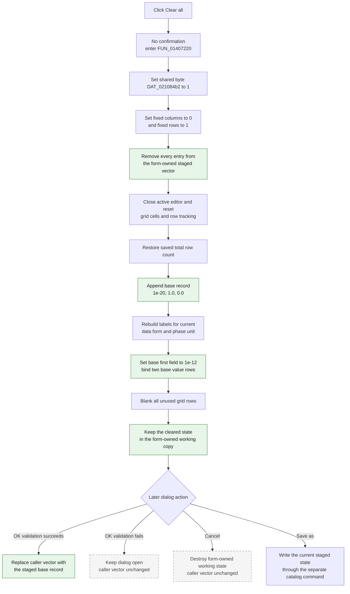

# Clear staged complex points and restore the base record

> Analysis status: Complete. The recovered handler, staged-list implementation, grid reset and population helpers, form lifecycle, and OK and Cancel paths agree on this behavior.

## Control

| Property | Recovered value |
| --- | --- |
| Form | CplxForm |
| Form caption | Parameter Editor |
| Component path | CplxForm.clearall |
| Control class | TButton |
| Caption | &Clear all |
| Hint | Not present in the recovered resource. |
| Text | Not present in the recovered resource. |
| Handler name | clearallClick |
| Handler address | 01407220 |
| Graph node | `resource:dfm:CplxForm/CplxForm.clearall` |
| Handler node | `function:01407220` |
| Graph layer | UI |

## What happens when clicked

The button immediately clears all user-added points from the Parameter Editor's staged complex-point vector. It does not ask for confirmation and does not validate the active grid editor first.

The handler keeps the vector object itself, removes all of its entries, and then adds one special base record. It resets and repopulates the `TAttributeGrid` named `Table` from that record. This preserves the editor invariant used by **Add new** and **Remove last**: the staged vector always contains at least one entry.

The clear is staged. It does not replace the caller-owned point vector, write a catalog file, close the dialog, or set a modal result. A later successful OK copies the cleared working state to the caller. Cancel closes without that copy-back.

## Confirmation and operation order

`FUN_01407220` has one unconditional path. It does not call a message-box, question-dialog, or confirmation helper. The operations occur in this order:

1. Set shared byte `DAT_021084b2` to `1`. The recovered source does not identify the byte's exact purpose.
2. Set the grid's fixed-column count to `0` and fixed-row count to `1`.
3. Clear every entry from the form-owned vector at `+0x7A8`.
4. Reset the grid editor, displayed cell state, and internal attribute-row tracking.
5. Restore the grid row count from saved form field `+0x7C0`.
6. Append a base three-double record with interim values `(1e-20, 1.0, 0.0)`.
7. Rebuild the mode-dependent row labels.
8. Repopulate the grid. During this step, the base record's first double is set to `1e-12`, so its final staged values are `(1e-12, 1.0, 0.0)`.

The first record is special. The grid population code displays its second and third doubles as the initial complex value pair. It does not add a normal frequency row for this base record. Later records use three rows: frequency plus the two representation-dependent value fields.

## Model, list, grid, and selection effects

| State | Proven effect |
| --- | --- |
| Staged vector | `FUN_00b95290` invokes the vector's virtual removal hook for every existing entry and sets its count to zero. `FUN_01d3c230` then adds the new base record. |
| Vector object | The handler does not replace or destroy the vector object at form field `+0x7A8`. The form continues to own it. |
| Grid dimensions | The handler sets zero fixed columns, one fixed row, and restores the total row count from `+0x7C0`. It does not shrink the grid to the number of active values. |
| Active editor | `FUN_00b0ae40` hides or clears the active editor and resets its two tracked coordinates to `-1`. No clear-specific validation result is shown. |
| Headers and labels | `FUN_01404f30` rebuilds the label list for the current rectangular or polar display and phase unit. `FUN_01405a00` writes the `Name` and `Value` headers. |
| Active rows | The population helper binds the base record's two value fields to the first two data rows. It writes the recovered blank placeholder to unused rows below the staged data. |
| Current row | `FUN_01405a00` requests grid row `1` before it adds the base value editors. The handler does not explicitly restore the previously selected logical point. |
| Current column and scroll | No recovered call assigns a final column, scroll offset, caret, or selection range. Their exact final values are grid implementation details. |

## Clear flow

## Handler and lifecycle evidence

- Clear-all handler: [FUN_01407220](../../../DecompiledSources/Tina16/functions/0000000001407220__FUN_01407220.c)
- Staged-vector clear: [FUN_00b95290](../../../DecompiledSources/Tina16/functions/0000000000B95290__FUN_00b95290.c)
- Base-record append: [FUN_01d3c230](../../../DecompiledSources/Tina16/functions/0000000001D3C230__FUN_01d3c230.c)
- Grid fixed-column setter: [FUN_008483b0](../../../DecompiledSources/Tina16/functions/00000000008483B0__FUN_008483b0.c)
- Grid fixed-row setter: [FUN_00848a30](../../../DecompiledSources/Tina16/functions/0000000000848A30__FUN_00848a30.c)
- Grid row-count setter: [FUN_00848a70](../../../DecompiledSources/Tina16/functions/0000000000848A70__FUN_00848a70.c)
- Attribute-grid reset: [FUN_00b0ae40](../../../DecompiledSources/Tina16/functions/0000000000B0AE40__FUN_00b0ae40.c)
- Mode-dependent label builder: [FUN_01404f30](../../../DecompiledSources/Tina16/functions/0000000001404F30__FUN_01404f30.c)
- Grid population: [FUN_01405a00](../../../DecompiledSources/Tina16/functions/0000000001405A00__FUN_01405a00.c)
- Form constructor: [FUN_01404dd0](../../../DecompiledSources/Tina16/functions/0000000001404DD0__FUN_01404dd0.c)
- Working-copy initialization: [FUN_01405e00](../../../DecompiledSources/Tina16/functions/0000000001405E00__FUN_01405e00.c)
- Form destructor: [FUN_01404eb0](../../../DecompiledSources/Tina16/functions/0000000001404EB0__FUN_01404eb0.c)
- OK validation and copy-back: [FUN_014063e0](../../../DecompiledSources/Tina16/functions/00000000014063E0__FUN_014063e0.c)
- OK close veto: [FUN_01404f10](../../../DecompiledSources/Tina16/functions/0000000001404F10__FUN_01404f10.c)
- Cancel handler: [FUN_014063d0](../../../DecompiledSources/Tina16/functions/00000000014063D0__FUN_014063d0.c)
- Separate catalog writer: [FUN_014072d0](../../../DecompiledSources/Tina16/functions/00000000014072D0__FUN_014072d0.c)

`FormCreate` allocates the private vector at `+0x7A8` and copies the caller-supplied vector into it. The constructor also allocates the separate string list at `+0x7B8` that holds the dynamic row labels. The form destructor destroys both containers. Thus, the click changes form-owned working state, not the container supplied by the caller.

`FUN_00b95290` does not only set the staged count to zero. It gets each entry and calls the vector's virtual removal hook before it resets the count. The indirect hook target is not recovered as a direct call, so this source does not prove the exact item-deallocation routine. The container itself remains alive and later receives the new base entry.

## OK, Cancel, and persistence boundary

- `clearallClick` performs no grid-validation call. It resets the active editor and rebuilds the grid directly.
- `okClick` validates the grid through `FUN_00b0a890`. On normal success, it sorts the staged point entries when needed, clears the caller's vector, and copies the working vector into it. For the clear result, only the special base record remains to copy.
- A nonzero OK validation result skips copy-back. `FUN_01404f10` uses the stored result to veto the close and then clears the result byte.
- The Cancel application handler is one return instruction. The resource-defined `bkCancel` behavior closes the modal editor without running the OK copy-back. Form destruction then releases the working containers, while the caller's vector stays unchanged.
- Clear does not save a file. A later **Save as** command can write the current staged base record to a catalog file even before OK. That is a separate explicit persistence action.
- The shared byte set by Clear is not reset in the Cancel handler. `FormCreate` resets it to zero for a new form instance, but the recovered source has no reader that establishes its meaning or any caller-side persistence effect.

## Repeated clicks, errors, and partial state

- Repeated clicks run the full clear and rebuild sequence again. The final staged vector is still one base record, but the routine does not detect or skip an already-cleared state.
- The handler has no minimum-count branch because it always clears the vector and recreates the base record.
- The handler has no confirmation, undo snapshot, local exception handler, retry, or rollback.
- It sets the shared byte and clears the existing vector before it appends the replacement entry. An allocation failure at the append can therefore leave the staged vector empty.
- A failure after the base append but during label construction or grid population can leave the staged vector reset while the visible grid is stale or only partly rebuilt.
- A grid-reset or row-count failure can leave the working vector cleared before the expected display is restored. The source does not establish how the application presents such a VCL or allocation exception.
- Because the caller's vector is not touched by this click, Cancel still avoids a normal copy-back after a partial staged failure. The recovered code does not establish whether an unhandled exception closes the form or whether the user can still choose Cancel.

## Resource evidence

- The button caption is **Clear all**. It has no hint, image reference, embedded glyph, action, built-in button kind, or modal result.
- The target is the `TAttributeGrid` named `Table`, confirmed by the handler's form field `+0x6D8` and the shared grid helpers.
- The form resource supplies `Real and imaginary part` and `Magnitude and phase` radio items. The row-label helper uses this mode when it rebuilds the cleared display.
- Nearby `Frequency`, `Real part`, `Imaginary part`, `Magnitude`, and phase labels support the parameter-editor context. Their positions alone do not establish the clear behavior.

## Analysis limits

- The first record is a recovered special base record. Its final three doubles and display treatment are proven, but its original Delphi type and semantic name are not.
- The exact implementation of the staged vector's virtual per-entry removal hook is unresolved. This article does not claim a specific destructor name or memory allocator.
- The exact active column, scroll position, focus owner, and caret after the grid rebuild are not assigned by the recovered handler.
- The handler's normal staged behavior is clear. Exception presentation and cleanup inside indirect VCL and container methods are not recovered.
