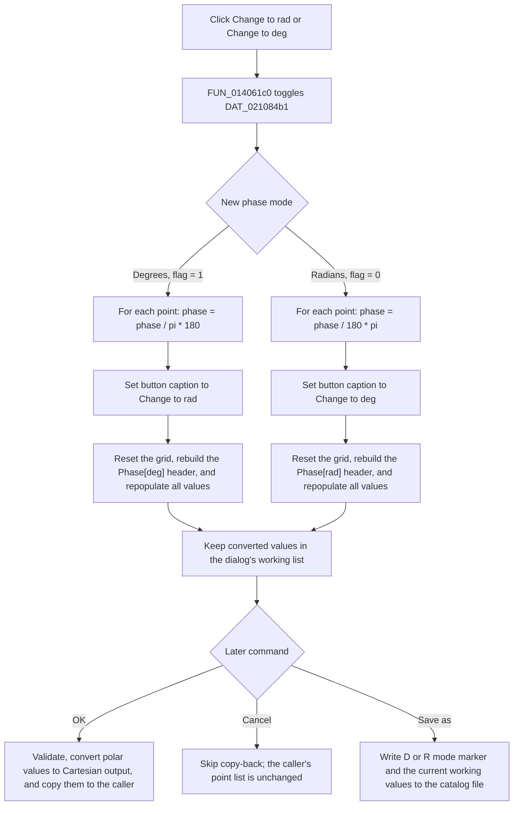

# Toggle phase values between degrees and radians

> Analysis status: Complete. The recovered click handler, form initialization, representation selector, grid rebuild, OK and Cancel handlers, and catalog import/export paths support this behavior.

## Control

| Property | Recovered value |
| --- | --- |
| Form | CplxForm |
| Form caption | Parameter Editor |
| Component path | CplxForm.DegRad |
| Control class | TButton |
| Initial caption | Change to rad |
| Handler name | DegRadClick |
| Handler address | 014061c0 |
| Graph node | `resource:dfm:CplxForm/CplxForm.DegRad` |
| Handler node | `function:014061c0` |
| Graph layer | UI |

## What happens when clicked

`TCplxForm.DegRadClick` changes how the phase field in the dialog's working point list is stored and displayed. [`FUN_014061c0`](../../../DecompiledSources/Tina16/functions/00000000014061C0__FUN_014061c0.c) first toggles global byte `DAT_021084b1`. The recovered mode mapping is:

- `DAT_021084b1 = 1`: the third value of each point is a phase in degrees. The button caption is `Change to rad`.
- `DAT_021084b1 = 0`: the third value is a phase in radians. The button caption is `Change to deg`.

When the new mode is degrees, the handler changes every phase with `phase / pi * 180`. When the new mode is radians, it changes every phase with `phase / 180 * pi`. Frequency and the second value, which is magnitude in this representation, are unchanged. The loop operates directly on the working list at form field `+0x7a8`.

The handler then resets the table's current display state, rebuilds its labels, and repopulates its cells from the converted working list. It does not only change a unit label: the stored phase doubles are converted before the grid is redrawn.

## Mode-change flow

## Representation and index mapping

`CplxForm.formofdata` is a radio group with two recovered items:

- index `0`: `Real and imaginary part`;
- index `1`: `Magnitude and phase`.

[`FUN_01406a40`](../../../DecompiledSources/Tina16/functions/0000000001406A40__FUN_01406a40.c), the radio-group handler, disables `DegRad` in index `0` and enables it in index `1`. Therefore, normal UI use exposes this command only when the third value is a phase. Switching from Cartesian to magnitude/phase derives magnitude and phase from each real and imaginary pair and initially uses degrees. Switching back converts a degree phase to radians when required, then calculates the Cartesian real and imaginary values.

[`FUN_01405e00`](../../../DecompiledSources/Tina16/functions/0000000001405E00__FUN_01405e00.c), the form's `OnCreate` handler, starts in radio index `0`, disables `DegRad`, and sets the phase-mode byte to degrees. The DFM supplies the matching initial `Change to rad` button caption. The handler also creates the private working list and copies the caller-supplied points into it.

The click handler has no internal radio-index guard. If another function invokes it while the Cartesian page is active, it still converts every third value as if it were a phase. The normal UI avoids this case by disabling the button in index `0`.

## Caption, header, and table refresh

The form contains resource-backed label controls for both action captions and both phase headers. The handler copies the applicable action label to `DegRad`:

- current degree mode uses `Change to rad` because radians are the next action;
- current radian mode uses `Change to deg` because degrees are the next action.

[`FUN_01404f30`](../../../DecompiledSources/Tina16/functions/0000000001404F30__FUN_01404f30.c) rebuilds the table label list. In magnitude/phase mode it selects `Magnitude` and either `Phase[deg]` or `Phase[rad]` from the same mode byte. [`FUN_01405a00`](../../../DecompiledSources/Tina16/functions/0000000001405A00__FUN_01405a00.c) then formats the working-list doubles and writes the Name and Value grid cells again. The shared [`FUN_00b0ae40`](../../../DecompiledSources/Tina16/functions/0000000000B0AE40__FUN_00b0ae40.c) path resets grid edit and display state before this rebuild.

Repeated degree-radian toggles can introduce normal binary floating-point rounding because each click multiplies or divides the stored phase values. The handler does not keep an original phase value for a lossless display-only conversion.

## Validation and errors

- The handler does not call the table validator. It reads already stored doubles from the working list and performs no parse, finite-number, range, or phase-normalization check.
- A normal VCL focus transition can finish a cell edit before the button's `OnClick`. The recovered handler does not explicitly import or validate an active editor value. It resets and repopulates the grid from the working list, so text that was not committed by the earlier focus event is not proven to survive the refresh.
- An empty working list skips the conversion loop but still changes the mode, caption, labels, and grid state.
- NaN, infinity, and values outside a conventional phase interval are not rejected by the conversion loop. IEEE floating-point arithmetic propagates them.
- List access, text assignment, grid reset, formatting, or grid repopulation failures have no local recovery branch. Because the handler toggles the flag and converts the list before it refreshes the display, an exception can leave the new unit state and converted data in place with an incomplete visual refresh.

## OK, Cancel, and persistence

The mode toggle changes staged dialog state. It does not directly change the caller's point list and does not set a modal result.

- [`FUN_014063e0`](../../../DecompiledSources/Tina16/functions/00000000014063E0__FUN_014063e0.c), the `bkOK` handler, validates the grid first. On success it sorts the working points. If the radio group is in magnitude/phase mode, it converts a degree phase to radians when the mode byte is `1`, calculates real and imaginary values from magnitude and phase, and then copies the working list to the caller-owned list. Thus the committed caller output is Cartesian; the degree/radian choice is not copied as a separate caller setting.
- [`FUN_01404f10`](../../../DecompiledSources/Tina16/functions/0000000001404F10__FUN_01404f10.c) uses the OK validation byte at `+0x7b0` as a close veto and clears it after the close attempt. A validation error skips copy-back and prevents the accepted close.
- [`FUN_014063d0`](../../../DecompiledSources/Tina16/functions/00000000014063D0__FUN_014063d0.c), the custom Cancel handler, is one `RET`. Standard `bkCancel` behavior closes without running OK copy-back. It does not reverse the working-list conversion or reset the global unit byte; it leaves the caller-owned list unchanged.
- The click performs no file, registry, or database write. [`FUN_01407750`](../../../DecompiledSources/Tina16/functions/0000000001407750__FUN_01407750.c) validates and invokes Save As separately. Its writer, [`FUN_014072d0`](../../../DecompiledSources/Tina16/functions/00000000014072D0__FUN_014072d0.c), records `D` for magnitude/phase values in degrees and `R` for magnitude/phase values in radians, followed by the current working values. This is the only proven durable effect of the selected unit mode in this path.
- The load path accepts the same `D` and `R` markers, restores the corresponding mode byte, updates the button caption, and rebuilds the table. A new form creation resets the default to degrees, so the global byte is not a persistent user preference by itself.

## Handler evidence

- Toggle handler: [FUN_014061c0](../../../DecompiledSources/Tina16/functions/00000000014061C0__FUN_014061c0.c)
- Form initialization: [FUN_01405e00](../../../DecompiledSources/Tina16/functions/0000000001405E00__FUN_01405e00.c)
- Cartesian or magnitude/phase selector: [FUN_01406a40](../../../DecompiledSources/Tina16/functions/0000000001406A40__FUN_01406a40.c)
- Dynamic label builder: [FUN_01404f30](../../../DecompiledSources/Tina16/functions/0000000001404F30__FUN_01404f30.c)
- Grid repopulation: [FUN_01405a00](../../../DecompiledSources/Tina16/functions/0000000001405A00__FUN_01405a00.c)
- OK commit: [FUN_014063e0](../../../DecompiledSources/Tina16/functions/00000000014063E0__FUN_014063e0.c)
- Cancel no-op: [FUN_014063d0](../../../DecompiledSources/Tina16/functions/00000000014063D0__FUN_014063d0.c)
- Catalog export: [FUN_014072d0](../../../DecompiledSources/Tina16/functions/00000000014072D0__FUN_014072d0.c)
- Recovered form evidence: [ui-evidence.json](../../../DecompiledSources/Tina16/resources/dfm/ui-evidence.json)
- Complexity: complex
- Distinct outgoing calls: 7

## Direct calls

- `function:00414560` — Finalizes the two temporary Unicode strings.
- `function:0064dd90` — Reads the selected action caption from a label control.
- `function:0064de00` — Assigns that caption to `DegRad` when it differs.
- `function:00b0ae40` — Resets the grid's edit and display state.
- `function:01404f30` — Rebuilds dynamic row or column label text for the current representation and phase unit.
- `function:01405a00` — Repopulates the grid from the working point list.
- `function:01d3c210` — Returns one point record from the working list.

## Analysis limits

- `DAT_021084b1` is a recovered global address, not its original Delphi variable name. Its Boolean meaning is established by the conversion formulas, phase labels, export markers, load logic, and OK conversion path.
- The recovered grid helper names are unresolved. The article describes their proven state and data flow without assigning original Delphi method names.
- The click handler does not validate an active cell editor. Event ordering outside this handler determines whether VCL commits such text before `OnClick`.
