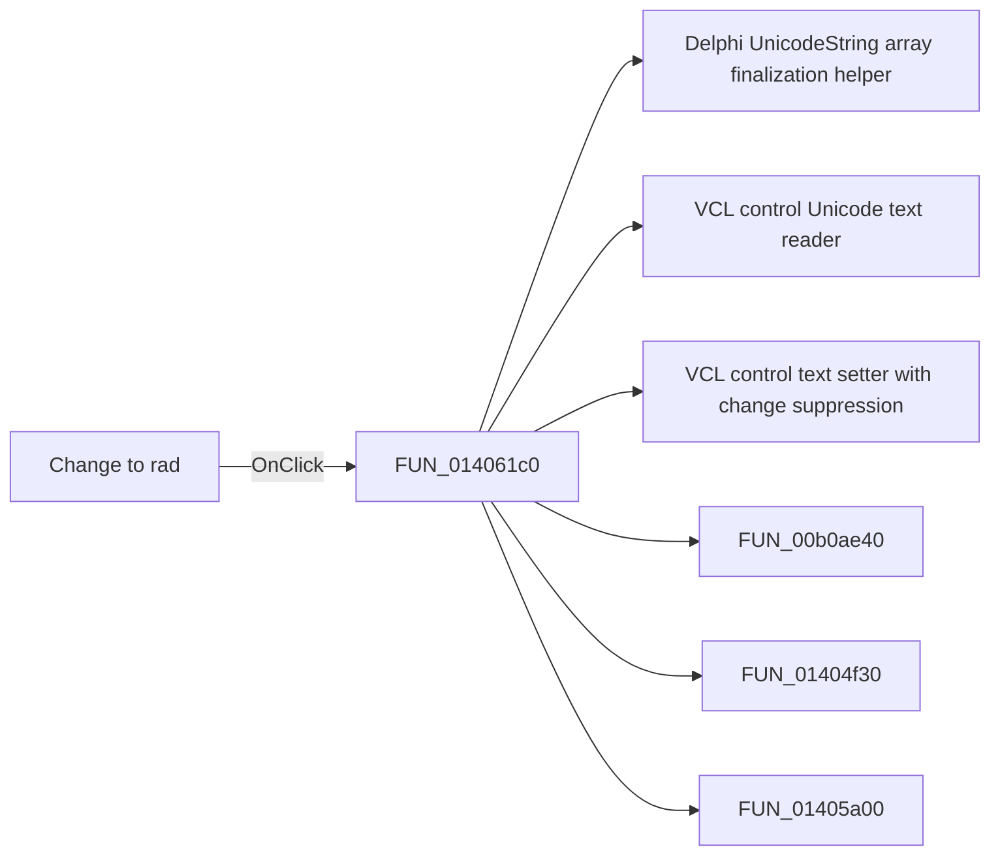

# Change to rad

> Analysis status: Pending individual source review.

## Control

| Property | Recovered value |
| --- | --- |
| Form | CplxForm |
| Component path | CplxForm.DegRad |
| Control class | TButton |
| Caption | Change to rad |
| Hint | Not present in the recovered resource. |
| Text | Not present in the recovered resource. |
| Handler name | DegRadClick |
| Handler address | 014061c0 |
| Graph node | `resource:dfm:CplxForm/CplxForm.DegRad` |
| Handler node | `function:014061c0` |
| Graph layer | UI |

## What happens when clicked

Pending individual analysis. An agent must read the recovered handler source and its relevant callees before it replaces this text.

## Click flow

## Handler evidence

- Source: [DecompiledSources/Tina16/functions/00000000014061C0__FUN_014061c0.c](../../../DecompiledSources/Tina16/functions/00000000014061C0__FUN_014061c0.c)
- Recovered role: Not present in the recovered resource.
- Current graph summary: Handles 1 Delphi UI event: CplxForm.DegRad.OnClick.
- Current graph behavior: Not present in the recovered resource.
- Current graph evidence: Not present in the recovered resource.
- Complexity: complex
- Distinct outgoing calls: 7

## Direct calls

- `function:00414560` — Delphi UnicodeString array finalization helper
- `function:0064dd90` — VCL control Unicode text reader
- `function:0064de00` — VCL control text setter with change suppression
- `function:00b0ae40` — FUN_00b0ae40
- `function:01404f30` — FUN_01404f30
- `function:01405a00` — FUN_01405a00
- `function:01d3c210` — FUN_01d3c210

## Resource evidence

- Kind: Not present in the recovered resource.
- Modal result: Not present in the recovered resource.
- Checked state: Not present in the recovered resource.
- List items: Not present in the recovered resource.
- Image reference: Not present in the recovered resource.
- Extracted glyph: None.

## Nearby label candidates

Nearby labels are layout candidates only. They are not proof of behavior.

- Rank 1: Frequency at distance 64.
- Rank 2: Imaginary part at distance 136.
- Rank 3: Phase[deg] at distance 152.

## Analysis limits

- Do not infer behavior from the control class, caption, hint, glyph, or nearby label alone.
- Do not replace the pending status until the handler source and relevant call path provide enough evidence.
