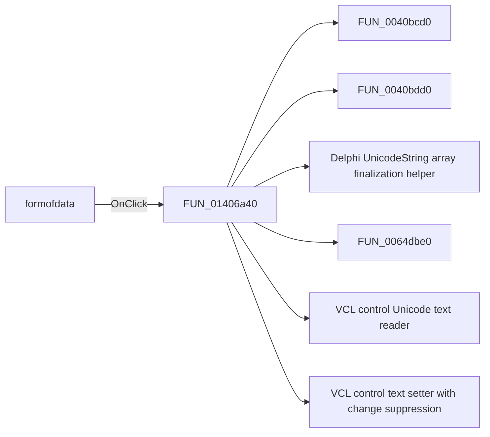

# formofdata

> Analysis status: Pending individual source review.

## Control

| Property | Recovered value |
| --- | --- |
| Form | CplxForm |
| Component path | CplxForm.formofdata |
| Control class | TRadioGroup |
| Caption | Not present in the recovered resource. |
| Hint | Not present in the recovered resource. |
| Text | Not present in the recovered resource. |
| Handler name | formofdataClick |
| Handler address | 01406a40 |
| Graph node | `resource:dfm:CplxForm/CplxForm.formofdata` |
| Handler node | `function:01406a40` |
| Graph layer | UI |

## What happens when clicked

Pending individual analysis. An agent must read the recovered handler source and its relevant callees before it replaces this text.

## Click flow

## Handler evidence

- Source: [DecompiledSources/Tina16/functions/0000000001406A40__FUN_01406a40.c](../../../DecompiledSources/Tina16/functions/0000000001406A40__FUN_01406a40.c)
- Recovered role: Not present in the recovered resource.
- Current graph summary: Handles 1 Delphi UI event: CplxForm.formofdata.OnClick.
- Current graph behavior: Not present in the recovered resource.
- Current graph evidence: Not present in the recovered resource.
- Complexity: complex
- Distinct outgoing calls: 14

## Direct calls

- `function:0040bcd0` — FUN_0040bcd0
- `function:0040bdd0` — FUN_0040bdd0
- `function:00414560` — Delphi UnicodeString array finalization helper
- `function:0064dbe0` — FUN_0064dbe0
- `function:0064dd90` — VCL control Unicode text reader
- `function:0064de00` — VCL control text setter with change suppression
- `function:0084e3e0` — FUN_0084e3e0
- `function:00b0ae40` — FUN_00b0ae40
- `function:00c44460` — FUN_00c44460
- `function:00c44590` — FUN_00c44590
- `function:00c445d0` — FUN_00c445d0
- `function:01404f30` — FUN_01404f30
- `function:01405a00` — FUN_01405a00
- `function:01d3c210` — FUN_01d3c210

## Resource evidence

- Kind: Not present in the recovered resource.
- Modal result: Not present in the recovered resource.
- Checked state: Not present in the recovered resource.
- List items: ("Real and imaginary part", "Magnitude and phase")
- Image reference: Not present in the recovered resource.
- Extracted glyph: None.

## Nearby label candidates

Nearby labels are layout candidates only. They are not proof of behavior.

- Rank 1: Change to rad at distance 229.
- Rank 2: Change to deg at distance 245.
- Rank 3: Name at distance 269.

## Analysis limits

- Do not infer behavior from the control class, caption, hint, glyph, or nearby label alone.
- Do not replace the pending status until the handler source and relevant call path provide enough evidence.
