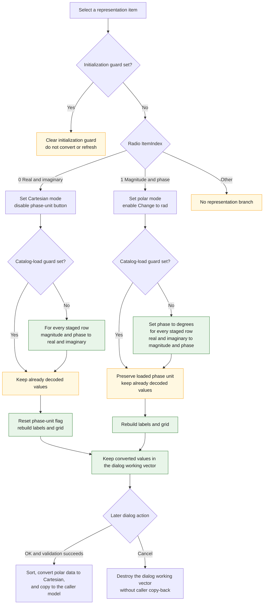

# Switch complex-value representation

> Analysis status: Complete. The recovered radio-group handler, conversion
> formulas, initialization and load guards, grid refresh, and OK and Cancel
> paths establish this behavior.

## Control

| Property | Recovered value |
| --- | --- |
| Form | CplxForm |
| Form caption | Parameter Editor |
| Component path | CplxForm.formofdata |
| Control class | TRadioGroup |
| Item 0 | Real and imaginary part |
| Item 1 | Magnitude and phase |
| Handler name | formofdataClick |
| Handler address | 01406a40 |
| Graph node | `resource:dfm:CplxForm/CplxForm.formofdata` |
| Handler node | `function:01406a40` |
| Graph layer | UI |

## Representation mapping

The click operates on the form-owned working vector at offset `+0x7a8`. Each
record contains three doubles: frequency, followed by two complex-value fields.
The selected radio index defines the last two fields:

- Index `0`, **Real and imaginary part**: the fields are Cartesian real and
  imaginary values. The recovered representation byte `DAT_021084b0` is set to
  `1`.
- Index `1`, **Magnitude and phase**: the fields are magnitude and phase.
  `DAT_021084b0` is set to `0`. A second byte, `DAT_021084b1`, records whether
  phase is in degrees (`1`) or radians (`0`).

The nearby **Real part**, **Imaginary part**, **Magnitude**, **Phase[deg]**, and
**Phase[rad]** labels agree with this mapping. The radio items and formulas,
not label proximity alone, establish it.

## Conversion of existing rows

Selecting index `1` converts each staged Cartesian pair to polar form:

```text
magnitude = sqrt(real * real + imaginary * imaginary)
phase = atan2(imaginary, real) * 180 / pi
```

The quadrant-aware phase helper returns zero for `(0, 0)`. A normal interactive
switch to polar form starts in degrees. The handler enables the `DegRad` button
and sets its action caption to **Change to rad**.

Selecting index `0` converts each staged polar pair to Cartesian form. If the
current phase-unit byte says degrees, the handler first changes the phase to
radians. It then applies:

```text
real = magnitude * cos(phase)
imaginary = magnitude * sin(phase)
```

The handler disables `DegRad` because a Cartesian pair has no displayed phase
unit. It resets the phase-unit byte to `0` after the switch.

Both branches reset the attribute grid, rebuild the mode-aware row labels, and
repopulate all displayed values from the converted working vector. Thus the
click changes both the stored staged doubles and their display. Repeated
Cartesian-to-polar-to-Cartesian changes can introduce normal floating-point
rounding.

## Programmatic-selection guards

The same `OnClick` handler can run when code assigns the radio index. It has two
guards for these cases:

- `DAT_021084c0` is set during form initialization. While it is set, neither
  conversion branch runs. The handler only clears the guard. `FormCreate` then
  initializes index `0` over the copied Cartesian working data.
- `DAT_021084c1` is set while a catalog file is loaded. The handler still
  updates the representation flag, button enabled state, labels, and grid, but
  it skips the numeric conversion. This preserves values that the loader has
  already decoded as algebraic, degree-polar, or radian-polar data. The load
  path then restores the correct **Change to rad** or **Change to deg** caption.

An index other than `0` or `1` enters neither conversion branch. The recovered
DFM supplies only these two items.

## Selection flow



## Validation, OK, and Cancel

This representation handler does not call the attribute-grid validator. It
uses the doubles already held by the working vector and has no invalid-text,
finite-number, range, or phase-normalization branch. It also does not set a
modal result or copy data to the caller.

The later OK handler provides the acceptance boundary:

- It validates the grid first. A validation error sets the form's close-veto
  byte, skips the sort and copy-back, and lets the user correct the table.
- On success, it sorts the working vector by frequency. If polar representation
  is selected, it applies the current degree or radian unit and converts every
  pair back to real and imaginary values. It then copies the working vector to
  the caller-owned model. The caller therefore receives Cartesian values.

The custom Cancel click handler is one `RET`. The standard `bkCancel` behavior
closes the dialog without executing the OK copy-back. The form destructor frees
the working vector, so representation changes made in this dialog do not change
the caller model after Cancel. The recovered global representation and unit
bytes are not reset by Cancel, but the next form creation initializes them
again.

## Boundary and error behavior

- A zero Cartesian pair becomes magnitude `0` and phase `0`.
- The conversion code does not reject NaN, infinity, a negative magnitude, or a
  phase outside a conventional interval. The recovered floating-point helpers
  determine the result.
- A zero record count skips the conversion loop. The normal editor paths keep a
  first record, and the behavior of the later grid refresh for a truly empty
  vector is not established by this handler.
- The handler has no local exception recovery or rollback. It changes mode and
  converts records before it finishes the grid rebuild. An exception can leave
  the staged vector partly converted or the display only partly refreshed.
- The click writes no file, registry value, or database row. A separate Save As
  path writes `A` for Cartesian data, `D` for degree-polar data, or `R` for
  radian-polar data.

## Evidence

- Representation handler: [FUN_01406a40](../../../DecompiledSources/Tina16/functions/0000000001406A40__FUN_01406a40.c)
- Form initialization and private working-vector creation: [FUN_01405e00](../../../DecompiledSources/Tina16/functions/0000000001405E00__FUN_01405e00.c)
- Magnitude helper: [FUN_00c44590](../../../DecompiledSources/Tina16/functions/0000000000C44590__FUN_00c44590.c)
- Quadrant-aware phase helper: [FUN_00c445d0](../../../DecompiledSources/Tina16/functions/0000000000C445D0__FUN_00c445d0.c)
- Phase-unit command: [FUN_014061c0](../../../DecompiledSources/Tina16/functions/00000000014061C0__FUN_014061c0.c)
- Shared row-label builder: [FUN_01404f30](../../../DecompiledSources/Tina16/functions/0000000001404F30__FUN_01404f30.c)
- Shared grid populator: [FUN_01405a00](../../../DecompiledSources/Tina16/functions/0000000001405A00__FUN_01405a00.c)
- OK validation and copy-back: [FUN_014063e0](../../../DecompiledSources/Tina16/functions/00000000014063E0__FUN_014063e0.c)
- Close-veto helper: [FUN_01404f10](../../../DecompiledSources/Tina16/functions/0000000001404F10__FUN_01404f10.c)
- Cancel no-op: [FUN_014063d0](../../../DecompiledSources/Tina16/functions/00000000014063D0__FUN_014063d0.c)
- Form destructor and working-vector cleanup: [FUN_01404eb0](../../../DecompiledSources/Tina16/functions/0000000001404EB0__FUN_01404eb0.c)
- Catalog loader: [FUN_01407990](../../../DecompiledSources/Tina16/functions/0000000001407990__FUN_01407990.c)
- Catalog writer: [FUN_014072d0](../../../DecompiledSources/Tina16/functions/00000000014072D0__FUN_014072d0.c)
- Recovered resource: [ui-evidence.json](../../../DecompiledSources/Tina16/resources/dfm/ui-evidence.json)
- Recovered role: Switch all staged complex values between Cartesian and polar
  representation and rebuild the editor grid.
- Likely Delphi method: `TCplxForm.formofdataClick`.
- Complexity: complex
- Distinct outgoing calls: 14

## Resource evidence

- The direct radio-group items are **Real and imaginary part** and **Magnitude
  and phase**.
- The form caption is **Parameter Editor**. The form also contains the
  representation-specific labels and the **Change to rad** button.
- This radio group has no caption, hint, action, glyph, image index, or embedded
  picture in the recovered resource.

## Analysis limits

- The original Delphi names of the recovered global mode and suppression bytes
  are not available. Their meanings follow from the formulas, UI state,
  catalog markers, and initialization and load paths.
- The row-label and grid-population helpers are shared CplxForm functions. This
  article uses their effects as evidence but does not assign them new graph
  annotations.
- Event order outside this handler determines whether VCL commits an active
  cell edit before `OnClick`. This handler does not explicitly import that text.
