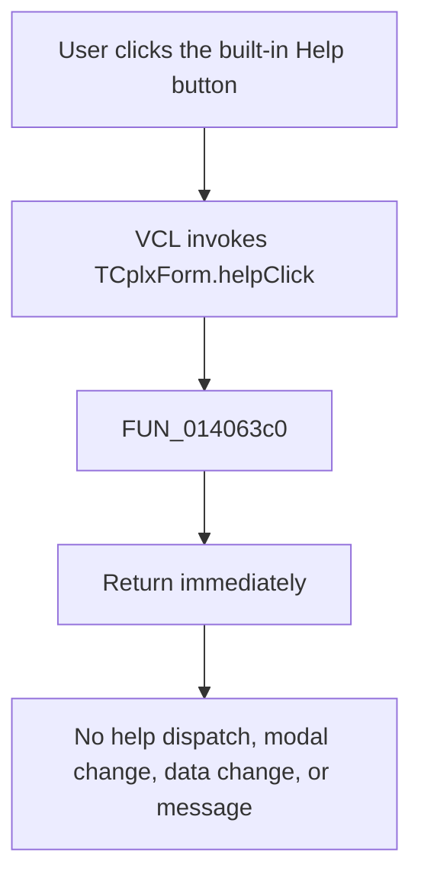

# Help

> Analysis status: Reviewed from recovered source and dialog resource evidence.

## Control

| Property | Recovered value |
| --- | --- |
| Form | CplxForm |
| Form caption | Parameter Editor |
| Component path | CplxForm.help |
| Control class | TBitBtn |
| Kind | `bkHelp` |
| Caption | Supplied by the built-in button kind; no custom caption is stored. |
| Hint | Not present in the recovered resource. |
| Handler name | helpClick |
| Handler address | 014063c0 |
| Graph node | `resource:dfm:CplxForm/CplxForm.help` |
| Handler node | `function:014063c0` |
| Graph layer | UI |

## What happens when clicked

The recovered application handler does nothing. `FUN_014063c0` contains only a return statement.

The handler does not:

- read a form or control help-context value;
- select a topic or keyword;
- construct or read a help-file path;
- call the application's help interface;
- call `WinHelp`, `HtmlHelp`, a browser, or a shell command;
- show a dialog or message;
- close the Parameter Editor or set a modal result.

The `bkHelp` kind supplies the standard Help-button presentation. It is resource evidence for the button's intended category, but it does not create an application help dispatch in this recovered `OnClick` path.

## Help dispatch evidence

The executable has generic HTML Help support elsewhere. For example, `FUN_0042a4a0` loads `hhctrl.ocx` and resolves `HtmlHelpA` and `HtmlHelpW`, and `FUN_0042a560` can call the resolved Unicode entry point. `FUN_014063c0` does not call either function and has no outgoing graph edge. Therefore the CplxForm Help handler does not delegate to that available application/runtime help path.

No topic ID, context number, keyword, file name, or URL is present in this handler. A specific CplxForm help topic cannot be recovered because this click path supplies none.

## Click flow

## State invariants

The handler has no parameters and reads or writes no memory. It leaves these application states unchanged:

- the complex-number point collection and attribute grid;
- real, imaginary, magnitude, phase, and frequency values;
- the selected data representation and degree/radian mode;
- file-dialog state and loaded or saved file names;
- form visibility and modal result.

The VCL performs normal button input processing before it invokes the event. The recovered handler does not explicitly change focus, selection, or keyboard state.

## Handler evidence

- Primary source: [FUN_014063c0](../../../DecompiledSources/Tina16/functions/00000000014063C0__FUN_014063c0.c).
- Available HTML Help loader: [FUN_0042a4a0](../../../DecompiledSources/Tina16/functions/000000000042A4A0__FUN_0042a4a0.c).
- Available HTML Help call wrapper: [FUN_0042a560](../../../DecompiledSources/Tina16/functions/000000000042A560__FUN_0042a560.c).
- The graph contains the resource-to-handler `triggers` edge and no outgoing call edge from `function:014063c0`.
- Complexity: simple; zero distinct outgoing calls.

## Direct calls

No direct, indirect, virtual, imported, or external call is present in the recovered handler source.

## Resource evidence

- The control kind is `bkHelp`.
- The form caption is `Parameter Editor`.
- The button has no custom caption, hint, action, image reference, or extracted glyph.
- Nearby labels describe complex-number values. They do not provide a help topic or context identifier.

## Repeated, no-op, and failure behavior

- Every click follows the same immediate-return path. Repeated clicks are no-ops.
- There is no conditional branch, disabled-state change, retry, or fallback.
- Because no help API is called, this handler cannot detect or report a missing help file, missing topic, unavailable HTML Help runtime, browser failure, or shell failure.
- The handler allocates nothing and has no local exception or error path.

## Persistence limits

The handler changes no live state and writes no persistent state.

## Analysis limits

- This article describes the recovered `OnClick` path. It does not infer an undocumented help topic from the form caption or nearby labels.
- The standard `bkHelp` appearance is not evidence that a help topic was successfully wired.
