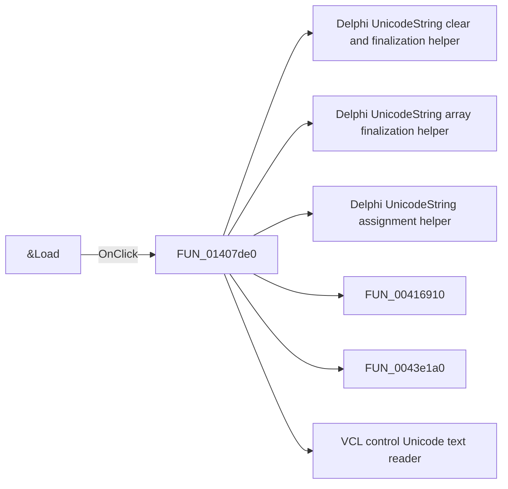

# &Load

> Analysis status: Pending individual source review.

## Control

| Property | Recovered value |
| --- | --- |
| Form | CplxForm |
| Component path | CplxForm.load |
| Control class | TButton |
| Caption | &Load |
| Hint | Not present in the recovered resource. |
| Text | Not present in the recovered resource. |
| Handler name | loadClick |
| Handler address | 01407de0 |
| Graph node | `resource:dfm:CplxForm/CplxForm.load` |
| Handler node | `function:01407de0` |
| Graph layer | UI |

## What happens when clicked

Pending individual analysis. An agent must read the recovered handler source and its relevant callees before it replaces this text.

## Click flow

## Handler evidence

- Source: [DecompiledSources/Tina16/functions/0000000001407DE0__FUN_01407de0.c](../../../DecompiledSources/Tina16/functions/0000000001407DE0__FUN_01407de0.c)
- Recovered role: Not present in the recovered resource.
- Current graph summary: Handles 1 Delphi UI event: CplxForm.load.OnClick.
- Current graph behavior: Not present in the recovered resource.
- Current graph evidence: Not present in the recovered resource.
- Complexity: complex
- Distinct outgoing calls: 17

## Direct calls

- `function:00414480` — Delphi UnicodeString clear and finalization helper
- `function:00414560` — Delphi UnicodeString array finalization helper
- `function:00414ad0` — Delphi UnicodeString assignment helper
- `function:00416910` — FUN_00416910
- `function:0043e1a0` — FUN_0043e1a0
- `function:0064dd90` — VCL control Unicode text reader
- `function:0064de00` — VCL control text setter with change suppression
- `function:00724270` — FUN_00724270
- `function:0074b490` — FUN_0074b490
- `function:008483b0` — FUN_008483b0
- `function:00848a30` — FUN_00848a30
- `function:00848a70` — FUN_00848a70
- `function:00b0ae40` — FUN_00b0ae40
- `function:00b95290` — FUN_00b95290
- `function:01404f30` — FUN_01404f30
- `function:01405a00` — FUN_01405a00
- `function:01407990` — FUN_01407990

## Resource evidence

- Kind: Not present in the recovered resource.
- Modal result: Not present in the recovered resource.
- Checked state: Not present in the recovered resource.
- List items: Not present in the recovered resource.
- Image reference: Not present in the recovered resource.
- Extracted glyph: None.

## Nearby label candidates

Nearby labels are layout candidates only. They are not proof of behavior.

- Rank 1: Frequency at distance 152.
- Rank 2: Imaginary part at distance 224.
- Rank 3: Phase[deg] at distance 240.

## Analysis limits

- Do not infer behavior from the control class, caption, hint, glyph, or nearby label alone.
- Do not replace the pending status until the handler source and relevant call path provide enough evidence.
