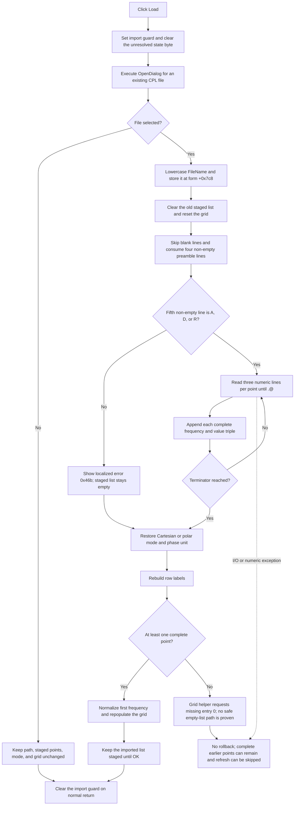

# Load a complex-point catalog into the staged table

> Analysis status: Reviewed from recovered source, embedded Delphi form-resource, and call-graph evidence.

## Control

| Property | Recovered value |
| --- | --- |
| Form | CplxForm |
| Form caption | Parameter Editor |
| Component path | CplxForm.load |
| Control class | TButton |
| Caption | &Load |
| Hint | Not present in the recovered resource. |
| Handler name | loadClick |
| Handler address | 01407de0 |
| Graph node | `resource:dfm:CplxForm/CplxForm.load` |
| Handler node | `function:01407de0` |
| Graph layer | UI |

## What happens when clicked

`TCplxForm.loadClick` opens the form's `TOpenDialog`. If the user selects a file, it replaces the dialog's private working list with complex points from a CPL catalog and rebuilds the attribute grid. This is a staged import. It does not copy the loaded points to the caller until the user later accepts the Parameter Editor with OK.

The embedded DFM gives the Open dialog these settings:

- default extension: `CPL`;
- filter: `Complex numbers to file (*.CPL)|*.CPL`;
- options: `ofHideReadOnly`, `ofShowHelp`, `ofFileMustExist`, and `ofEnableSizing`.

The phrase `to file` is the exact recovered Open-dialog filter text, although it describes a load operation. Neither the DFM nor the click handler sets an initial directory or an initial file name. The handler also does not seed the dialog from the form's remembered CPL path before it calls `Execute`.

## Dialog result and path state

The handler first writes `0` to global byte `DAT_021084b2` and writes `1` to `DAT_021084c1`. The latter byte suppresses normal representation conversions while the handler restores the file's stored representation.

If `Execute` returns false, the handler does not change the working list, remembered path, radio selection, phase-unit caption, or grid. It clears `DAT_021084c1` on the normal return path. `DAT_021084b2` remains `0`; no recovered reader establishes the purpose of this byte.

If `Execute` returns true, the handler reads `OpenDialog.FileName`, converts the whole Unicode path to lowercase, and stores it at form offset `+0x7c8`. This assignment happens before the file is opened or validated. The separate Save As handler later derives its suggested file name from this field, so even a file that fails to parse can replace the form's remembered path.

## Replacement starts before parsing

After acceptance, the handler prepares the grid at `+0x6d8`, clears every entry from the private point list at `+0x7a8`, resets the grid, and restores its retained row capacity from `+0x7c0`. It does not first validate or commit the active grid editor. It also does not keep a backup of the old staged points.

This order is important: a canceled Open dialog preserves the old staged data, but an accepted malformed file does not. Once parsing starts, the previous working list is already gone.

## CPL file structure and parsing

The handler converts the stored path to a Delphi short-string buffer and calls the catalog parser. The paired Save As writer proves the intended text format. The parser skips empty lines and consumes four non-empty preamble lines without checking their content. The fifth non-empty line must be one of these exact one-character markers:

| Marker | Imported representation | Resulting UI state |
| --- | --- | --- |
| `A` | Algebraical form: real and imaginary values | Select `Real and imaginary part`; disable the degree/radian command. |
| `D` | Euler form: magnitude and phase in degrees | Select `Magnitude and phase`; set the unit flag to degrees and show `Change to rad`. |
| `R` | Euler form: magnitude and phase in radians | Select `Magnitude and phase`; set the unit flag to radians and show `Change to deg`. |

The writer identifies the first preamble line as `Catalog file for four poles` and writes one description for each marker in the next three lines. The loader does not compare those four descriptive lines. It validates only the fifth non-empty line.

After a valid marker, the parser reads records until a non-empty line starts with `.@`. Each record consists of three non-empty numeric lines:

1. frequency;
2. real part or magnitude;
3. imaginary part or phase.

The shared numeric parser accepts the application's engineering-number syntax. A point is appended only after all three values are parsed. The parser extends the grid row count as complete points are added, but it does not write the grid cells yet.

## Mode, units, and grid rebuild

When parsing returns normally, `loadClick` selects radio index `0` for `A` or index `1` for `D` and `R`. `DAT_021084c1` is still set during this selection, so the normal radio-group handler changes the controls without converting the imported values between Cartesian and polar form. For a polar file, the handler also sets the degree/radian button caption from the imported unit marker.

It then runs the shared label builder and grid-population helper. The population helper:

- sets one fixed header row;
- writes the recovered `Name` and `Value` column headers;
- forces the first staged record's frequency to `1e-12` and displays only its two complex-value fields;
- writes frequency and both value fields for later records;
- clears unused cells in the retained grid capacity.

The helper assumes that the staged list contains an entry `0`. The first-frequency assignment changes the staged model, not only the displayed text. Thus, a successfully imported first frequency is normalized to `1e-12` before the user can accept or save the staged list.

Finally, the handler clears `DAT_021084c1` on its normal tail. The loaded data remains in the form-owned working list.

## Click flow

## Staging, OK, Cancel, and persistence

`CplxForm.FormCreate` creates the list at `+0x7a8` and copies the caller-supplied complex table into it. Load replaces only this private list.

- The OK handler validates the grid, sorts staged entries after the reserved first entry, converts polar data to Cartesian values when required, and only then replaces the caller-supplied list.
- The `bkCancel` handler returns without copy-back. Closing with Cancel discards the loaded staged list and leaves the caller's list unchanged.
- Load does not write a file, registry value, or preference. Save As is a separate action. It writes the current working list and the `A`, `D`, or `R` marker to a CPL text file.

The lowercased path at `+0x7c8` is form-local state. It can seed a later Save As operation during the same editor lifetime, but the recovered load path does not persist it outside the form.

## Error, partial-state, and no-op behavior

- Open-dialog cancellation is the clean no-import path. Existing staged data and UI state stay in place.
- The `ofFileMustExist` option prevents normal selection of a nonexistent file. It does not prove that the file remains accessible when parsing starts.
- An unknown mode marker calls a localized-message helper with resource ID `0x46b`. The exact message text is not recovered. The parser then returns normally with the staged list empty. The handler continues to the mode and refresh path, where the grid helper unconditionally requests list entry `0`. The list getter takes its out-of-range virtual path; the recovered code does not establish a safe empty-list result.
- A valid header followed immediately by `.@` reaches the same empty-list refresh path.
- Missing data lines, a missing `.@` terminator, invalid numeric text, file-open failures, and read failures have no local recovery or rollback branch in the handler. The Delphi numeric conversion raises on invalid text, and the RTL I/O checks raise on file errors.
- A point is appended only after its three numeric values parse. Therefore, a failure in a later point can leave earlier complete points in the staged list. Because the final mode and grid refresh is after parsing, an exception can also leave the visible grid stale or empty.
- The recovered source has no local exception handler that restores the previous path, list, mode, row count, or import guard. Managed-string cleanup during unwind does not establish application-state rollback.
- Load does not call the grid's active-editor validator. An invalid staged cell does not block an accepted import because the old staged list is cleared before the new file is parsed.

## Handler evidence

- Primary handler: [FUN_01407de0](../../../DecompiledSources/Tina16/functions/0000000001407DE0__FUN_01407de0.c) contains the dialog-result branch, path assignment, destructive staged-list reset, parser call, representation restore, and refresh calls.
- Catalog parser: [FUN_01407990](../../../DecompiledSources/Tina16/functions/0000000001407990__FUN_01407990.c) opens the text file, consumes the preamble, validates `A`/`D`/`R`, parses numeric triples, stops at `.@`, and appends complete records.
- Non-empty-line reader: [FUN_01407930](../../../DecompiledSources/Tina16/functions/0000000001407930__FUN_01407930.c) reads lines until it gets non-empty text or reaches end of file.
- Numeric parser: [FUN_00b8f030](../../../DecompiledSources/Tina16/functions/0000000000B8F030__FUN_00b8f030.c) converts the catalog values with the application's engineering-number rules and raises through the conversion path for invalid text.
- Point append: [FUN_01d3c230](../../../DecompiledSources/Tina16/functions/0000000001D3C230__FUN_01d3c230.c) creates and appends one three-double point record.
- Grid reset: [FUN_00b0ae40](../../../DecompiledSources/Tina16/functions/0000000000B0AE40__FUN_00b0ae40.c) clears the active editor and displayed cell state.
- Row labels: [FUN_01404f30](../../../DecompiledSources/Tina16/functions/0000000001404F30__FUN_01404f30.c) builds names from `Frequency` and the selected Cartesian or polar labels.
- Grid population: [FUN_01405a00](../../../DecompiledSources/Tina16/functions/0000000001405A00__FUN_01405a00.c) writes headers and staged values, normalizes the first frequency, blanks unused rows, and assumes that entry `0` exists.
- Working-copy initialization: [FUN_01405e00](../../../DecompiledSources/Tina16/functions/0000000001405E00__FUN_01405e00.c) creates the form-owned list and copies the supplied table.
- OK commit: [FUN_014063e0](../../../DecompiledSources/Tina16/functions/00000000014063E0__FUN_014063e0.c) validates and copies the staged list to the caller only on acceptance.
- Cancel handler: [FUN_014063d0](../../../DecompiledSources/Tina16/functions/00000000014063D0__FUN_014063d0.c) contains only `return`; the DFM supplies `bkCancel` behavior.
- CPL writer: [FUN_014072d0](../../../DecompiledSources/Tina16/functions/00000000014072D0__FUN_014072d0.c) proves the preamble, marker meanings, numeric record order, and `.@` terminator.
- Save As path use: [FUN_01407750](../../../DecompiledSources/Tina16/functions/0000000001407750__FUN_01407750.c) derives its suggested file name from form field `+0x7c8`.
- Recovered control tree: [ui-evidence.json](../../../DecompiledSources/Tina16/resources/dfm/ui-evidence.json) binds `CplxForm.load.OnClick` to `01407de0` and identifies the dialog and data-entry controls.
- Extractor property scope: [TiaraUiEvidence.rs](../../../analysis/undelphi/TiaraUiEvidence.rs) shows why dialog `Filter`, `DefaultExt`, and `Options` are not present in the selected JSON property set. They were read directly from the embedded `CplxForm` TPF0 stream.
- Complexity: complex; 17 distinct outgoing calls are present in the graph.

## Resource evidence

- The form caption is `Parameter Editor`.
- The button caption is `&Load`. It has no hint, action, image reference, or extracted glyph.
- `formofdata` contains `Real and imaginary part` and `Magnitude and phase`.
- The form contains labels for `Frequency`, `Real part`, `Imaginary part`, `Magnitude`, `Phase[deg]`, and `Phase[rad]`. Parser and refresh data flow, not layout proximity, establishes their relation to the loaded fields.
- The embedded DFM stream starts at rebuilt-PE file offset `54517652`. Its OpenDialog object starts at offset `54520375` and contains the CPL default extension, filter, and options listed above.

## Analysis limits

- The original Delphi names of the parser and grid helper are not present in RTTI. Their responsibilities come from file, list, mode, and grid data flow.
- Resource ID `0x46b` is proven to select the invalid-marker message path, but its localized text is not recovered.
- The purpose of `DAT_021084b2` is unknown because the recovered call set only writes it.
- The parser has no explicit maximum-count, duplicate-frequency, ordering, sign, or post-conversion finite-value check. The numeric converter and later consumers can impose behavior outside this click handler.
- The embedded form extractor intentionally selects common UI properties. It does not currently export file-dialog filter, extension, or options, so those values were checked in the raw TPF0 stream rather than inferred from the button caption.
