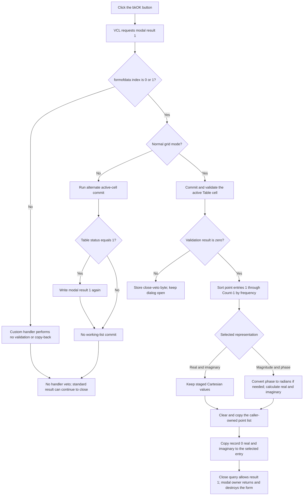

# Validate and commit the complex-point table

> Analysis status: Reviewed from recovered handler, grid-validation, form-initialization, modal-owner, and form-resource evidence.

## Control

| Property | Recovered value |
| --- | --- |
| Form | CplxForm |
| Form caption | Parameter Editor |
| Component path | CplxForm.ok |
| Control class | TBitBtn |
| Button kind | bkOK |
| Framework modal result | 1 (`mrOk`) |
| Handler name | okClick |
| Handler address | 014063e0 |
| Graph node | `resource:dfm:CplxForm/CplxForm.ok` |
| Handler node | `function:014063e0` |
| Graph layer | UI |

## What happens when clicked

`TCplxForm.okClick` is the normal commit boundary for the Parameter Editor. It first commits and validates the active `Table` cell. On success, it sorts the staged point records by frequency, converts magnitude and phase values to Cartesian values when required, and replaces the caller-owned point list. It also copies the Cartesian values from record `0` to two summary fields in the selected caller entry.

The standard `bkOK` button path requests modal result `1` before it dispatches the recovered handler. [`FUN_01404f10`](../../../DecompiledSources/Tina16/functions/0000000001404F10__FUN_01404f10.c) uses the handler's validation-status byte at form offset `+0x7b0` as a close veto. A validation failure therefore keeps the editor open. The close-query handler clears that byte so the user can correct the input and try again.

## Staged data and ownership

[`FUN_01404dd0`](../../../DecompiledSources/Tina16/functions/0000000001404DD0__FUN_01404dd0.c), the form constructor, stores the supplied collection at `+0x780` and the selected item index at `+0x788`. [`FUN_01405e00`](../../../DecompiledSources/Tina16/functions/0000000001405E00__FUN_01405e00.c) resolves that selected entry to `+0x790`, creates a private point list at `+0x7a8`, and copies the selected entry's list at `entry + 0x10` into it. Table edits, Arrange, representation changes, unit changes, Add, Remove, Clear, and Load operate on this private list.

Each point record contains three consecutive `double` values. For point entries `1` and later, the recovered table labels and population logic identify them as:

1. frequency;
2. real part or magnitude;
3. imaginary part or phase.

Record `0` is a base record. It is copied but not included in the frequency sort. After copy-back, its second and third doubles are also written to offsets `0` and `+8` of the selected caller entry.

[`FUN_01434ba0`](../../../DecompiledSources/Tina16/functions/0000000001434BA0__FUN_01434ba0.c) constructs this form with the wrapper's caller-owned collection and selected index. [`FUN_00b088a0`](../../../DecompiledSources/Tina16/functions/0000000000B088A0__FUN_00b088a0.c) shows the form modally and destroys it after the modal call returns. There is no later detached copy-back step. The accepted handler changes the caller-owned selected entry directly before the modal call returns.

## Active-cell validation and close veto

In the normal recovered mode, identified by `*PTR_DAT_020039a8 == 0`, the handler calls [`FUN_00b0a890`](../../../DecompiledSources/Tina16/functions/0000000000B0A890__FUN_00b0a890.c) for `Table` at form offset `+0x6d8`.

- If no cell editor is active, the helper returns `0`.
- If an editor is active, it calls [`FUN_00b0a150`](../../../DecompiledSources/Tina16/functions/0000000000B0A150__FUN_00b0a150.c). That path accepts the editor text, updates the cell and callbacks, and returns `0` when the cell-location validation succeeds. It returns `1` when that validation fails.

`okClick` stores the result at `+0x7b0`. Any nonzero result stops the handler before sorting, polar conversion, target-list clearing, copy-back, or summary-field writes. The close-query path permits closure only when this byte is zero, then clears it. Thus invalid active-cell input does not produce a partial model commit and can be retried in the open dialog.

## Sort and representation conversion

After successful validation, both supported data modes sort point entries `1..Count-1` by the first `double`. The adjacent-swap loops exchange all three doubles when the next frequency is lower than the previous frequency. Equal frequencies are not swapped. For ordinary finite values, the result is a stable ascending-frequency order. Record `0` stays in place.

The `formofdata` radio group selects the next step:

- Index `0`, `Real and imaginary part`: the three fields are already Cartesian. The handler does not change the numeric representation after sorting.
- Index `1`, `Magnitude and phase`: the handler converts every working-list record, including record `0`. It reads magnitude from offset `+8` and phase from `+0x10`. If `DAT_021084b1` is nonzero, it converts the phase from degrees to radians with `phase * pi / 180`. It then writes `magnitude * cos(phase)` to `+8` and `magnitude * sin(phase)` to `+0x10`.

The committed list is therefore Cartesian in both modes. The degree/radian choice is staging information. It is not copied to the caller as a separate setting. The conversion changes the private working list in place, so it also becomes Cartesian immediately before copy-back.

## Caller commit and modal result

For either supported radio index, the successful normal path performs this sequence:

1. Obtain the selected caller entry's point list from `entry + 0x10`.
2. Clear that target list through [`FUN_00b95290`](../../../DecompiledSources/Tina16/functions/0000000000B95290__FUN_00b95290.c).
3. Copy all records and the list's auxiliary value from the working list through [`FUN_01d3c2d0`](../../../DecompiledSources/Tina16/functions/0000000001D3C2D0__FUN_01d3c2d0.c).
4. Read copied record `0` through [`FUN_01d3c210`](../../../DecompiledSources/Tina16/functions/0000000001D3C210__FUN_01d3c210.c).
5. Copy record `0` fields `+8` and `+0x10` to the selected entry's fields `0` and `+8`.

The handler does not perform a file, registry, or database write. Save As is a separate command. After the successful click event returns, the standard modal result remains `1`, the close-query byte is zero, and the modal owner can receive acceptance and destroy the form.

## Alternate grid mode

When `*PTR_DAT_020039a8 != 0`, both supported radio indices use [`FUN_00b0a960`](../../../DecompiledSources/Tina16/functions/0000000000B0A960__FUN_00b0a960.c) instead of the normal commit path. That helper locates the active cell, invokes its alternate virtual commit, and stores the returned status at `Table + 0x638`. If that status equals `1`, `okClick` writes modal result `1` to the form again.

This branch does not sort the working list, convert magnitude and phase, clear or copy the caller list, write the selected entry's summary values, or set the normal close-veto byte. The recovered source does not identify the purpose of this global mode or the other status values. This article therefore records the exact branch behavior without treating it as the normal model-commit path.

## Accept flow

## Cancel contrast

[`FUN_014063d0`](../../../DecompiledSources/Tina16/functions/00000000014063D0__FUN_014063d0.c), the application Cancel handler, is one return instruction. Its standard `bkCancel` behavior supplies modal result `2`. Cancel does not call the grid validator or `okClick`, so it does not sort, convert, clear, or copy the caller list. An accepted Cancel destroys the form and its private working list. The caller-owned points remain unchanged.

Cancel does not undo effects outside this working-copy boundary. For example, a file already written by the separate Save As command remains on disk, and Cancel does not explicitly restore the global phase-unit byte. A new form creation resets that byte to degrees.

## Handler evidence

- Primary handler: [FUN_014063e0](../../../DecompiledSources/Tina16/functions/00000000014063E0__FUN_014063e0.c) contains the mode branches, validation gate, sort, polar conversion, target replacement, and summary-field writes.
- Form initialization: [FUN_01405e00](../../../DecompiledSources/Tina16/functions/0000000001405E00__FUN_01405e00.c) creates and fills the private working list and selects Cartesian display with degree staging as the initial state.
- Close query: [FUN_01404f10](../../../DecompiledSources/Tina16/functions/0000000001404F10__FUN_01404f10.c) converts the validation byte to `CanClose` and clears the byte.
- Point access: [FUN_01d3c210](../../../DecompiledSources/Tina16/functions/0000000001D3C210__FUN_01d3c210.c) returns a point-record payload.
- Target clear: [FUN_00b95290](../../../DecompiledSources/Tina16/functions/0000000000B95290__FUN_00b95290.c) removes the existing target entries and sets the count to zero.
- List copy: [FUN_01d3c2d0](../../../DecompiledSources/Tina16/functions/0000000001D3C2D0__FUN_01d3c2d0.c) appends every source record and copies the list's auxiliary field.
- Modal owner: [FUN_00b088a0](../../../DecompiledSources/Tina16/functions/0000000000B088A0__FUN_00b088a0.c) calls the dialog's modal method and destroys the form after it returns.
- Recovered form evidence: [ui-evidence.json](../../../DecompiledSources/Tina16/resources/dfm/ui-evidence.json) binds `CplxForm.ok.OnClick` to `okClick` at `014063e0` and defines the control as `bkOK`.
- Complexity: complex; seven distinct outgoing calls are present in the graph.

## Direct calls

- `function:0040bcd0` - cosine used for polar-to-Cartesian conversion.
- `function:0040bdd0` - sine used for polar-to-Cartesian conversion.
- `function:00b0a890` - normal active-cell commit and validation.
- `function:00b0a960` - alternate active-cell commit path.
- `function:00b95290` - caller target-list clear.
- `function:01d3c210` - working or target point-record access.
- `function:01d3c2d0` - working-list copy to the caller target.

## Resource evidence

- The form caption is `Parameter Editor`.
- `ok` is a `TBitBtn` with `Kind = bkOK`. The kind supplies the standard caption, glyph, default state, and modal result; the DFM does not store separate custom values for them.
- The representation items are `Real and imaginary part` and `Magnitude and phase`.
- The table labels include `Frequency`, `Real part`, `Imaginary part`, `Magnitude`, `Phase[deg]`, and `Phase[rad]`. The source paths, not label proximity alone, establish their relation to the three record fields.
- The OK control has no recovered custom caption, hint, action, image reference, or extracted glyph.

## No-op, error, and partial-mutation behavior

- A normal validation failure occurs before any sort, conversion, caller-list clear, copy, or summary-field write. It leaves the form open for correction.
- A radio-group index other than `0` or `1` enters neither custom branch. The handler does not validate or copy data and does not set the close-veto byte. Because the standard button already requested result `1`, this invalid internal state can close without committing the staged list.
- The handler has no explicit empty-list guard before it reads target record `0` after copy-back. Empty-list behavior belongs to the list accessor or normal exception path.
- The sort has no explicit finite-value, range, or duplicate-frequency validation. Equal finite frequencies keep their order. NaN comparisons do not provide a defined useful order.
- Polar conversion has no finite-value, magnitude-range, or phase-range check. Floating-point NaN and infinity values propagate through the arithmetic and trigonometric calls.
- The handler has no local exception handler, transaction, or rollback. An exception during sorting or conversion can leave only the private working list partly changed. Once target clearing starts, an exception can leave the caller list empty or partly copied. An exception after list copy but during the two summary writes can leave the list committed while one or both selected-entry summary fields are stale.
- No recovered error dialog is called directly. Grid validation feedback and exceptions remain under the grid, VCL, list, or caller-owned error paths.

## Analysis limits

- `PTR_DAT_020039a8`, `DAT_021084b1`, and the form offsets are recovered addresses. Their original Delphi names are not available.
- The normal branch proves the commit and veto semantics. The purpose of the alternate global grid mode and the meaning of statuses other than `1` are not recovered.
- The code proves in-place caller mutation before modal return. It does not identify all later consumers of the selected complex entry.
