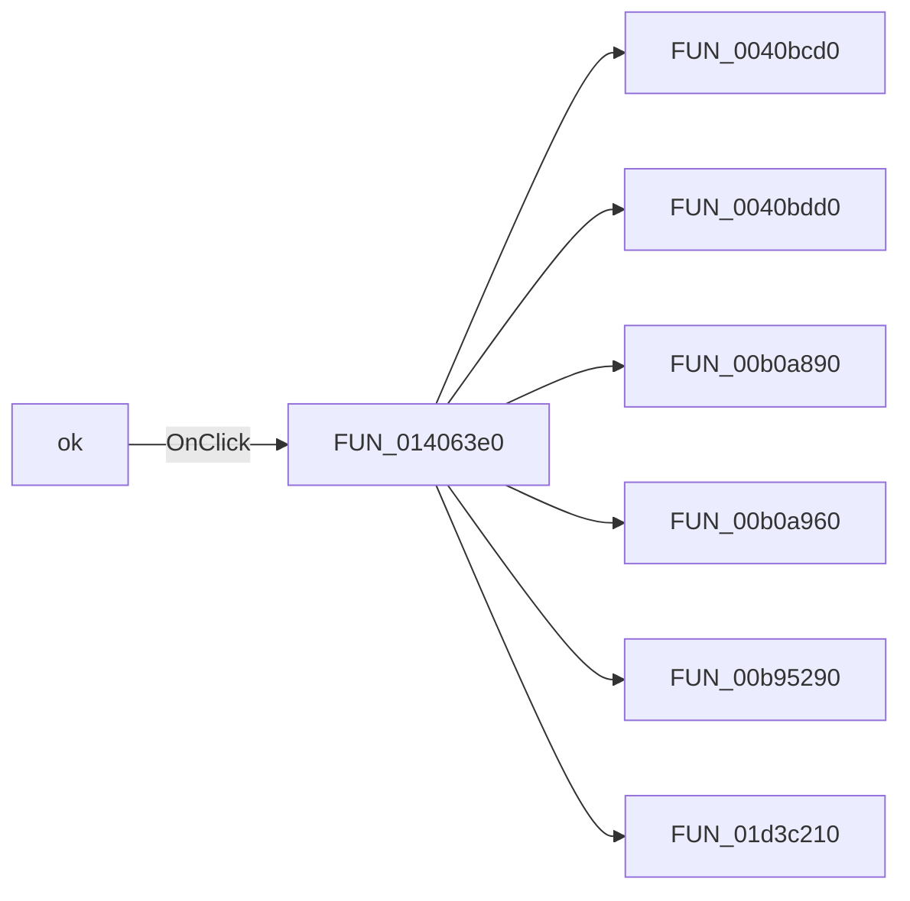

# ok

> Analysis status: Pending individual source review.

## Control

| Property | Recovered value |
| --- | --- |
| Form | CplxForm |
| Component path | CplxForm.ok |
| Control class | TBitBtn |
| Caption | Not present in the recovered resource. |
| Hint | Not present in the recovered resource. |
| Text | Not present in the recovered resource. |
| Handler name | okClick |
| Handler address | 014063e0 |
| Graph node | `resource:dfm:CplxForm/CplxForm.ok` |
| Handler node | `function:014063e0` |
| Graph layer | UI |

## What happens when clicked

Pending individual analysis. An agent must read the recovered handler source and its relevant callees before it replaces this text.

## Click flow

## Handler evidence

- Source: [DecompiledSources/Tina16/functions/00000000014063E0__FUN_014063e0.c](../../../DecompiledSources/Tina16/functions/00000000014063E0__FUN_014063e0.c)
- Recovered role: Not present in the recovered resource.
- Current graph summary: Handles 1 Delphi UI event: CplxForm.ok.OnClick.
- Current graph behavior: Not present in the recovered resource.
- Current graph evidence: Not present in the recovered resource.
- Complexity: complex
- Distinct outgoing calls: 7

## Direct calls

- `function:0040bcd0` — FUN_0040bcd0
- `function:0040bdd0` — FUN_0040bdd0
- `function:00b0a890` — FUN_00b0a890
- `function:00b0a960` — FUN_00b0a960
- `function:00b95290` — FUN_00b95290
- `function:01d3c210` — FUN_01d3c210
- `function:01d3c2d0` — FUN_01d3c2d0

## Resource evidence

- Kind: bkOK
- Modal result: Not present in the recovered resource.
- Checked state: Not present in the recovered resource.
- List items: Not present in the recovered resource.
- Image reference: Not present in the recovered resource.
- Extracted glyph: None.

## Nearby label candidates

Nearby labels are layout candidates only. They are not proof of behavior.

- Rank 1: Name at distance 8.
- Rank 2: Value at distance 24.
- Rank 3: Change to deg at distance 32.

## Analysis limits

- Do not infer behavior from the control class, caption, hint, glyph, or nearby label alone.
- Do not replace the pending status until the handler source and relevant call path provide enough evidence.
