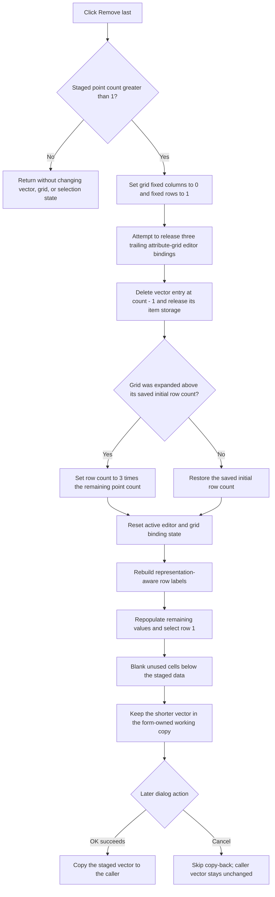

# Remove the last staged complex point

> Analysis status: Complete. The recovered click handler, vector deletion path, attribute-grid binding helpers, form lifecycle, and OK and Cancel paths support this behavior.

## Control

| Property | Recovered value |
| --- | --- |
| Form | CplxForm |
| Form caption | Parameter Editor |
| Component path | CplxForm.removelast |
| Control class | TButton |
| Caption | &Remove last |
| Handler name | removelastClick |
| Handler address | 01407100 |
| Graph node | `resource:dfm:CplxForm/CplxForm.removelast` |
| Handler node | `function:01407100` |
| Graph layer | UI |

## What happens when clicked

`TCplxForm.removelastClick` removes the last user-added record from the Parameter Editor's staged complex-point vector. [`FUN_01407100`](../../../DecompiledSources/Tina16/functions/0000000001407100__FUN_01407100.c) reads the vector at form field `+0x7a8` and runs its delete path only when the count is greater than `1`.

This count guard preserves the special first record. The handler does not use the current grid selection and does not accept an index. It always calls [`FUN_01d3c270`](../../../DecompiledSources/Tina16/functions/0000000001D3C270__FUN_01d3c270.c), which deletes vector index `count - 1`.

One point owns three doubles: frequency plus either real and imaginary values or magnitude and phase values. Before it removes the vector entry, the handler makes three attempts to release trailing attribute-grid editor bindings. It then adjusts the grid row count, resets and rebuilds the remaining grid, and clears unused trailing cells. It does not ask for confirmation.

## Remove-last flow

## Count and reserved-record guards

The outer `count > 1` condition is the command's complete minimum-count guard. If the vector contains zero or one record, the function returns before any grid setter or deletion helper runs. Repeated clicks eventually reach one record and then become exact no-ops.

The remaining first record is special in the CplxForm grid model:

- It has no normal editable frequency row.
- The grid populator displays only its two complex-value fields.
- [`FUN_01405a00`](../../../DecompiledSources/Tina16/functions/0000000001405A00__FUN_01405a00.c) sets its frequency double to `1e-12` whenever it rebuilds the table.
- Later point records use three rows each: frequency and two representation-dependent values.

The handler calls [`FUN_00b0adf0`](../../../DecompiledSources/Tina16/functions/0000000000B0ADF0__FUN_00b0adf0.c) exactly three times. This helper removes the last bound editor only while the next-active-row marker is greater than the grid's current row. Each successful call hides the active editor, clears the last value-column binding, and decrements the marker. The three calls are intended to remove one ordinary point's frequency and two value bindings. If the current-row guard blocks one or more attempts, the later full grid reset still clears the remaining bindings before the table is rebuilt.

## Record ownership and deletion

[`FUN_01405e00`](../../../DecompiledSources/Tina16/functions/0000000001405E00__FUN_01405e00.c), the form's `OnCreate` handler, allocates the vector at `+0x7a8` and copies the caller-supplied points into it. The dialog therefore edits a private working vector.

The last-record helper computes `count - 1` and passes that index to [`FUN_00b94f10`](../../../DecompiledSources/Tina16/functions/0000000000B94F10__FUN_00b94f10.c). The generic vector routine gets the item, removes it from the container, and invokes the vector's virtual item-release hook. The record payload is the recovered three-double value. No string, bitmap, file handle, or other application resource is released by the click path.

The vector object remains allocated. Only its final entry and owned item storage are removed. [`FUN_01404eb0`](../../../DecompiledSources/Tina16/functions/0000000001404EB0__FUN_01404eb0.c), the form destructor, later destroys the complete working vector.

## Grid dimensions, refresh, and selection

The handler first sets the grid's fixed-column count to `0` and fixed-row count to `1`. These values match the Name and Value table layout with its header row.

After the vector deletion, the handler compares the grid's current row count with the saved initial row count at form field `+0x7c0`:

- If the grid is currently larger than the saved initial size, it shrinks to `remaining count * 3` rows.
- Otherwise, it restores the saved initial row count. This keeps the form's normal visible grid size when there are few active point rows.

The handler then uses three shared CplxForm helpers:

- [`FUN_00b0ae40`](../../../DecompiledSources/Tina16/functions/0000000000B0AE40__FUN_00b0ae40.c) hides or clears the active editor, resets two tracked editor coordinates to `-1`, clears existing attribute cells, and resets the active-binding marker.
- [`FUN_01404f30`](../../../DecompiledSources/Tina16/functions/0000000001404F30__FUN_01404f30.c) rebuilds labels for the current Cartesian or magnitude/phase representation and degree/radian unit.
- `FUN_01405a00` repopulates the grid from every remaining record, writes the Name and Value headers, and requests current row `1`.

Finally, the loop starting at `remaining count * 3` writes the recovered blank value to both columns of all unused rows. The old selected logical point is not restored. The recovered path requests row `1`, but it does not assign a final current column, scroll position, caret, or selection range.

## Validation, staging, OK, and Cancel

- Remove last does not call the grid validator. A normal VCL focus change can finish an edit before `OnClick`, but the handler itself does not explicitly validate or import active editor text before it releases trailing bindings and rebuilds the grid.
- The vector deletion is immediately visible in the dialog's working list and table. It does not set a modal result or close the form.
- [`FUN_014063e0`](../../../DecompiledSources/Tina16/functions/00000000014063E0__FUN_014063e0.c), the OK handler, later validates and sorts the staged points. On success it converts polar data to Cartesian form when required, clears the caller-owned vector, and copies the shorter working vector into it.
- [`FUN_01404f10`](../../../DecompiledSources/Tina16/functions/0000000001404F10__FUN_01404f10.c) uses the OK validation byte at `+0x7b0` to veto an invalid close. Failed validation does not copy the shortened vector to the caller.
- [`FUN_014063d0`](../../../DecompiledSources/Tina16/functions/00000000014063D0__FUN_014063d0.c), the custom Cancel handler, is one return instruction. Standard `bkCancel` behavior closes without running OK copy-back. The caller-owned vector is unchanged.
- This click performs no file, registry, or database write. A later Save As command can persist the already shortened working vector to a catalog file. That is a separate explicit action.

## Errors and partial state

- At a count of zero or one, there is no confirmation, message, warning, or other feedback. The no-op branch returns directly.
- There is no local exception handler, undo snapshot, retry, or rollback.
- The handler attempts the three trailing grid-binding releases before it deletes the vector item. A failure in the vector deletion can therefore leave the point in staged data after one or more visible editor bindings have already been removed.
- Once the vector deletion succeeds, a row-count, label-building, editor-allocation, formatting, or grid-population failure can leave the staged vector shortened while the table is stale or only partly rebuilt.
- A failure while clearing unused rows occurs after the vector and main grid population have changed. It can leave only the trailing blank area partly refreshed.
- The caller-owned vector is not changed by the click. Cancel still skips normal copy-back after a staged partial failure, although the recovered code does not establish whether an unhandled exception leaves the dialog usable.

## Handler evidence

- Remove-last handler: [FUN_01407100](../../../DecompiledSources/Tina16/functions/0000000001407100__FUN_01407100.c)
- Delete-last vector wrapper: [FUN_01d3c270](../../../DecompiledSources/Tina16/functions/0000000001D3C270__FUN_01d3c270.c)
- Indexed vector removal and item release: [FUN_00b94f10](../../../DecompiledSources/Tina16/functions/0000000000B94F10__FUN_00b94f10.c)
- Remove trailing grid binding: [FUN_00b0adf0](../../../DecompiledSources/Tina16/functions/0000000000B0ADF0__FUN_00b0adf0.c)
- Grid fixed-column setter: [FUN_008483b0](../../../DecompiledSources/Tina16/functions/00000000008483B0__FUN_008483b0.c)
- Grid fixed-row setter: [FUN_00848a30](../../../DecompiledSources/Tina16/functions/0000000000848A30__FUN_00848a30.c)
- Grid row-count setter: [FUN_00848a70](../../../DecompiledSources/Tina16/functions/0000000000848A70__FUN_00848a70.c)
- Attribute-grid reset: [FUN_00b0ae40](../../../DecompiledSources/Tina16/functions/0000000000B0AE40__FUN_00b0ae40.c)
- Mode-dependent label builder: [FUN_01404f30](../../../DecompiledSources/Tina16/functions/0000000001404F30__FUN_01404f30.c)
- Grid population: [FUN_01405a00](../../../DecompiledSources/Tina16/functions/0000000001405A00__FUN_01405a00.c)
- Working-copy initialization: [FUN_01405e00](../../../DecompiledSources/Tina16/functions/0000000001405E00__FUN_01405e00.c)
- OK copy-back: [FUN_014063e0](../../../DecompiledSources/Tina16/functions/00000000014063E0__FUN_014063e0.c)
- Cancel no-op: [FUN_014063d0](../../../DecompiledSources/Tina16/functions/00000000014063D0__FUN_014063d0.c)
- Recovered form evidence: [ui-evidence.json](../../../DecompiledSources/Tina16/resources/dfm/ui-evidence.json)
- Complexity: complex
- Distinct outgoing calls: 9

## Direct calls

- `function:008483b0` — Sets the grid fixed-column count to zero.
- `function:00848a30` — Sets the grid fixed-row count to one.
- `function:00848a70` — Changes the total grid row count.
- `function:0084e3e0` — Writes the blank value to an unused cell.
- `function:00b0adf0` — Removes one trailing attribute editor binding.
- `function:00b0ae40` — Resets active editing, bound cells, and attribute-row tracking.
- `function:01404f30` — Rebuilds row labels for the remaining points.
- `function:01405a00` — Repopulates the grid from the remaining staged vector.
- `function:01d3c270` — Deletes the last vector record.

## Resource evidence

- The button caption is **Remove last**. It has no hint, image reference, embedded glyph, action, built-in button kind, or modal result.
- Nearby Frequency, real, imaginary, magnitude, and phase labels confirm the complex-point editor context. Their positions alone do not establish the deletion behavior.

## Analysis limits

- The first record's special display and `1e-12` frequency are proven. The recovered source does not provide its original Delphi semantic name.
- The generic vector invokes a virtual item-release hook, but the indirect target has no recovered symbol. This article does not name a specific destructor or allocator.
- The exact focus and selection event sequence inside the grid setters is not recovered. Only the explicit fixed counts, editor reset, row request, and missing final column assignment are stated.
