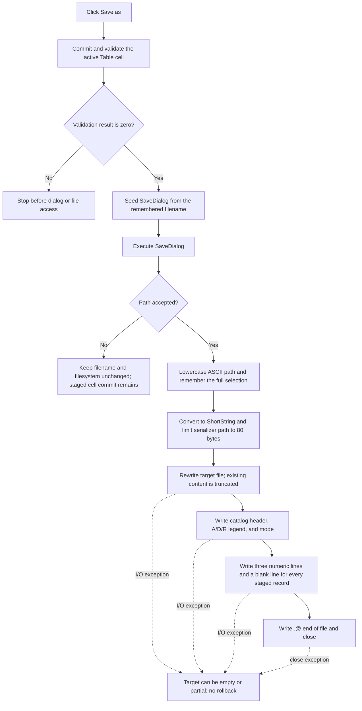

# &Save as

> Analysis status: Reviewed from recovered source, form-resource, call-graph, and Delphi file-runtime evidence.

## Control

| Property | Recovered value |
| --- | --- |
| Form | CplxForm |
| Form caption | Parameter Editor |
| Component path | CplxForm.saveas |
| Control class | TButton |
| Caption | &Save as |
| Hint | Not present in the recovered resource. |
| Handler name | saveasClick |
| Handler address | 01407750 |
| Graph node | `resource:dfm:CplxForm/CplxForm.saveas` |
| Handler node | `function:01407750` |
| Graph layer | UI |

## What happens when clicked

`saveasClick` validates the active parameter-grid editor, asks the user for a path, and writes the current staged complex-point list as a text catalog file. Saving does not press OK and does not copy the staged list back to the caller.

The handler first calls `FUN_00b0a890` for the `Table` grid and stores the result in form byte `+0x7b0`. A nonzero result stops the operation before the save dialog opens. A zero result means that there is no active editor or that the current cell text was committed. Therefore the file includes a just-accepted cell edit.

## Save dialog and remembered path

`CplxForm.FormCreate` initializes the form filename at `+0x7c8` to `noname.cpl`. Before each dialog execution, `saveasClick` passes the trailing filename part of that field to `SaveDialog.FileName`. After an accepted selection, the next Save As operation is seeded from the last selected filename rather than a fixed default, even if later serialization fails.

The recovered click handler does not assign `Filter`, `DefaultExt`, `FilterIndex`, `InitialDir`, or `Options`. The extracted DFM evidence contains only the `TSaveDialog` name and layout coordinates. It does not preserve those properties. Therefore:

- the exact filter text and default extension are not established;
- the handler itself does not add `.cpl` to an extensionless selection;
- an extension addition or an overwrite-confirmation prompt can only come from unrecovered dialog properties or normal `TSaveDialog` behavior.

The dialog's virtual `Execute` result is the path-selection guard. Cancel returns without reading `FileName`, changing the remembered filename, or opening a file. The earlier successful grid commit remains in the staged working list even when the user then cancels the dialog.

On acceptance, the handler reads `SaveDialog.FileName`, converts ASCII `A` through `Z` to lowercase, and stores that full lowercased string at form offset `+0x7c8`. Non-ASCII characters are not case-folded by this helper. It then converts the path to a Pascal ShortString with a maximum of 255 bytes.

The serializer applies a second and smaller limit: it copies at most the first 80 ShortString bytes before it assigns the text file. A selected path longer than 80 encoded bytes is therefore truncated for file creation, while the form still remembers the full lowercased selection. The source has no path-length warning or equality check for these two values.

## Exact catalog structure

`FUN_014072d0` opens the target with the Delphi text-file rewrite operation. It writes this header and legend, with blank lines in the positions shown:

```text
@ Catalog file for four poles

* A - Algebraical form
* D - Euler form, phase in degree
* R - Euler form, phase in radian

<mode>

<record-0 field-0>
<record-0 field-1>
<record-0 field-2>

<record-1 field-0>
<record-1 field-1>
<record-1 field-2>

...
.@ end of file
```

The mode line is exact:

- `A` when the form-of-data radio group has item index `0`, which is the algebraic real/imaginary representation;
- `R` for the polar representation when the phase-unit flag is radians;
- `D` for the polar representation when the phase-unit flag is degrees.

Every working-list entry, including reserved entry `0`, is written in its current order. Save As does not sort the list. Each entry contributes three lines: frequency, then real part or magnitude, then imaginary part or phase. The numeric helper is called with the recovered arguments `(2, 0, 1)` for each `double`; it produces the application's engineering-number text, including its metric-prefix handling. No delimiter shares a line with another value.

The serializer writes the staged representation as displayed. It does not convert polar values to rectangular form before saving. The `A`, `D`, or `R` line tells the later reader how to interpret fields two and three.

## Encoding and line output

The serializer uses the Delphi `TextFile` runtime and passes encoding value `0` to file assignment. This selects the runtime's default text code page. The source does not request UTF-8 and does not write a Unicode BOM.

Each output operation uses the runtime `Write` and `WriteLn` paths. `WriteLn` emits line termination according to the text-file flags and flushes the buffer. The handler checks the Delphi I/O status after assignment, rewrite, every written line, and close. A nonzero I/O status raises through the runtime error path; the handler does not convert it to a local message or Boolean result.

## Overwrite and failure behavior

After the dialog accepts a path, the serializer uses `Rewrite`. This creates a new text file or truncates an existing one. There is no second overwrite check in `saveasClick` or `FUN_014072d0`. Any confirmation must occur inside the save dialog before `Execute` returns true.

The remembered lowercased path is updated before the serializer runs. If file assignment, creation, writing, flushing, or close fails, the form can show the new remembered name even though the file is missing or incomplete.

There is no temporary file, atomic rename, local exception handler, or rollback. A failure after `Rewrite` can leave an empty or partial target file. A failure before the final close also skips the explicit close statement on this recovered path.

## Staged state and later OK or Cancel

The file is produced from the private working list at form offset `+0x7a8`. Save As does not write the caller-supplied table.

- Later OK validates and copies the working list back to the caller. That commit is independent of whether the file save succeeded.
- Later Cancel performs no copy-back. The caller table stays unchanged, but a file already written by Save As is not deleted or rolled back.
- Save As does not close the editor and does not change the modal result.

## Click flow



## Handler evidence

- Primary handler: [FUN_01407750](../../../DecompiledSources/Tina16/functions/0000000001407750__FUN_01407750.c) contains the grid-validation gate, filename seed, dialog guard, lowercase assignment, ShortString conversion, and serializer call.
- Grid commit: [FUN_00b0a890](../../../DecompiledSources/Tina16/functions/0000000000B0A890__FUN_00b0a890.c) returns zero when no editor is active or after a successful active-cell commit.
- Filename seed helper: [FUN_00441920](../../../DecompiledSources/Tina16/functions/0000000000441920__FUN_00441920.c) scans backward for a path separator and returns the trailing filename portion.
- Dialog filename setter: [FUN_00724380](../../../DecompiledSources/Tina16/functions/0000000000724380__FUN_00724380.c) assigns the supplied seed to `FileName` when it differs.
- Dialog filename reader: [FUN_00724270](../../../DecompiledSources/Tina16/functions/0000000000724270__FUN_00724270.c) obtains the accepted path.
- ASCII lowercase conversion: [FUN_0043e1a0](../../../DecompiledSources/Tina16/functions/000000000043E1A0__FUN_0043e1a0.c) maps only `A..Z` to `a..z`.
- ShortString conversion: [FUN_00416910](../../../DecompiledSources/Tina16/functions/0000000000416910__FUN_00416910.c) limits the path passed to the serializer to 255 encoded bytes.
- Catalog serializer: [FUN_014072d0](../../../DecompiledSources/Tina16/functions/00000000014072D0__FUN_014072d0.c) applies the 80-byte path limit and writes the header, mode, record triples, end marker, and close operation.
- Text-file assignment: [FUN_0040cf10](../../../DecompiledSources/Tina16/functions/000000000040CF10__FUN_0040cf10.c) stores the target filename and selects the default code page for encoding value `0`.
- Rewrite: [FUN_0040ca00](../../../DecompiledSources/Tina16/functions/000000000040CA00__FUN_0040ca00.c) opens the text file in rewrite mode.
- Line writer: [FUN_0040f590](../../../DecompiledSources/Tina16/functions/000000000040F590__FUN_0040f590.c) writes the line ending and flushes the text buffer.
- I/O check: [FUN_00409900](../../../DecompiledSources/Tina16/functions/0000000000409900__FUN_00409900.c) raises when the thread-local I/O status is nonzero.
- Close: [FUN_0040d150](../../../DecompiledSources/Tina16/functions/000000000040D150__FUN_0040d150.c) flushes and closes the text file and records close errors.
- Complexity: complex; ten distinct outgoing calls are present in the graph.

## Resource evidence

- The button caption is `&Save as`; the ampersand defines its keyboard mnemonic.
- `SaveDialog` is a `TSaveDialog` owned by `CplxForm`.
- No hint, action, image reference, or extracted glyph exists for the button.
- The extracted resource does not expose a filter, default extension, title, initial directory, or overwrite option for this dialog. This absence limits the analysis; it does not prove that every property had its VCL default in the original DFM.

## No-op and analysis limits

- Validation failure opens no dialog and changes no file.
- Dialog cancel changes no remembered path and opens no file. It does not undo a grid edit that validation already committed to the staged model.
- The exact numeric characters depend on the recovered engineering-number formatter and runtime format settings. The three-values-per-record structure and the `(2, 0, 1)` formatter arguments are proven.
- The exact default text code page and line-ending flag value are runtime state, not constants in this handler.
- The dialog's filter, default extension, and overwrite-prompt option are not available in the extracted resource evidence. They must not be invented from the `.cpl` initial filename.
