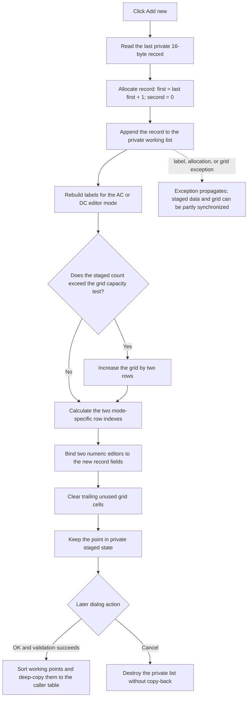

# Add a new staged target point

`Add &new` appends one default point to the Target Setting Editor's private working table. The new point uses the last stored first value plus `1.0` and a second value of `0.0`. The handler adds two bound grid editors for that record. It does not validate, sort, commit, save, or close the dialog.

## Control

| Property | Recovered value |
| --- | --- |
| Form | `CplxForm11` (`Target Setting Editor`) |
| Component path | `CplxForm11.addnew` |
| Control class | `TButton` |
| Caption | `Add &new` |
| Hint | Not present in the recovered resource. |
| Handler | `addnewClick` at `013e7eb0` |
| Resource node | `resource:dfm:CplxForm11/CplxForm11.addnew` |
| Handler node | `function:013e7eb0` |
| Graph layer | UI |

The recovered resource has no glyph, image, hint, or action for this button. The caption states the command, but the handler and the staged-table paths establish what is added.

## Record creation and order

The handler performs these operations in order:

1. It reads the working-list count at form offset `+0x788` and gets the last 16-byte record.
2. It saves that record's first double in a recovered global scratch value.
3. It allocates a new 16-byte record.
4. It writes `(last first value + 1.0, 0.0)` to the two double fields.
5. It appends the record pointer to the end of the private working list.

The handler does not use the selected grid row and does not find a sorted insertion position. The default first value comes from the last stored record, not from the greatest value in the table. If the staged table is out of order, the new value can also be out of order. `Arrange points` and the successful OK path perform the recovered sort later.

## Input and validation boundary

The click does not parse `feTolerance`, read text from the active grid editor, or call the attribute-grid validation function. It also does not check a minimum, maximum, duplicate value, or ordering rule.

The grid editors are bound to record addresses, so earlier completed edits can already be present in the working records. However, this handler does not explicitly finish the active cell before it reads the last record. The recovered function does not show whether the VCL focus change commits an active edit before `OnClick` runs. OK performs the explicit grid-finish and validation step.

## Grid update

After the append, the handler calls `FUN_013e72b0` to rebuild the complete row-label list for the current editor mode. It then updates only the newly appended record's editors:

- Each record has two double fields and uses two attribute-grid rows.
- When the constructor mode byte is `1`, used for the AC-table caller, the new row starts at `2 × record index`.
- When the mode byte is `0`, used for the DC-table caller, the new row starts two rows earlier. This mode-specific offset excludes the first working record from the normal X/Y point rows.
- When the staged count exceeds the saved grid-row capacity test, the handler increases the grid row count by two.
- It takes two rebuilt labels for the calculated rows.
- It creates two numeric editors bound directly to the new record's first and second doubles.
- It installs those editors in the attribute grid.
- It clears both visible columns in trailing rows below the staged data.

There is no explicit redraw, repaint, focus, or selection call. The installed editors and updated cells are the direct UI output.

## Mode and measurement-unit state

The form is opened with mode `1` for an AC target table and mode `0` for a DC target table. The label builder uses the mode to produce Frequency/Magnitude-style labels or indexed X/Y labels. Form creation disables `rgMeasUnit` in DC mode. The radio group offers `dB` and `V` in AC mode.

`Add &new` does not read or change `rgMeasUnit`. It writes a numeric zero to the second field without a conversion. For an AC table, the parent copies the selected measurement-unit index back only after the modal dialog returns OK. A Cancel result does not copy that selection.

## Staging, OK, and Cancel

Form creation deep-copies the caller-owned target table into the private list at `+0x788`. Add changes only this private list and its grid bindings.

The later OK handler:

1. asks the grid to finish and validate its active editor;
2. stops the close when validation reports failure;
3. preserves the first record and sorts the other working records by their first double;
4. parses `feTolerance` and writes it to the first working record;
5. clears the supplied caller table and deep-copies the working records into it.

The Cancel button is the built-in `bkCancel` control and has no custom click handler. Cancel does not run the OK copy-back path. Form destruction frees the private records and leaves the caller-owned table unchanged. Add itself does not set a modal result or write a file.

## No-op and error behavior

There is no normal no-op branch. The handler assumes that the working list contains at least one record. That is also an editor invariant:

- form creation reads record zero from the supplied table;
- Clear all creates one zeroed record;
- Remove last does nothing when only one record remains.

If the invariant is broken, the checked list access for `count - 1` follows its error path before a new record is appended.

The handler has no local exception handler and no rollback. The record is appended before labels, grid capacity, numeric-editor creation, and cell binding are updated. If one of those later operations raises an allocation, VCL, or grid exception, the private list can contain the new record while the grid update is incomplete. The handler does not restore the old table, show a control-specific error, or remove the partially added record.

## Click flow

## Evidence

- [Add-new handler](../../../DecompiledSources/Tina16/functions/00000000013E7EB0__FUN_013e7eb0.c): reads the last record, allocates and appends `(last first + 1.0, 0.0)`, rebuilds labels, grows the grid, binds two numeric editors, and clears trailing cells.
- [Mode-aware label builder](../../../DecompiledSources/Tina16/functions/00000000013E72B0__FUN_013e72b0.c): rebuilds labels for mode `1` or mode `0` and reads the recovered Frequency and Magnitude label controls for the mode-1 text.
- [Grid-binding refresh](../../../DecompiledSources/Tina16/functions/00000000013E7620__FUN_013e7620.c): proves the two-double record layout, the special handling of record zero, and the mode-dependent grid rows.
- [Form initialization](../../../DecompiledSources/Tina16/functions/00000000013E7930__FUN_013e7930.c): deep-copies the supplied records, initializes tolerance and grid state, and disables `rgMeasUnit` for mode `0`.
- [OK handler](../../../DecompiledSources/Tina16/functions/00000000013E7BC0__FUN_013e7bc0.c) and [close guard](../../../DecompiledSources/Tina16/functions/00000000013E7290__FUN_013e7290.c): validate, sort, copy back on success, and block closure after validation failure.
- [Remove-last handler](../../../DecompiledSources/Tina16/functions/00000000013E8130__FUN_013e8130.c) and [clear-all handler](../../../DecompiledSources/Tina16/functions/00000000013E8270__FUN_013e8270.c): preserve the normal one-record minimum.
- [AC caller](../../../DecompiledSources/Tina16/functions/00000000013EE580__FUN_013ee580.c) and [DC caller](../../../DecompiledSources/Tina16/functions/00000000013EE700__FUN_013ee700.c): pass mode `1` or `0`; the AC caller copies the measurement-unit selection only after modal result `1`.
- [Form destructor](../../../DecompiledSources/Tina16/functions/00000000013E71F0__FUN_013e71f0.c): frees each private record and the private list without freeing the caller-owned table.
- [Recovered Delphi UI evidence](../../../DecompiledSources/Tina16/resources/dfm/ui-evidence.json): binds `CplxForm11.addnew.OnClick` to `addnewClick` at `013e7eb0` and supplies the caption, target-editor title, dB/V items, tolerance controls, and built-in OK/Cancel kinds.

## Shared-helper coordination

`FUN_013e72b0` and `FUN_013e7620` are shared by Add, Remove last, Clear all, Load, and Arrange points. This Bead documents their direct effects but leaves their canonical graph annotations to the sibling refresh analysis. Existing lifecycle and OK annotations remain owned by their earlier target-table analysis. This fragment adds only the unique Add-new handler.

## Analysis limits

- The original Delphi type and field names for the 16-byte record are not recovered. The source proves two doubles and the mode-specific row labels.
- The recovered global used between reading the old record and allocating the new one is a scratch value. No wider application meaning is established.
- The handler has no application error text, so the exact global exception presentation is outside this analysis.
