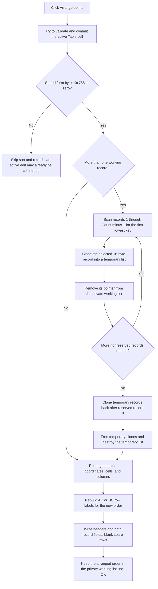

# Arrange staged target points

> Analysis status: Source reviewed and behavior traced.

## Control

| Property | Recovered value |
| --- | --- |
| Form | CplxForm11 |
| Form caption | Target Setting Editor |
| Component path | CplxForm11.arrange |
| Control class | TButton |
| Caption | &Arrange points |
| Hint | Not present in the recovered resource. |
| Handler name | arrangeClick |
| Handler address | 013e8cc0 |
| Graph node | `resource:dfm:CplxForm11/CplxForm11.arrange` |
| Handler node | `function:013e8cc0` |
| Graph layer | UI |

## What happens when clicked

`FUN_013e8cc0` attempts to finish the active `Table` cell, sorts the form's
private target-point records by their first floating-point field, and rebuilds
the attribute-grid display. It does not copy the result to the caller-owned
table.

The private working list is at form offset `+0x788`. Each list item points to a
16-byte record that contains two consecutive `double` values. Record 0 is a
reserved record. Arrange sorts only records 1 through `Count - 1`; the second
field stays paired with the first field throughout the reorder.

## Validation gate

The handler first calls `FUN_00b0a890` for the `TAttributeGrid` at form offset
`+0x6D0`. If a cell editor is active, this helper tries to validate and commit
its text. It returns zero after a successful commit or when there is no active
editor, and a nonzero result for a rejected cell.

This Arrange handler does not store that return value. It next tests the
existing form byte at `+0x768` and proceeds only when that byte is zero. The
recovered writers of this byte are the OK and Save As handlers; the form's
`OnCloseQuery` reads and clears it. No recovered Arrange call path copies the
current `FUN_00b0a890` result into this byte.

The practical recovered behavior is therefore:

- The active editor can be committed before the sort.
- A nonzero stored byte blocks sorting and all refresh calls, even if the
  current editor commit returns zero.
- A zero stored byte permits sorting even if the current editor commit returns
  nonzero.

This is different from OK and Save As, which explicitly store the current
validation result before they test the byte. The recovered material does not
establish whether the Arrange behavior is intentional or a decompilation
artifact.

## Sort key, order, and stability

Arrange constructs a temporary raw pointer list and performs these operations
until only reserved record 0 remains in the working list:

1. Start with working record 1 as the selected candidate.
2. Scan all nonreserved working records.
3. Replace the candidate only when another record's first `double` is less
   than the current candidate. The recovered test is `next <= candidate` plus
   `candidate != next`, which is strict less-than for ordinary numeric values.
4. Allocate a 16-byte clone of the selected record and append it to the
   temporary list.
5. Remove the selected record pointer from the working list.

The handler then allocates new 16-byte records in temporary-list order and
appends them after reserved record 0 in the working list. It frees the temporary
record clones and destroys the temporary list.

This is a stable ascending sort for ordinary numeric values. A scan keeps the
first record when keys are equal, so equal keys keep their earlier relative
order. The handler does not swap records in place. It rebuilds the nonreserved
part of the list through clone, remove, and append operations.

The source does not recover a semantic field name for the sort key. In DC mode,
the row-label helper presents the two fields as `X` and `Y`. In AC mode, the DFM
contains the corresponding `Frequency` and `Magnitude` label resources. The
first `double` is the only comparison key in both modes. The second `double` is
never compared.

The source has no special NaN policy. A NaN candidate prevents later numeric
values from replacing it because the comparison is false. The result is not a
defined total order when records contain NaN values.

## Grid and selection refresh

After rebuilding the private list, Arrange calls three UI helpers:

- `FUN_00b0ae40` hides the active grid editor, resets the tracked cell
  coordinates to `-1`, clears the displayed cells and column state, and keeps
  the existing row capacity.
- `FUN_013e72b0` clears and rebuilds the row-label list at `+0x770`. It creates
  labels for the current AC or DC mode and for the current number of working
  records. The DC path uses numbered `X` and `Y` labels. The AC path uses the
  form's recovered caption controls.
- `FUN_013e7620` establishes one fixed header row, writes the recovered `Name`
  and `Value` headers, and repopulates the grid from the private working list.
  It forces the first `double` of reserved record 0 to zero, writes the
  applicable reserved value in AC mode, writes both fields of every later
  record, and leaves unused retained rows blank.

No call restores the previously active editor, caret, current cell, or logical
point selection. The grid reset removes the tracked coordinates before the
sorted values are inserted. The exact visual focus after the refresh remains
an inherited grid behavior.

## Arrange flow

## Reserved records and short lists

- Record 0 is never considered as a sort candidate and is never removed by
  Arrange. The later grid population helper does set its first field to zero.
- With one record, there are no sortable points. The temporary list remains
  empty, but the full grid reset, label rebuild, and population still run.
- With an already sorted list, or with equal keys, the final order is unchanged.
  The handler still clones and replaces all nonreserved working records and
  refreshes the grid.
- A zero-record working list violates the form's recovered initialization
  invariant. The sort loop is empty, but `FUN_013e7620` then requests record 0
  through the bounds-checked list accessor and raises a list-index error.

## Staged state, OK, and Cancel

`FUN_013e70f0` stores the caller-owned target table at form offset `+0x790` and
creates the private working list at `+0x788`. `FormCreate` deep-copies the
caller's 16-byte records into that working list before the editor is shown
modally.

Arrange changes only the private working records, the form-owned row-label
list, and the grid display. It never clears or writes the caller-owned list at
`+0x790`.

The built-in OK handler has the actual commit boundary. It stores the current
grid validation result, repeats the same ascending stable reorder, writes the
tolerance edit value into the first field of reserved record 0, frees and
clears the caller-owned list, and deep-copies the working records into it.
Clicking Arrange is therefore optional; OK sorts again before copy-back.

The Cancel control is the resource-defined `bkCancel` button and has no
application `OnClick` handler. A non-OK modal result does not run the copy-back
handler. Form destruction frees the record blocks that remain in the private
working list and destroys that list. Thus, Cancel discards the staged arranged
order and leaves the caller-owned table unchanged.

## Allocation and failure behavior

- List access, record allocation, cell validation, string creation, and grid
  writes can raise through their called routines. Arrange has no recovered
  local exception handler or rollback.
- Sorting mutates the private list one extraction at a time. A failure before
  reconstruction can leave it with some nonreserved records removed. A failure
  during refresh can leave the working order changed while the grid is empty or
  only partly rebuilt.
- The working and temporary lists are raw pointer lists. On the normal path,
  the handler clones each selected original record, removes the original
  pointer, but does not call the recovered memory-free routine for that removed
  block. It later frees only the temporary clones after it has allocated a new
  set of working records. The recovered path therefore appears to leak one
  original 16-byte block for each arranged nonreserved record.
- This allocation issue does not make Arrange persistent. Removed blocks are no
  longer reachable through either the private or caller-owned list, and Cancel
  still performs no caller-table copy-back.

## Evidence

- [Arrange handler `FUN_013e8cc0`](../../../DecompiledSources/Tina16/functions/00000000013E8CC0__FUN_013e8cc0.c)
  contains the stored validation-byte gate, stable extraction sort, private-list
  reconstruction, temporary cleanup, and three refresh calls.
- [Active-cell commit helper `FUN_00b0a890`](../../../DecompiledSources/Tina16/functions/0000000000B0A890__FUN_00b0a890.c)
  returns zero when no editor is active and otherwise returns the active cell's
  validation and commit result.
- [Cell validation helper `FUN_00b0a150`](../../../DecompiledSources/Tina16/functions/0000000000B0A150__FUN_00b0a150.c)
  commits valid editor text and returns a failure value when validation rejects
  the cell.
- [Grid reset helper `FUN_00b0ae40`](../../../DecompiledSources/Tina16/functions/0000000000B0AE40__FUN_00b0ae40.c)
  hides the editor, resets tracked coordinates, clears grid cells and columns,
  and initializes the next insertion row.
- [Row-label builder `FUN_013e72b0`](../../../DecompiledSources/Tina16/functions/00000000013E72B0__FUN_013e72b0.c)
  rebuilds the form-owned AC or DC labels for the current working-list count.
- [Grid population helper `FUN_013e7620`](../../../DecompiledSources/Tina16/functions/00000000013E7620__FUN_013e7620.c)
  writes headers and working values, normalizes reserved record 0, and clears
  unused retained cells.
- [Raw-list record accessor `FUN_004aeac0`](../../../DecompiledSources/Tina16/functions/00000000004AEAC0__FUN_004aeac0.c)
  bounds-checks list indexes before it returns record pointers.
- [Raw-list remove helper `FUN_004ae870`](../../../DecompiledSources/Tina16/functions/00000000004AE870__FUN_004ae870.c)
  removes and shifts a pointer without returning it; for this raw-list class it
  does not invoke an item-notification callback.
- [Memory allocation helper `FUN_004095c0`](../../../DecompiledSources/Tina16/functions/00000000004095C0__FUN_004095c0.c)
  allocates each recovered 16-byte record block.
- [Memory release helper `FUN_004095f0`](../../../DecompiledSources/Tina16/functions/00000000004095F0__FUN_004095f0.c)
  is called for temporary records but not for originals removed during Arrange.
- [Working-copy constructor `FUN_013e70f0`](../../../DecompiledSources/Tina16/functions/00000000013E70F0__FUN_013e70f0.c)
  creates the private lists and stores the borrowed caller-table pointer and
  editor mode.
- [Form initialization `FUN_013e7930`](../../../DecompiledSources/Tina16/functions/00000000013E7930__FUN_013e7930.c)
  deep-copies caller records and builds the initial labels and grid.
- [OK handler `FUN_013e7bc0`](../../../DecompiledSources/Tina16/functions/00000000013E7BC0__FUN_013e7bc0.c)
  validates, repeats the sort, updates the reserved tolerance field, and copies
  the working list to the caller-owned table.
- [Close-query handler `FUN_013e7290`](../../../DecompiledSources/Tina16/functions/00000000013E7290__FUN_013e7290.c)
  uses and clears the stored validation-result byte.
- [Private-state destructor `FUN_013e71f0`](../../../DecompiledSources/Tina16/functions/00000000013E71F0__FUN_013e71f0.c)
  frees records still present in the private working list without freeing the
  borrowed caller table.
- [Modal DC editor caller `FUN_013ee700`](../../../DecompiledSources/Tina16/functions/00000000013EE700__FUN_013ee700.c)
  shows this editor modally and applies the target-selection UI only after
  modal result 1; the form's OK handler owns table copy-back.
- [Recovered UI evidence](../../../DecompiledSources/Tina16/resources/dfm/ui-evidence.json)
  identifies the Target Setting Editor, the Arrange caption, the Table control,
  hidden row-label resources, and the built-in OK and Cancel controls.

## Resource evidence and limits

- The button caption is `&Arrange points`. It has no hint, action, image
  reference, or extracted glyph.
- Nearby `Tol.` and `[%]` labels describe the separate tolerance edit. They do
  not establish the Arrange sort key.
- The exact original Delphi record and field names are not recovered. This
  article uses record offsets and observed grid labels rather than inventing
  declarations.
- The source establishes ascending stable order for ordinary numeric values.
  It does not define an application policy for NaN values.

## Annotation scope

The fragment owns the unique Arrange handler `FUN_013e8cc0` and the shared
CplxForm11 row-label and grid-population helpers `FUN_013e72b0` and
`FUN_013e7620`. Existing canonical fragments own the common grid-validation
helper and the form constructor, initialization, OK, close-query, and destructor
roles.
