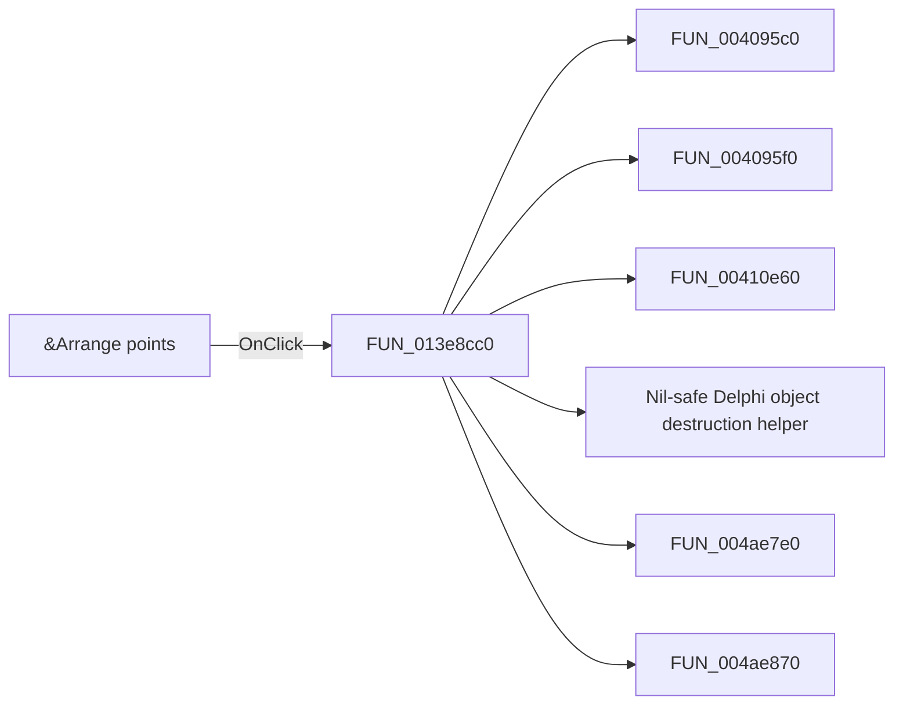

# &Arrange points

> Analysis status: Pending individual source review.

## Control

| Property | Recovered value |
| --- | --- |
| Form | CplxForm11 |
| Component path | CplxForm11.arrange |
| Control class | TButton |
| Caption | &Arrange points |
| Hint | Not present in the recovered resource. |
| Text | Not present in the recovered resource. |
| Handler name | arrangeClick |
| Handler address | 013e8cc0 |
| Graph node | `resource:dfm:CplxForm11/CplxForm11.arrange` |
| Handler node | `function:013e8cc0` |
| Graph layer | UI |

## What happens when clicked

Pending individual analysis. An agent must read the recovered handler source and its relevant callees before it replaces this text.

## Click flow

## Handler evidence

- Source: [DecompiledSources/Tina16/functions/00000000013E8CC0__FUN_013e8cc0.c](../../../DecompiledSources/Tina16/functions/00000000013E8CC0__FUN_013e8cc0.c)
- Recovered role: Not present in the recovered resource.
- Current graph summary: Handles 1 Delphi UI event: CplxForm11.arrange.OnClick.
- Current graph behavior: Not present in the recovered resource.
- Current graph evidence: Not present in the recovered resource.
- Complexity: complex
- Distinct outgoing calls: 11

## Direct calls

- `function:004095c0` — FUN_004095c0
- `function:004095f0` — FUN_004095f0
- `function:00410e60` — FUN_00410e60
- `function:00410f20` — Nil-safe Delphi object destruction helper
- `function:004ae7e0` — FUN_004ae7e0
- `function:004ae870` — FUN_004ae870
- `function:004aeac0` — FUN_004aeac0
- `function:00b0a890` — FUN_00b0a890
- `function:00b0ae40` — FUN_00b0ae40
- `function:013e72b0` — FUN_013e72b0
- `function:013e7620` — FUN_013e7620

## Resource evidence

- Kind: Not present in the recovered resource.
- Modal result: Not present in the recovered resource.
- Checked state: Not present in the recovered resource.
- List items: Not present in the recovered resource.
- Image reference: Not present in the recovered resource.
- Extracted glyph: None.

## Nearby label candidates

Nearby labels are layout candidates only. They are not proof of behavior.

- Rank 1: Tol. at distance 44.
- Rank 2: [%] at distance 118.
- Rank 3: Frequency at distance 336.

## Analysis limits

- Do not infer behavior from the control class, caption, hint, glyph, or nearby label alone.
- Do not replace the pending status until the handler source and relevant call path provide enough evidence.
