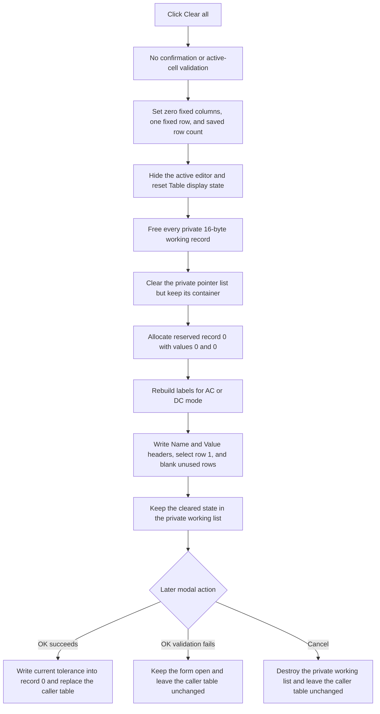

# Clear all staged target points

> Analysis status: Reviewed from recovered source, form resources, list ownership, grid refresh, and modal commit paths.

## Control

| Property | Recovered value |
| --- | --- |
| Form | CplxForm11 |
| Form caption | Target Setting Editor |
| Component path | CplxForm11.clearall |
| Control class | TButton |
| Caption | `&Clear all` |
| Hint | Not present in the recovered resource. |
| Handler name | clearallClick |
| Handler address | 013e8270 |
| Graph node | `resource:dfm:CplxForm11/CplxForm11.clearall` |
| Handler node | `function:013e8270` |
| Graph layer | UI |

## What happens when clicked

The button immediately clears the Target Setting Editor's private working points. It does not ask for confirmation and it does not validate or commit the active cell first.

The handler performs these operations in order:

1. It sets `Table` to zero fixed columns and one fixed header row.
2. It resets the attribute grid. This hides the active editor, clears its tracked cell coordinates, and resets displayed attribute state.
3. It restores the grid row count saved in form field `+0x778` when the form was created.
4. It frees every 16-byte record in the private working list at `+0x788`, then clears the list of record pointers. The list container remains allocated.
5. It allocates one replacement 16-byte record, sets both 8-byte fields to zero, and appends it as record `0`.
6. It rebuilds the mode-dependent row labels and repopulates the grid from the one-record working list.

The result is a staged clear. No normal target point remains. Record `0` remains because the editor treats it as a reserved settings record, not as a plotted target point.

## Reserved record and grid state

Record `0` has two recovered floating-point fields. The surrounding form paths establish its special role:

- `FormCreate` reads its first field into the `feTolerance` editor.
- `Draw` ignores record `0` and starts its plotted curve at record `1`.
- `Add new` and `Remove last` preserve at least record `0`.
- A successful OK writes the current `feTolerance` value back to record `0` before it copies the working list to the caller-owned table.

Clear initializes both fields of this reserved record to `0`. It does not change the visible `feTolerance.Text`, whose recovered initial resource text is `5`. If the user accepts immediately, OK replaces the first zero with the current tolerance value. In AC mode, the refresh path also exposes the second field through the first editable data row; Clear initializes that value to zero.

The grid refresh applies these visible-state changes:

- row `0` receives the hidden-label captions `Name` and `Value` as its two headers;
- the current grid row is set to `1`, so the prior row selection is not preserved;
- in AC mode, row `1` is bound to reserved record field `+8`;
- in DC mode, the refresh installs no editor for the reserved record;
- rows from twice the working-record count through the saved grid capacity are filled with the recovered blank placeholder. With one reserved record, this starts at row `2`.

The handler does not assign a final current column, scroll position, caret, or focus owner. Those states remain grid implementation details.

## Clear flow

## Staging, OK, and Cancel boundary

The form constructor stores the caller-owned target table at `+0x790` and allocates a separate working list at `+0x788`. `FormCreate` deep-copies every supplied 16-byte record into that private list. Clear changes only this private copy.

The built-in OK button runs `FUN_013e7bc0`. It first asks `Table` to finish and validate its active editor. Only a zero validation result enters the commit path. That path keeps reserved record `0`, sorts records `1` and later by their first floating-point value, writes `feTolerance` into record `0`, frees the caller table's existing records, and deep-copies the private working records into it. After a Clear with no later edits, the caller receives one record whose first field is the current tolerance and whose second field is zero.

A nonzero OK validation result skips copy-back. `FormCloseQuery` vetoes that close request and resets the result byte so the user can correct the input or cancel later.

The Cancel button has `Kind = bkCancel` and no application `OnClick` handler. Its modal result closes the form without calling the OK copy-back path. Form destruction then frees the private records and list but does not free or replace the caller-owned table.

Clear itself does not close the editor, set a modal result, update the caller's AC or DC target selector, write the selected dB/V unit back to the caller, or save a catalog file. The separate Save As command can export the current staged data before OK.

## Repeated clicks, no-op paths, and errors

- There is no list-count or already-cleared guard. Repeated clicks free the existing reserved record, allocate a new zeroed record, and rebuild the grid again.
- Individual grid dimension setters can suppress unchanged assignments, but the list replacement and refresh sequence still runs.
- Clear does not call the attribute-grid validation helper. It hides and resets the active editor without using the normal validation-and-commit path. The source does not expose the uncommitted editor text after that reset.
- The handler has no undo snapshot, local exception handler, retry, or rollback.
- The grid reset occurs before record destruction. A failure while freeing records can therefore leave the grid reset and the working list partly freed but not yet cleared.
- After the list is cleared, an allocation or append failure can leave the private list empty. The caller-owned table is still unchanged.
- A failure during label or grid rebuilding can leave the one zeroed reserved record staged while the display is stale or partly rebuilt.
- The recovered source does not establish how the application presents these allocation, list, or VCL exceptions.

## Handler and lifecycle evidence

- Clear handler: [FUN_013e8270](../../../DecompiledSources/Tina16/functions/00000000013E8270__FUN_013e8270.c) resets the grid, frees and clears the private list, appends one zeroed record, and invokes both refresh helpers.
- Form constructor: [FUN_013e70f0](../../../DecompiledSources/Tina16/functions/00000000013E70F0__FUN_013e70f0.c) allocates the private list at `+0x788`, stores the supplied table at `+0x790`, and stores the AC or DC mode at `+0x798`.
- Form creation: [FUN_013e7930](../../../DecompiledSources/Tina16/functions/00000000013E7930__FUN_013e7930.c) deep-copies the supplied records, maps record `0` to `feTolerance`, saves the grid row count, and performs the initial refresh.
- Label rebuild: [FUN_013e72b0](../../../DecompiledSources/Tina16/functions/00000000013E72B0__FUN_013e72b0.c) clears and rebuilds the label list from the working-record count and AC or DC mode.
- Grid population: [FUN_013e7620](../../../DecompiledSources/Tina16/functions/00000000013E7620__FUN_013e7620.c) selects row `1`, writes the `Name` and `Value` headers, resets record `0` field `0`, installs mode-dependent numeric editors, and blanks unused rows.
- OK validation and copy-back: [FUN_013e7bc0](../../../DecompiledSources/Tina16/functions/00000000013E7BC0__FUN_013e7bc0.c) validates, sorts normal points, stores tolerance, and replaces the supplied table only on success.
- Close veto: [FUN_013e7290](../../../DecompiledSources/Tina16/functions/00000000013E7290__FUN_013e7290.c) permits closing only when the validation-result byte is zero, then resets that byte.
- Form destruction: [FUN_013e71f0](../../../DecompiledSources/Tina16/functions/00000000013E71F0__FUN_013e71f0.c) frees the private labels, records, and list without freeing the supplied table.
- AC modal caller: [FUN_013ee580](../../../DecompiledSources/Tina16/functions/00000000013EE580__FUN_013ee580.c) copies the selected dB/V unit and activates the AC-table selector only after modal result `1`.
- DC modal caller: [FUN_013ee700](../../../DecompiledSources/Tina16/functions/00000000013EE700__FUN_013ee700.c) activates the DC-table selector only after modal result `1`.
- Grid reset: [FUN_00b0ae40](../../../DecompiledSources/Tina16/functions/0000000000B0AE40__FUN_00b0ae40.c) hides the active editor, resets tracked editor coordinates, clears displayed attribute state, and resets column state.
- Grid dimension helpers: [FUN_008483b0](../../../DecompiledSources/Tina16/functions/00000000008483B0__FUN_008483b0.c), [FUN_00848a30](../../../DecompiledSources/Tina16/functions/0000000000848A30__FUN_00848a30.c), and [FUN_00848a70](../../../DecompiledSources/Tina16/functions/0000000000848A70__FUN_00848a70.c) set fixed columns, fixed rows, and row count.
- Heap and pointer-list helpers: [FUN_004095c0](../../../DecompiledSources/Tina16/functions/00000000004095C0__FUN_004095c0.c), [FUN_004095f0](../../../DecompiledSources/Tina16/functions/00000000004095F0__FUN_004095f0.c), [FUN_004ae7e0](../../../DecompiledSources/Tina16/functions/00000000004AE7E0__FUN_004ae7e0.c), and [FUN_004aeac0](../../../DecompiledSources/Tina16/functions/00000000004AEAC0__FUN_004aeac0.c) allocate, free, append, and access the working records.

## Resource evidence

- The form caption is `Target Setting Editor`.
- The command is a plain `TButton` captioned `Clear all`. It has no recovered hint, action, image reference, embedded glyph, built-in button kind, or modal result.
- `Table` is a `TAttributeGrid`.
- Hidden labels supply `Frequency`, `Magnitude`, `Name`, and `Value` texts used by the dynamic grid.
- `rgMeasUnit` supplies `dB` and `V` choices for AC mode. Form creation hides this control in DC mode.
- `feTolerance` is next to labels `Tol.` and `[%]` and has recovered text `5`.
- OK is `bkOK`; Cancel is `bkCancel`.

## Analysis limits

- The original Delphi type name for the 16-byte record is not recovered. The reserved role of record `0`, its tolerance field, and its exclusion from plotted points are source-established.
- The second field of reserved record `0` is exposed by the AC refresh path, but its original Delphi member name is not recovered.
- The exact current column, scroll position, focus, caret, and exception presentation are not assigned by the recovered application handler.
- Shared refresh helpers `FUN_013e72b0` and `FUN_013e7620` are documented here as evidence but are owned by the adjacent control analysis and are not repeated in this Bead's annotation fragment.
