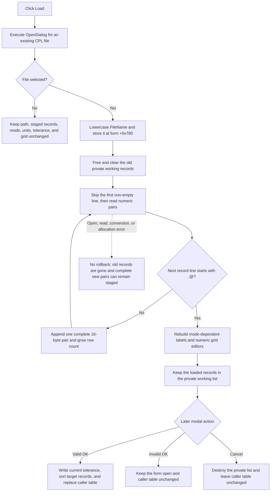

# Load an optimization target catalog into the staged table

> Analysis status: Reviewed from recovered source, the embedded Delphi form stream, the paired catalog writer, and the form's working-copy and modal commit paths.

## Control

| Property | Recovered value |
| --- | --- |
| Form | CplxForm11 |
| Form caption | Target Setting Editor |
| Component path | CplxForm11.load |
| Control class | TButton |
| Caption | `&Load` |
| Hint | Not present in the recovered resource. |
| Handler name | loadClick |
| Handler address | 013e8b00 |
| Graph node | `resource:dfm:CplxForm11/CplxForm11.load` |
| Handler node | `function:013e8b00` |
| Graph layer | UI |

## What happens when clicked

`TCplxForm11.loadClick` opens the form's `TOpenDialog`. If the user selects a file, it deletes the Target Setting Editor's private working records, loads value pairs from an optimization catalog, and rebuilds the mode-dependent grid. This is a staged replacement. The handler does not copy the loaded records to the caller-owned target table.

The embedded Delphi form stream gives the Open dialog these settings:

- default extension: `CPL`;
- filter: `Complex numbers to file (*.CPL)|*.CPL`;
- options: `ofHideReadOnly`, `ofShowHelp`, `ofFileMustExist`, and `ofEnableSizing`.

The phrase `to file` is the exact recovered filter text, although this dialog reads a file. Neither the form resource nor the click handler sets an initial directory or initial file name. Form creation stores `noname.cpl` in a separate form string at `+0x780`, but Load does not copy that string to the Open dialog before it calls `Execute`.

If `Execute` returns false, the handler skips the full import branch. It leaves the remembered path, working records, grid, AC or DC mode, dB/V selection, tolerance text, and caller-owned table unchanged.

## Accepted path and destructive replacement

If `Execute` returns true, the handler performs these operations in order:

1. It reads `OpenDialog.FileName`, converts the full Unicode path to lowercase, and stores it in the form string at `+0x780`.
2. It sets the attribute grid to zero fixed columns and one fixed header row.
3. It frees every 16-byte record in the private working list at `+0x788`, then clears the pointer list.
4. It resets the grid and restores the row count saved at `+0x778` when the form was created.
5. It converts the stored path to an 8-bit Delphi short string. The handler permits up to 255 bytes, but the parser copies at most the first 80 bytes before it opens the file.
6. It parses and appends complete value pairs to the now-empty private list.
7. After a normal parser return, it rebuilds row labels and repopulates the grid.

The path assignment and old-list destruction happen before the file is opened or its contents are checked. The handler does not keep a backup of the old path or old records.

The separate Save As handler seeds its save dialog from form string `+0x780`. Thus, an accepted Load selection changes the form-local save suggestion even if file opening or parsing fails after the assignment. The path is not copied to the caller model or stored as a preference by this handler.

## Catalog file structure and parsing

The paired Save As writer proves the intended text structure:

```text
@ Catalog file for optimization

<first value of record 0>
<second value of record 0>

<first value of record 1>
<second value of record 1>

...
.@ end of file
```

The loader ignores blank lines. It reads and discards the first non-empty line without checking that it is the expected header. It then processes each record as two non-empty numeric lines. It stops when the first two characters of the next record line are `.@`; text after those two characters is not checked. Content after the terminator is not read.

Both values use the application's engineering-number parser. A record is allocated and appended only after both values parse. Each complete record contains two 8-byte floating-point values. The parser increases the grid row count as records are appended, but the click handler does the final label and editor rebuild only after parsing returns normally.

The file contains no recovered AC/DC marker, dB/V marker, declared record count, or tolerance marker. The loader does not validate the header text, value ranges, ordering, duplicates, or a minimum record count.

## Mode, units, tolerance, and grid refresh

The form constructor fixes the interpretation mode before the dialog opens:

- mode `1` is the AC target editor. Its `rgMeasUnit` control is enabled and has the recovered choices `dB` and `V`;
- mode `0` is the DC target editor. Form creation disables `rgMeasUnit`.

Load does not change the mode byte at `+0x798`, the current dB/V item index, or the tolerance editor. It interprets the same two-value records through the mode that the caller supplied when it constructed the form.

After a normal parse, the shared refresh path selects grid row `1`, writes the recovered `Name` and `Value` headers, and installs numeric editors over the new working records. It also sets the first imported record's first value to zero. In AC mode, the second value of record `0` is exposed through the first editable data row. In DC mode, record `0` has no editable data row. Later records supply the mode-dependent target rows. Unused rows through the saved grid capacity are blanked.

The first record is reserved form state. `FormCreate` reads the caller's first record into `feTolerance`; Draw starts at record `1`; and successful OK writes the current `feTolerance` value into record `0` before copy-back. Load does not update `feTolerance.Text` from the file. Therefore, after Load, the file's first value in record `0` is overwritten with zero during refresh and then with the current visible tolerance only if OK later succeeds.

## Load flow



## Validation, errors, and partial state

- `ofFileMustExist` checks the selection through the dialog. It does not ensure that the file remains accessible when the later open starts.
- Load does not call the attribute-grid active-editor validator before it clears the old records. Invalid or uncommitted grid text does not block the import through this handler.
- The parser accepts any first non-empty line as the header. A wrong header alone does not cause an error.
- Invalid numeric text uses the normal Delphi conversion error path. File-open, file-read, numeric-conversion, and allocation failures have no local recovery branch in the handler or parser.
- A failure before the first complete pair leaves the private list empty. A later failure can leave all earlier complete pairs in the list because each pair is appended immediately.
- A file that reaches `.@` before it supplies a pair also leaves the list empty. The next refresh unconditionally requests record `0`; the recovered path does not provide a safe empty-list case.
- A missing terminator or missing second value reaches end-of-file with no graceful success path. The next empty line is passed toward numeric conversion instead.
- The path can be longer than the parser's 80-byte file-name buffer. Truncation occurs before file open, after the full lowercase Unicode path is already stored in form state.
- An error after parsing but during label or grid rebuilding can leave the new model staged while the visible grid is stale or partly rebuilt.
- There is no undo snapshot, retry, transaction, or rollback. Cancel can still avoid copying staged records to the caller if the form remains usable, but it cannot restore the old private list inside the open editor.
- The recovered source does not establish how the application presents these Delphi I/O, conversion, range, or allocation exceptions.

## Staging, OK, Cancel, and persistence

The constructor stores the caller-owned target table at `+0x790` and allocates the private list at `+0x788`. `FormCreate` deep-copies the caller's 16-byte records into that private list. Load frees and replaces only this private copy.

The built-in OK handler first validates the active grid editor. On success, it sorts records `1` and later by their first value, writes `feTolerance` into record `0`, frees the caller table's old records, and deep-copies the staged list into the caller table. A validation failure skips copy-back and the close-query handler keeps the form open.

The `bkCancel` control has no application `OnClick` handler. Its modal result closes the form without the OK copy-back path. Form destruction frees the private records and list but does not free or replace the caller table. The AC caller also copies the current dB/V selection back only after modal result `1`; the DC caller has no unit copy-back.

Load itself reads a catalog but does not write one, change a registry value, save a preference, or close the dialog. Save As is the separate disk-write command.

## Handler and lifecycle evidence

- Load handler: [FUN_013e8b00](../../../DecompiledSources/Tina16/functions/00000000013E8B00__FUN_013e8b00.c) contains the dialog-result branch, lowercase path assignment, destructive private-list reset, parser call, and refresh calls.
- Catalog parser: [FUN_013e8810](../../../DecompiledSources/Tina16/functions/00000000013E8810__FUN_013e8810.c) opens the 80-byte path, skips the header, reads numeric pairs, appends 16-byte records, and stops at `.@`.
- Catalog writer: [FUN_013e8340](../../../DecompiledSources/Tina16/functions/00000000013E8340__FUN_013e8340.c) proves the expected header, two-value record layout, blank-line tolerance, and terminator.
- Save As handler: [FUN_013e85d0](../../../DecompiledSources/Tina16/functions/00000000013E85D0__FUN_013e85d0.c) validates the grid, seeds its dialog from form string `+0x780`, lowercases an accepted save path, and calls the catalog writer.
- Non-empty-line reader: [FUN_013e87b0](../../../DecompiledSources/Tina16/functions/00000000013E87B0__FUN_013e87b0.c) skips blank lines and returns after end-of-file without creating a separate successful EOF result for the parser.
- Numeric parser: [FUN_00b8f030](../../../DecompiledSources/Tina16/functions/0000000000B8F030__FUN_00b8f030.c) converts catalog values with the application's engineering-number rules.
- Constructor: [FUN_013e70f0](../../../DecompiledSources/Tina16/functions/00000000013E70F0__FUN_013e70f0.c) allocates the private list, stores the caller table, and stores the AC/DC mode.
- Form creation: [FUN_013e7930](../../../DecompiledSources/Tina16/functions/00000000013E7930__FUN_013e7930.c) deep-copies the caller records, initializes the tolerance and remembered path, saves grid capacity, and performs the initial refresh.
- Row-label rebuild: [FUN_013e72b0](../../../DecompiledSources/Tina16/functions/00000000013E72B0__FUN_013e72b0.c) builds mode-dependent names from the working-record count.
- Grid population: [FUN_013e7620](../../../DecompiledSources/Tina16/functions/00000000013E7620__FUN_013e7620.c) resets record `0` field `0`, installs mode-dependent editors, and blanks unused rows.
- OK validation and copy-back: [FUN_013e7bc0](../../../DecompiledSources/Tina16/functions/00000000013E7BC0__FUN_013e7bc0.c) validates, sorts normal records, stores tolerance, and replaces the caller table only on success.
- Draw handler: [FUN_013e8ed0](../../../DecompiledSources/Tina16/functions/00000000013E8ED0__FUN_013e8ed0.c) starts at record `1`, which proves that record `0` is not a plotted target point.
- Form destruction: [FUN_013e71f0](../../../DecompiledSources/Tina16/functions/00000000013E71F0__FUN_013e71f0.c) frees the private labels, records, and list without freeing the caller table.
- AC modal caller: [FUN_013ee580](../../../DecompiledSources/Tina16/functions/00000000013EE580__FUN_013ee580.c) constructs the form in mode `1` and copies dB/V selection back only after OK.
- DC modal caller: [FUN_013ee700](../../../DecompiledSources/Tina16/functions/00000000013EE700__FUN_013ee700.c) constructs the form in mode `0` and applies the result only after OK.
- Recovered control tree: [ui-evidence.json](../../../DecompiledSources/Tina16/resources/dfm/ui-evidence.json) binds `CplxForm11.load.OnClick` to `013e8b00` and identifies the form, controls, captions, and selected properties.
- Extractor property scope: [TiaraUiEvidence.rs](../../../analysis/undelphi/TiaraUiEvidence.rs) shows that the JSON evidence exports a selected property set. The default extension, filter, and options above were checked in the raw `CplxForm11` TPF0 stream, where its OpenDialog data starts near rebuilt-image file offset `54523070`.
- Complexity: complex; 14 distinct outgoing calls are present in the graph.

## Resource evidence

- The form caption is `Target Setting Editor`.
- The command is a plain `TButton` captioned `&Load`. It has no recovered hint, action, image reference, embedded glyph, built-in button kind, or modal result.
- `Table` is a `TAttributeGrid`.
- Hidden labels supply `Frequency`, `Magnitude`, `Name`, and `Value` text for the dynamic grid.
- `rgMeasUnit` supplies `dB` and `V`. The caller and constructor data flow, not layout proximity, establish their relation to AC target values.
- `feTolerance` is next to `Tol.` and `[%]` and has recovered initial text `5`. Load does not read or write it.

## Analysis limits

- The original Delphi type name and member names for the 16-byte record are not recovered. Record `0`'s reserved role, its tolerance update, and its exclusion from Draw are established by source data flow.
- The file has no marker that identifies the original intended meaning of its two numeric columns. Current AC/DC mode and the shared grid refresh determine their visible interpretation.
- The exact path encoding is not named in the decompiled source. The Unicode-to-short-string conversion and the parser's 80-byte copy limit are visible.
- The original Delphi names of the parser and refresh helpers are not present in RTTI. Their responsibilities come from file, list, and grid data flow.
- Shared refresh helpers `FUN_013e72b0` and `FUN_013e7620` are evidence for this article but are owned by the Arrange analysis and are not repeated in this Bead's annotation fragment.
