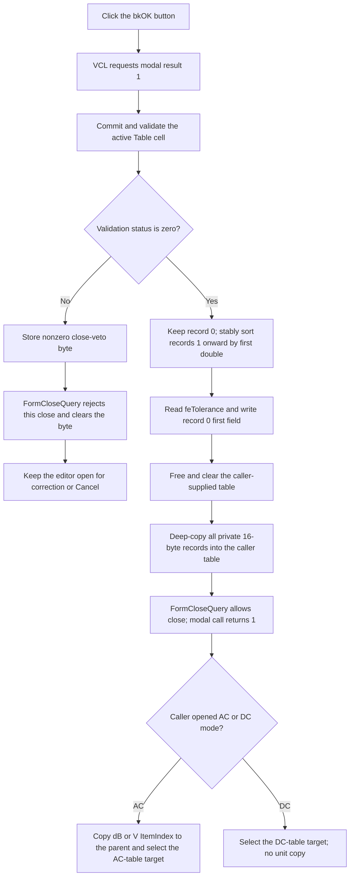

# Validate and commit the target setting table

> Analysis status: Reviewed from recovered handler, active-cell validation, form lifecycle, modal-caller, and resource evidence.

## Control

| Property | Recovered value |
| --- | --- |
| Form | CplxForm11 |
| Form caption | Target Setting Editor |
| Component path | CplxForm11.ok |
| Control class | TBitBtn |
| Button kind | bkOK |
| Framework modal result | 1 (`mrOk`) |
| Handler name | okClick |
| Handler address | 013e7bc0 |
| Graph node | `resource:dfm:CplxForm11/CplxForm11.ok` |
| Handler node | `function:013e7bc0` |
| Graph layer | UI |

## What happens when clicked

`TCplxForm11.okClick` is the commit boundary for the Target Setting Editor. It first asks the attribute grid to accept and validate its active cell. A successful validation causes the handler to sort the staged target points, read the tolerance edit, and replace the caller-supplied table with deep copies of the staged records. A failed active-cell validation stops before the sort and copy-back.

The `bkOK` button uses the standard VCL modal result `1`. The form's close-query handler uses the result of grid validation as a close veto. Therefore, a failed validation keeps the dialog open. A successful handler return lets the modal result continue to the caller.

## Staged data and ownership

The form constructor stores the caller-supplied table pointer at form offset `+0x790` and creates a separate private pointer list at `+0x788`. On form creation, [`FUN_013e7930`](../../../DecompiledSources/Tina16/functions/00000000013E7930__FUN_013e7930.c) allocates one 16-byte record for each supplied record and copies both 8-byte fields into the private list. Edits operate on this private list until OK succeeds.

Record `0` is reserved. Form creation reads its first floating-point field into `feTolerance`. The point commands and draw path treat records `1` and later as normal target points. OK leaves record `0` outside the point sort and writes the current `feTolerance` value back to its first field before copy-back.

The handler writes directly through the supplied pointer at `+0x790`. There is no later detached table-commit operation after the modal call returns.

## Active-cell validation and close veto

[`FUN_00b0a890`](../../../DecompiledSources/Tina16/functions/0000000000B0A890__FUN_00b0a890.c) checks the current `Table` cell. If no cell editor exists, it returns zero. If an editor exists, it calls [`FUN_00b0a150`](../../../DecompiledSources/Tina16/functions/0000000000B0A150__FUN_00b0a150.c) to accept the editor text, update the cell and callbacks, and return its validation status.

`okClick` stores this status at form offset `+0x768`. A nonzero value returns from the handler before any point sort, tolerance read, caller-record free, list clear, or copy-back. [`FUN_013e7290`](../../../DecompiledSources/Tina16/functions/00000000013E7290__FUN_013e7290.c) sets `CanClose` only when `+0x768` is zero, then resets the byte. The user can correct the input and try OK again. Cancel can also close after the failed OK because the close-veto byte was reset.

## Sort and tolerance update

On validation success, the handler creates a temporary raw pointer list. While more than the reserved record remains in the working list, it finds the first record with the smallest first `double` among indices `1..Count-1`, copies both fields to a temporary record, and removes the selected working-list entry. It then appends new 16-byte copies in temporary-list order. For ordinary finite values, this produces an ascending order and keeps equal values in their original order. Record `0` remains at index `0`.

After the sort, [`FUN_00b90090`](../../../DecompiledSources/Tina16/functions/0000000000B90090__FUN_00b90090.c) reads the numeric value from `feTolerance` at form offset `+0x750`. The handler writes that value to the first field of reserved record `0`. It does not change record `0`'s second field.

## Caller-table copy-back and unit state

After the tolerance update, the handler:

1. frees every 16-byte record in the caller-supplied table at `+0x790`;
2. clears that table's pointer list;
3. allocates one new 16-byte record for each private working record;
4. copies both 8-byte fields; and
5. appends each copy to the caller table.

This is an in-place replacement of the caller-owned table. The handler does not write a file, registry value, or database row. The separate **Save as** command owns file output.

OK does not read or write `rgMeasUnit`. In AC mode, [`FUN_013ee580`](../../../DecompiledSources/Tina16/functions/00000000013EE580__FUN_013ee580.c) sets the initial dB/V selection before the modal call and copies the final `ItemIndex` back to the parent only after modal result `1`. Resource order maps index `0` to **dB** and index `1` to **V**. In DC mode, [`FUN_013ee700`](../../../DecompiledSources/Tina16/functions/00000000013EE700__FUN_013ee700.c) does not transfer a unit, and form creation disables the radio group. Thus the table commit and the AC unit copy are separate accepted-result effects.

## Accept flow

## Cancel contrast

`CplxForm11.cancel` is a `bkCancel` button and has no application `OnClick` handler. It does not call grid validation or `okClick`. Cancel therefore does not sort the working records, update the reserved tolerance field, replace the caller table, or copy the AC dB/V choice to the parent. Form destruction frees the private records and list without freeing or replacing the supplied caller table.

Cancel does not undo effects outside this private-copy boundary. For example, a file already written through **Save as** remains on disk.

## No-op, error, and partial-mutation behavior

- A failed active-cell validation is the clean no-commit path. It occurs before the handler changes the working-list order or caller table.
- The handler has no explicit empty-list guard before it accesses record `0`. Normal initialization supplies that reserved record. An empty or corrupt list follows the list accessor's error path.
- The sort does not validate finite values or duplicate first-field values. Equal finite values keep their order. NaN comparisons do not produce a useful numeric order.
- The tolerance getter parses the edit text, checks the recovered numeric range, and can invoke an installed value validator. A parse, range, or validator exception occurs after the private working list was sorted but before the caller table is cleared. The caller table remains unchanged on that sequence.
- The handler has no local exception handler, transaction, or rollback. A failure during sorting can leave the private list partly rebuilt. After caller-table clearing begins, an allocation or append failure can leave the caller table empty or partly copied.
- The source contains no direct error-dialog call in `okClick`. Grid feedback, numeric-edit messages, and unexpected exceptions remain in their component, VCL, or caller error paths.

## Handler and lifecycle evidence

- Primary handler: [FUN_013e7bc0](../../../DecompiledSources/Tina16/functions/00000000013E7BC0__FUN_013e7bc0.c) contains the validation gate, stable point sort, tolerance update, caller-record release, and deep-copy loop.
- Constructor: [FUN_013e70f0](../../../DecompiledSources/Tina16/functions/00000000013E70F0__FUN_013e70f0.c) creates the private list and stores the caller table and AC/DC mode.
- Form creation: [FUN_013e7930](../../../DecompiledSources/Tina16/functions/00000000013E7930__FUN_013e7930.c) deep-copies the supplied table, loads the tolerance, populates the grid, and disables `rgMeasUnit` for DC mode.
- Close query: [FUN_013e7290](../../../DecompiledSources/Tina16/functions/00000000013E7290__FUN_013e7290.c) converts the validation byte to `CanClose` and resets the byte.
- Form destruction: [FUN_013e71f0](../../../DecompiledSources/Tina16/functions/00000000013E71F0__FUN_013e71f0.c) releases the private records and containers but not the caller table.
- AC modal caller: [FUN_013ee580](../../../DecompiledSources/Tina16/functions/00000000013EE580__FUN_013ee580.c) transfers `rgMeasUnit.ItemIndex` only after result `1`.
- DC modal caller: [FUN_013ee700](../../../DecompiledSources/Tina16/functions/00000000013EE700__FUN_013ee700.c) selects the DC-table target only after result `1` and does not transfer a unit.
- Recovered form: [ui-evidence.json](../../../DecompiledSources/Tina16/resources/dfm/ui-evidence.json) defines the Target Setting Editor, binds `ok.OnClick` to `okClick` at `013e7bc0`, and identifies the button as `bkOK`.
- Graph neighborhood: `function:013e7bc0` has nine distinct outgoing calls and is in the UI layer with complex classification.

## Direct calls

- `function:004095c0` - allocates each 16-byte temporary, rebuilt working, or caller record.
- `function:004095f0` - frees temporary and old caller records.
- `function:00410e60` - creates the temporary pointer list used by the sort.
- `function:00410f20` - destroys the temporary pointer list.
- `function:004ae7e0` - appends a record pointer to a list.
- `function:004ae870` - removes one selected working-list pointer during sorting.
- `function:004aeac0` - returns a bounded list entry.
- `function:00b0a890` - accepts and validates the active grid cell.
- `function:00b90090` - reads and validates the tolerance value.

## Resource evidence

- The form caption is `Target Setting Editor`.
- The control is a `TBitBtn` with `Kind = bkOK`. It has no recovered custom caption, hint, action, image reference, or extracted glyph.
- `Table` is a `TAttributeGrid`.
- `feTolerance` has recovered text `5` and is next to `Tol.` and `[%]` labels. The source, not label proximity alone, proves its storage in record `0`.
- `rgMeasUnit` contains `dB` and `V`. The source-established modal callers prove when this selection is copied.
- Cancel is `bkCancel` and has no recovered application click handler.

## Analysis limits

- Original Delphi names for the 16-byte record fields and form offsets are not recovered. Their roles come from data flow across form creation, grid display, drawing, and OK copy-back.
- The recovered source proves the close-veto and caller-table replacement. It does not expose all cell-specific validation rules or how every exception appears to the user.
- This review did not run the original application. It does not claim a live test of sorting, validation feedback, modal closure, or exception presentation.
