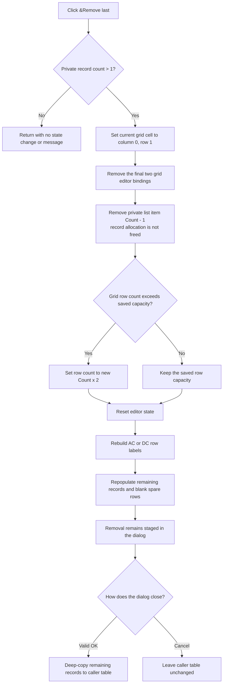

# Remove the final staged target point

The `&Remove last` button removes the final nonreserved target point from the Target Setting Editor's private working list. It does not remove the selected grid row. The command does nothing when only reserved record 0 remains.

## Control

| Property | Recovered value |
| --- | --- |
| Form | CplxForm11 (`Target Setting Editor`) |
| Component path | CplxForm11.removelast |
| Control class | TButton |
| Caption | `&Remove last` |
| Handler name | `removelastClick` |
| Handler address | `013e8130` |
| Graph node | `resource:dfm:CplxForm11/CplxForm11.removelast` |
| Handler node | `function:013e8130` |
| Graph layer | UI |

The recovered resource has no hint, action, or glyph for this button. The behavior below comes from the handler, its callees, and the form lifecycle.

## What happens when clicked

The handler reads the record count from the private list at form offset `+0x788`. If the count is 0 or 1, it returns without a message and without changing the grid or list. The strict `Count > 1` guard preserves record 0, which the other form code treats as a reserved record.

When there is a removable record, the handler performs these operations:

1. It sets the grid's current cell to column 0, row 1. It does this before rows can disappear. The source does not prove which control receives Windows focus.
2. It calls the grid binding-removal helper twice. Each call removes the editor binding for the current final data row and moves the binding cursor back by one. The two calls correspond to the two double fields stored in each target-point record.
3. It removes list item `Count - 1`. It does not read the selected row, so the command always removes the final record.
4. It adjusts the visible row count. If the grid had grown beyond the saved row capacity at form offset `+0x778`, the new row count becomes `new Count * 2`. Otherwise, the saved capacity remains. The command therefore does not shrink the grid below that saved capacity.
5. It resets the grid editor state, rebuilds the mode-specific row labels, and repopulates the grid from the remaining working records. It then writes empty strings to both columns of trailing spare rows.

In DC mode, the shared label builder creates numbered `X` and `Y` rows for records after record 0. In AC mode, it uses the form's recovered mode-specific captions and also displays the reserved record's second value. The shared grid refresh forces the reserved record's first double to zero.

## Record ownership and deletion limit

Each working record is a separately allocated 16-byte block that contains two doubles. Form creation deep-copies the caller's records into the private list. The remove handler deletes the final pointer from that list, but it does not call the recovered raw-memory free routine for the pointed-to record.

This list uses the base list VMT. The generic list-delete routine skips its optional item notification for that VMT, so it does not free the record indirectly. The form destructor frees only the record pointers that remain in the list. Therefore, the removed 16-byte allocation becomes unreachable on this recovered path. This is an apparent memory leak in the original binary, not a deletion of caller-owned data.

The separate clear-all command supports this ownership reading: it explicitly frees every record before it clears the list.

## Staging, OK, and Cancel

The dialog edits a private copy. This click does not update the caller-owned target table at form offset `+0x790`.

- `OK` validates the grid, sorts the nonreserved records, frees the caller's old records, and deep-copies the current private records back to the caller. The removal becomes persistent only through this successful copy-back.
- `Cancel` is the form's built-in cancel result and has no custom click handler. It skips copy-back, so the caller's table keeps the removed point. The form destructor frees the records that are still in the private list, but it cannot recover the pointer already removed by this command.

The remove handler does not call the form's grid validator. Moving the current cell can invoke behavior inside the recovered grid implementation, but the source does not prove a separate validation result or error message on this click path.

## Click flow

## Error and partial-state behavior

The handler has no local exception handler and no rollback. Its guard makes `Count - 1` a valid list index under the observed single-handler execution. However, operations occur in a fixed sequence:

- If an error occurs while the two grid bindings are removed, the list can still contain the final point while the grid binding state is only partly changed.
- After the pointer is removed, an error during row resizing or refresh can leave the private list without the point while the grid is stale or partly rebuilt.
- No error message is issued by this handler. Allocation, string, grid, or list exceptions propagate through the Delphi runtime.

## Evidence

- [Remove-last handler](../../../DecompiledSources/Tina16/functions/00000000013E8130__FUN_013e8130.c) proves the count guard, fixed grid coordinate, two binding removals, final-list-index deletion, row-capacity decision, refresh calls, and spare-row clearing.
- [List delete routine](../../../DecompiledSources/Tina16/functions/00000000004AE870__FUN_004ae870.c) proves that the base list VMT skips item notification when a pointer is deleted.
- [Grid binding-removal helper](../../../DecompiledSources/Tina16/functions/0000000000B0ADF0__FUN_00b0adf0.c) proves that each call removes one trailing editor binding and decrements the binding cursor.
- [Grid reset helper](../../../DecompiledSources/Tina16/functions/0000000000B0AE40__FUN_00b0ae40.c) proves that refresh hides the editor, clears grid state, and resets its insertion cursor.
- [Row-label builder](../../../DecompiledSources/Tina16/functions/00000000013E72B0__FUN_013e72b0.c) and [grid population helper](../../../DecompiledSources/Tina16/functions/00000000013E7620__FUN_013e7620.c) prove the mode-specific rebuild from remaining records.
- [Form creation](../../../DecompiledSources/Tina16/functions/00000000013E7930__FUN_013e7930.c), [OK handler](../../../DecompiledSources/Tina16/functions/00000000013E7BC0__FUN_013e7bc0.c), and [form destructor](../../../DecompiledSources/Tina16/functions/00000000013E71F0__FUN_013e71f0.c) prove private staging, accepted-only copy-back, and manual freeing of remaining private records.
- [Clear-all handler](../../../DecompiledSources/Tina16/functions/00000000013E8270__FUN_013e8270.c) proves that this form normally frees record blocks explicitly before it clears the pointer list.

## Analysis limits

- Recovered offsets and call data establish the behavior, but the original Delphi field and type names are unavailable.
- The source proves the grid coordinate change, not the final keyboard focus, caret, scroll position, or repaint timing.
- The handler has no direct save or file operation. Persistence outside the caller's in-memory table is not part of this click path.
